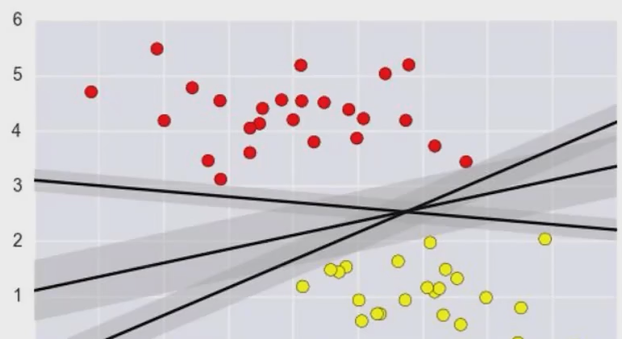

[TOC]

# 支持向量机

能将样本分类正确的超平面有很多，哪一个超平面是最优的呢？

超平面可以通过如下线性方程来描述
$$
w^Tx + b = 0
$$
现在，我们考虑一个二分类的任务：将一个样本的正例表示为+1，负例表示为-1，于是有
$$
\left\{
\begin{aligned}
w^Tx + b \gt 0 & \iff y_i = +1 \\
w^Tx + b \lt 0 & \iff y_i = -1 
\end{aligned}
\right. 
$$

## 优化目标

**目标：**找到一条线【超平面】，使得离该线最近的点（**这些点被称作支持向量**）能够尽可能远。

空间中一个点$x$到超平面的距离为：
$$
\frac{||w^Tx+b||}{||w||}
$$
于是，优化目标为：
$$
\underset{w,b} {\operatorname{argmax}} \left\{ \underset{i} {\operatorname{min}}[\frac{||w^Tx_i+b||}{||w||}] \right\}
$$
因为支持向量不可能在超平面上，我们设支持向量到超平面的距离为d，根据上述点到直线公式有：
$$
\left\{
\begin{aligned}
\frac{w^Tx + b}{||w||} \ge +d & \iff y_i = +1 \\
\frac{w^Tx + b}{||w||} \le -d & \iff y_i = -1 
\end{aligned}
\right. \\
$$
将公式(4)进行转化，得到：
$$
\left\{
\begin{aligned}
\frac{w^Tx + b}{||w||d} \ge +1 & \iff y_i = +1 \\
\frac{w^Tx + b}{||w||d} \le -1 & \iff y_i = -1 
\end{aligned}
\right.
$$
$||w||d$是正数，为了方便推导和优化，将它暂设为1（这样做对接下来要推导的目标函数优化过程没有影响），得：
$$
\left\{
\begin{aligned}
w^Tx + b \ge +1 & \iff y_i = +1 \\
w^Tx + b \le -1 & \iff y_i = -1 
\end{aligned}
\right.
$$
将公式(7)合并，我们可以简写为：
$$
y(w^Tx+b) \ge 1
$$
因为y = {+1， -1}，于是，公式(4)中$||w^Tx+b||$可以写成$y(w^Tx+b)$，再结合公式(8)，优化目标可以写作：
$$
\begin{aligned}
&\underset{w,b} {\operatorname{argmax}} \left\{ \underset{i} {\operatorname{min}}[\frac{y_i(w^Tx_i+b)}{||w||}] \right\} \\
= &\underset{w,b} {\operatorname{argmax}} \frac{1}{||w||} \\
= &\underset{w,b} {\operatorname{argmin}} \frac{1}{2}||w||^2, s.t. y_i(w^Tx_i+b) \ge 1
\end{aligned}
$$

## 求解目标函数

我们要求解的目标是$min\frac{1}{2}||w||^2$，它就是一个条件极值问题，条件是$y_i(w^Tx_i+b) \ge 1$

可以利用拉格朗日乘子法来求解这个问题，经过一系列过程得到：
$$
\underset{\alpha} {\operatorname{max}} \sum_{i=1}^{m}\alpha_i - \frac{1}{2}\sum_{i=1}^{m}\sum_{j=1}^{m}\alpha_i\alpha_jy_iy_jx_i^Tx_j，s.t. \sum_{i=1}^{m}\alpha_iy_i=0, \alpha_i \ge 0
$$
求解出$\alpha$后，依次得到$w$和$b$，$w = \sum_{i=1}^{m} \alpha_iy_ix_i$ 和 $b$

## 软间隔

有时候数据中一些噪声存在，一味追求数据线性可分可能会使模型陷入过拟合，因此，我们放宽对样本的要求，允许少量样本分类错误。【实现方法类似于加一个正则项】

## 核函数

有些样本分类不是二维线性可分的，我们使用一个核函数变换，将样本从原始空间映射到一个更高维的特征空间，使得样本在这个高维特征空间内线性可分。
$$
\phi(x_i)表示x_i在高维空间的特征向量 \\
K(x_i,x_j) = \phi(x_i)^T\phi(x_j)
$$
一般使用高斯核函数
