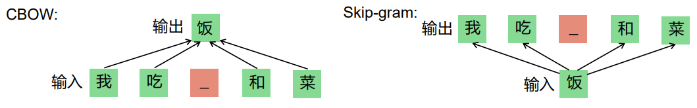
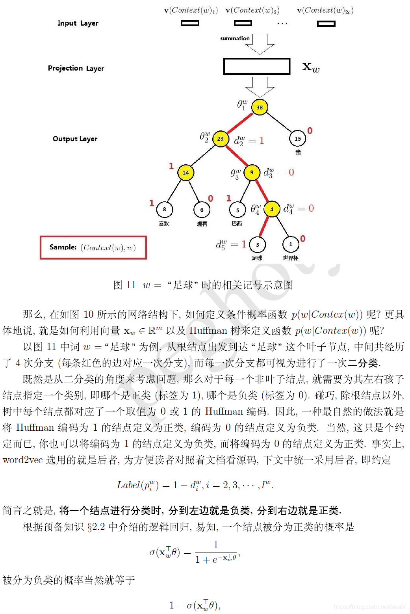
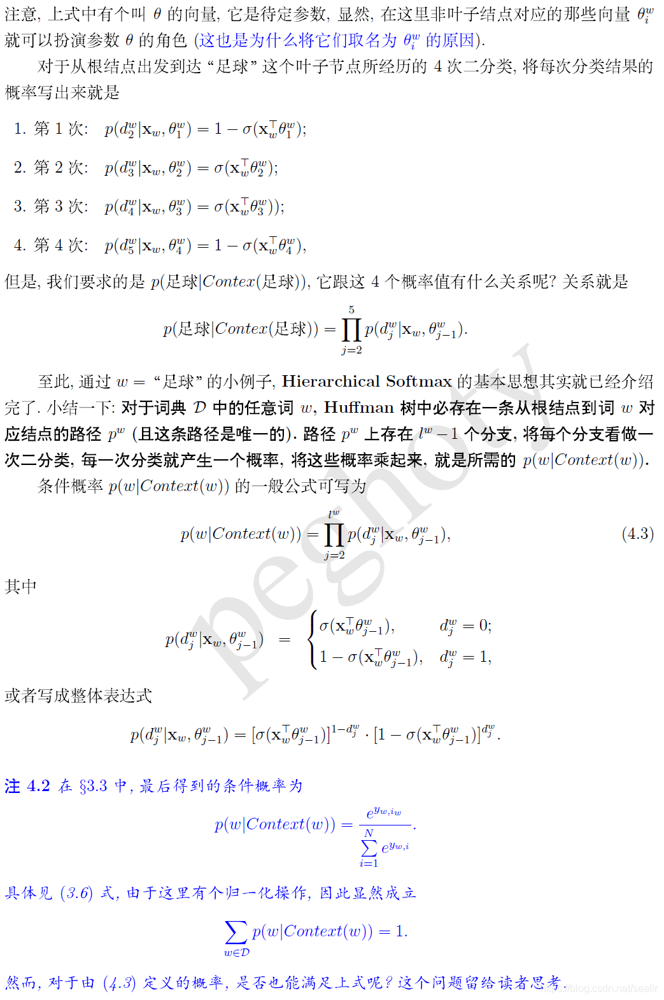
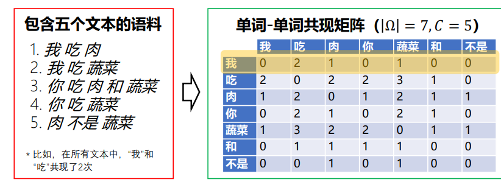
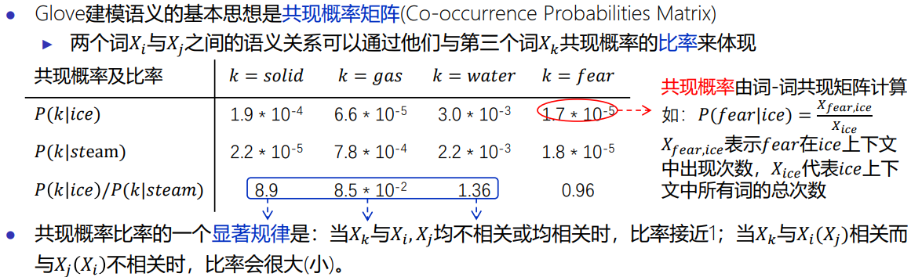
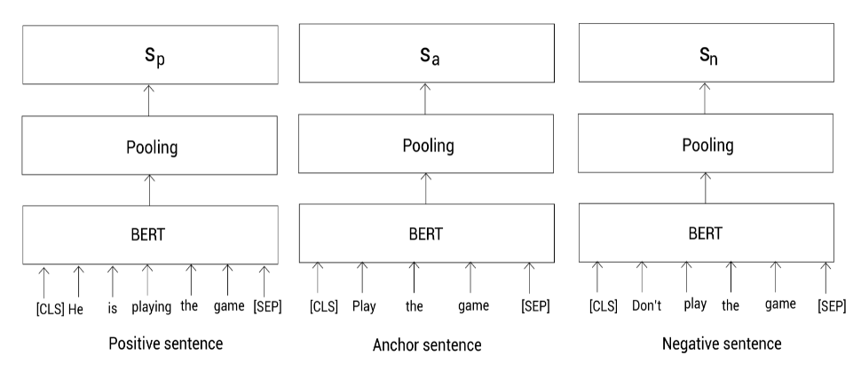
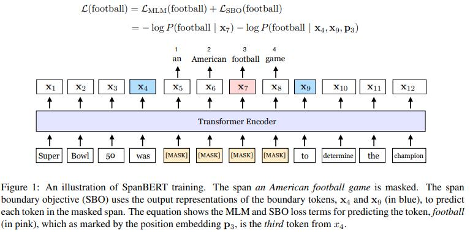
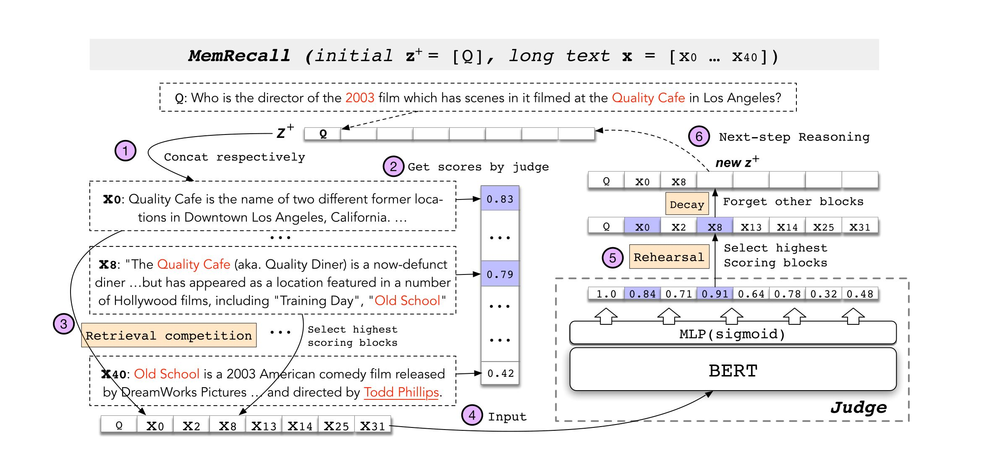

[TOC]

# BERT（2018）

## 词向量的发展历史

### [word2vec](https://blog.csdn.net/sealir/article/details/85204630)

利用自监督训练的语言模型任务来学习到好的词向量表示

1. skip-gram
2. CBOW



缺点：

1. 只能捕获窗口大小的局部上下文信息

计算效率优化：

1. 分层softmax【隐藏层中间表示不再通过参数矩阵直接投影到词表大小，而是投影到哈夫曼树中】：根据词的权重（词频）建立一颗哈夫曼编码树【每个非叶子结点都有自己的维度参数】，在预测某个单词时，将softmax的多分类计算转为多个二分类计算，从而减小计算量。

   eg：CBOW根据上下文预测“足球”

   

   

2. 负采样【对比学习，NCE思想的应用】：构造标签为0的负样本对。

   负样本的选择应该尽可能贴近真实数据分布，让高频词作为负样本的概率大一点，低频词作为负样本的概率小一点。每个词被选择的概率为
   $$
   p(w) = \frac{counter(w)^{0.75}}{\sum_{u \in D}counter(u)^{0.75}}
   $$
   

### Glove

Glove建模语义的基本思想是共现概率矩阵，先介绍一下**共现矩阵**，如下图所示



共现矩阵有如下几个特点：

1. 它是对称的
2. 它统计的是整个语料库而不是一句话，一个文章的信息，具有全局性
3. 统计的是单词对在给定环境中的共现次数，可以反映单词之间的关系

**共现概率矩阵**



现在做完统计之后，就可以将得到的共现概率比，作为标签：


### Fasttext

fasttext是早期的文本分类算法


### ELMo（NAACL 2018）

之前的Word Embedding本质上是静态的方法，所谓静态指的是训练好之后每个单词的表示就固定了，对于多义词在不同的语境下是需要不同的表示的。ELMo解决了这个问题，在需要使用词向量时，不再单独只做一个词向量的查询；使用时，将一整段句子输入到模型中，模型根据上下文会推断句子中每个词的向量表示。

ELMo：使用两个单向LSTM模型（不共享参数，共享词表）进行语言模型的训练【正向LSTM利用上文信息计算一个loss + 反向LSTM利用下文信息计算一个loss】

在下游任务中，将LSTM所有层的表示+原始词向量 进行加权作为最终token的表示

Q：为什么不能使用多层的双向LSTM

A：因为在Bi-LSTM中第二层会看到上下文token的信息【Bi-LSTM会拼接前后向的隐藏层状态信息，而一旦拼接了信息在做单向语言模型预训练时就看见了上下文（其实可以像BERT一样用MASK来解决这个问题，去做MLM，不做LM）】，造成标签泄露


### GPT

GPT1：decoder模型，根据**上文**来预测当前的词做预训练

下游任务具体做法：

1. 分类任务：送入transformer得到特征向量
2. 自然语言推理：将前提和假设拼接，通过分隔符隔开，送入transformer
3. 语义相似度：A句拼B句、B句拼A句，做正反两次拼接，然后送入transformer，将两个向量再拼接
4. 问答和常识推理：将每个回答都和内容进行拼接，送入transformer，选置信度最大的


GPT2&3：作者将各种任务都转换为LM任务【如，机器翻译：EN 》ZH，EN》[待预测的中文译文]】，认为任何的有监督任务都是语言模型的一个子集，当模型容量非常大且数据量丰富时，仅靠LM就可以完成其他有监督任务的学习。当大模型训练好后，在下游任务上不做训练，直接zero-shot one-shot few-shot（few-shot GPT3也不做微调）性能就可以很好。


## 主要内容

GPT是单向的，BERT设计了双向。两个预训练任务MLM和NSP

MLM：15%的MASK进行预测，其中80%用MASK换，10%随机token，10%不变【MLM可以认为是denoising autoencoder的思想】

NSP：预测是否连续，但是它太简单了，它的负样例来自于不同的document，相当于topic分类+segment连贯性预测的任务。改进的任务是SOP（sentence order prediction），在相同的document中选segment来做预测


## QA

1. 为什么会在前面使用CLS token

   因为这个无明显语义信息的token会“公平”地融合文本中各个词的语义信息，从而更好地表示整句话的语义

2. BERT的规模

   BASE：L12 H768 A12；LARGE：L24 H1024 A16

3. BERT的非线性来源

   GELU 和 Self-attn（Softmax）

4. BERT的MASK策略改进

   1. BERT WWM：全词掩码，不是只遮掩子词 
   2. ERINE【百度和清华都有】：引入外部知识，进行短语、实体的MASK 
      1. 清华：给knowledge entity做一个embedding，它有自己的attention模块。token的attn输出和knowledge entity的输出做融合，下一章节记载了ERINE清华
      2. 百度：把实体和短语进行遮掩，分三个级别MLM->phrase-level masking->entity-level masking递进式训练，下一章节记载了ERINE百度
   3. SpanBERT： 本章节记载了SpanBERT

5. BERT如何处理长序列文本

   三种方法：截断法、pooling法（将每个segment的表示拼起来）、压缩法（选择需要的segment）

   本章节记载了CogLTX


# Sentence Bert（EMNLP 2019）

在语义相似度计算的任务上，Bert需要送入AB句，假设有1000个句子，两两计算相似度，则需要计算1000*999/2次。

Sentence-Bert采用孪生网络，将不同的句子输入到两个bert中（共享参数），得到句子的表征向量，用于语义相似度计算和无监督聚类。【关键点就在于如何将每个句子的bert输出嵌入到一个空间中】

## loss设计

1. 语义相似度分类任务

   
   
2. 余弦相似度损失(MAE)【**推断阶段**使用的方法，也是回归任务的损失函数】

   

3. 三重态相似度损失（对比学习）

   有3个句子，一个锚点，一个正样本，一个负样本

   ``` shell
   Anchor：play the game
   positive： he is playing the game
   negative：don't play the game
   ```
   

$$
max(||s_a - s_p|| - ||s_a-s_n||+ϵ,0)
$$


# SpanBERT（TACL 2020）

三个扩展点：

1. 对 contiguous random spans 进行MASK，不做80 10 10，全都是[MASK]
2. 对 span boundary representation 进行训练，它的意图是使用span的边界词来预测span内容，让span的边界token存储整个span的信息，这在下游任务上是有用的。 
2. 去掉了NSP，获得更长的上下文输入



根据几何分布，先随机选择一段span的长度【几何分布会偏向于得到短的长度】，之后再根据均匀分布选择这一段的起始位置。

## span boundary representation（SBO）

我们希望能够用span mask的boundary tokens来构建关于span的语义表示。为此，本文作者引入了span boundary objective，用span边界处的tokens的representations对masked span内部的tokens进行预测。预测span中每个token的信息时还会加上一个相对位置编码。

如上图所示，具体做法是在训练时取 Span 前后边界的两个词（这两个词不在 Span 内），然后用这两个词向量加上 Span 中被遮盖掉词的相对位置信息来预测原词。


# CogLTX

CogLTX思想：使用压缩法，将一个长文本动态地切成连续的短句子(x[0], ..., x[n])。然后利用judge（一个BERT）从中识别出与任务相关的关键片段组成语块。依据不同任务类型，将关键语块组成满足任务需要的输入格式，送入reasoner（另一个BERT）中。

## Method

1. MemRecall算法利用judge模型来检索关键块，作者假设存在一个$z^+$，它可以完全代替长文本$x$。$z^+$被MemRecall动态维护以模拟人类的记忆，在不同的任务中$z^+$初始化的方式也不一样。【QA用Q做初始化】

   $$
   \begin{aligned}
   z^+ &= [CLS\space Q\space SEP\space z_0 \space SEP...z_{n-1}]\\
   judge(z^+) &= sigmoid(MLP(BERT(z^+)))\\ 
   Score_{z_i} &= judge(z^+)[z_i]是z_i中所有token的分数均值
   \end{aligned}
   $$
   MemRecall首先进行retrieval competition的粗相关性打分，计算$judge(z^+[SEP]x_i)[x_i]$，得分最高的几个$x_i$被插入到$z$中【左下角就是$z$】。接下来的rehearsal-decay阶段会给每个$z_i$做精相关性打分，计算$judge(z^+)[z_i]$，只有最高分数的$x_i$被保留在$z^+$中，更新$z^+$。【打精分，可以认为是短句子$x_i$相互学习，类似reranking的方式】

   

   整个流程会重复进行，需要注意的是如果被$z^+$中的新加入的信息证明相关性不够，之前的一些短句子$x_i$则会decay掉

2. loss

   - judge监督学习：使用交叉熵，文本中相关的短句子被标记为1，不相关的被标记为0【这个句子中所有的token都会标成1或0】

   - reasoner监督学习：训练时reasoner的输入应该由MemRecall来生成，但是并不能保证所有的相关block都能被检索到。以QA任务为例，如果答案的blcok没有被检索到，reasoner就无法通过检索到的block进行训练，因此解决方案为做一个近似，将所有相关block和retrieval competition中的“winner” block输入到reasoner中进行训练。

   - judge无监督学习：大多数的任务不会提供相关性的label。对于这种情况我们使用干预的手段来推断相关性标签：通过从$z$中剔除某个block来看它是否是不可或缺的。每次训练reasoner后，我们会剔除每个$z$中的$z_i$，然后根据loss的增加调整它们的相关性标签。如果loss的增加是不显著的，则表明这个block是不相关的，它可能在下一个epoch中不会再赢得retrieval competition，因为它将在下一个epoch中被标记为irrelevant来训练judge。
     $$
     loss_{reasoner}(z-z_i) - loss_{reasoner}(z) > t\space (需要的)
     $$


# StructBert（ICLR 2020）

新的loss：

1. 将乱序的token输入，还原token的order【交叉熵】
2. 升级版NSP，3分类，判断AB句{A是B的后句，A是B的前句，A和B没有关系}
