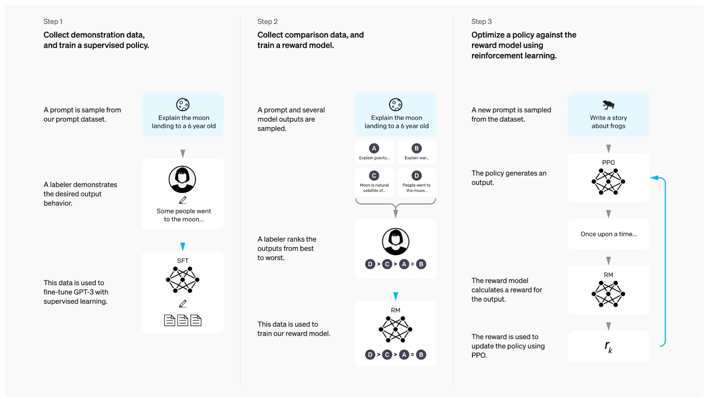
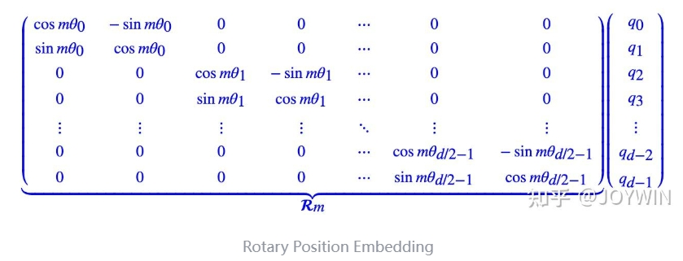
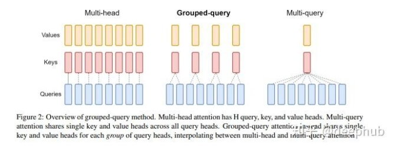
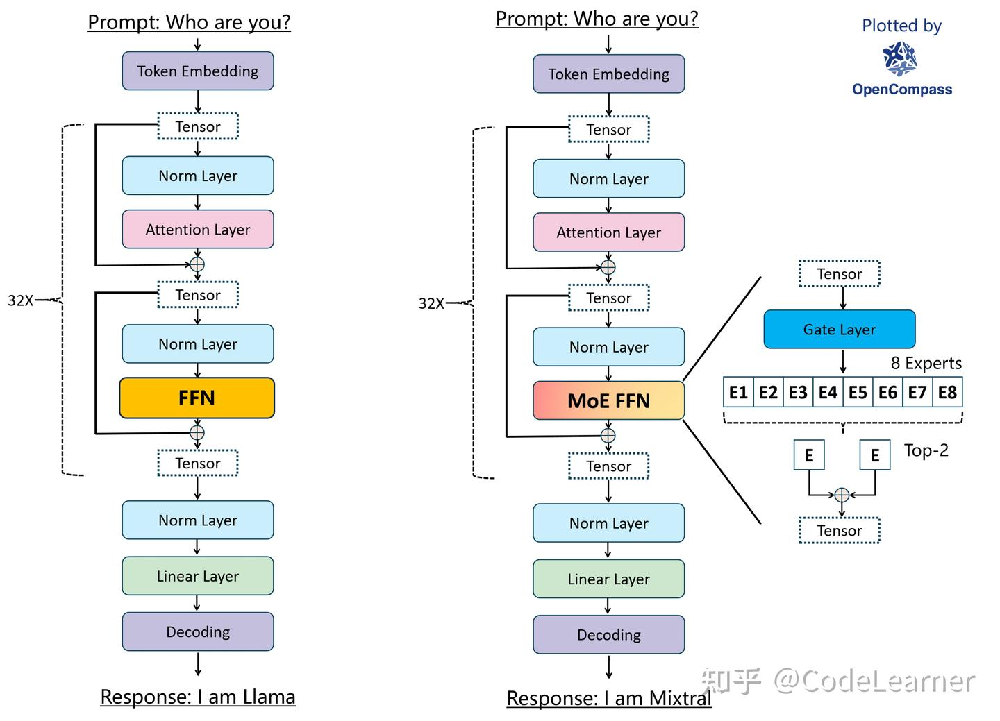
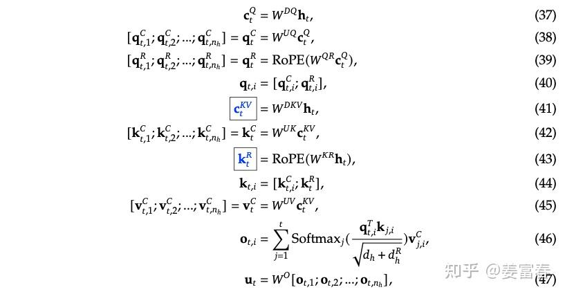
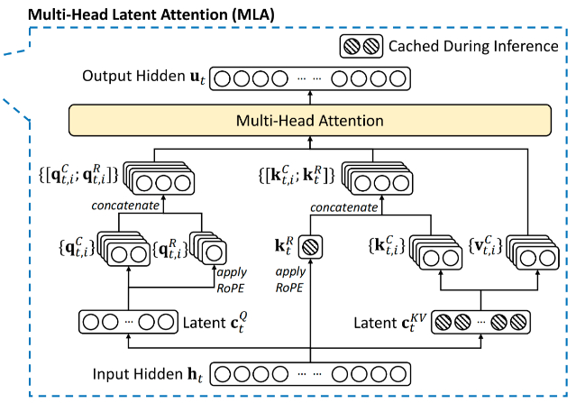
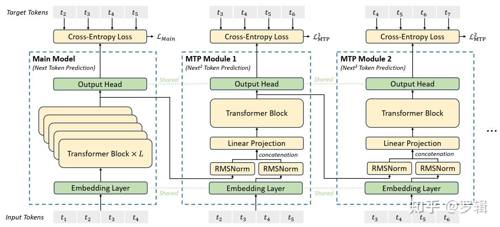
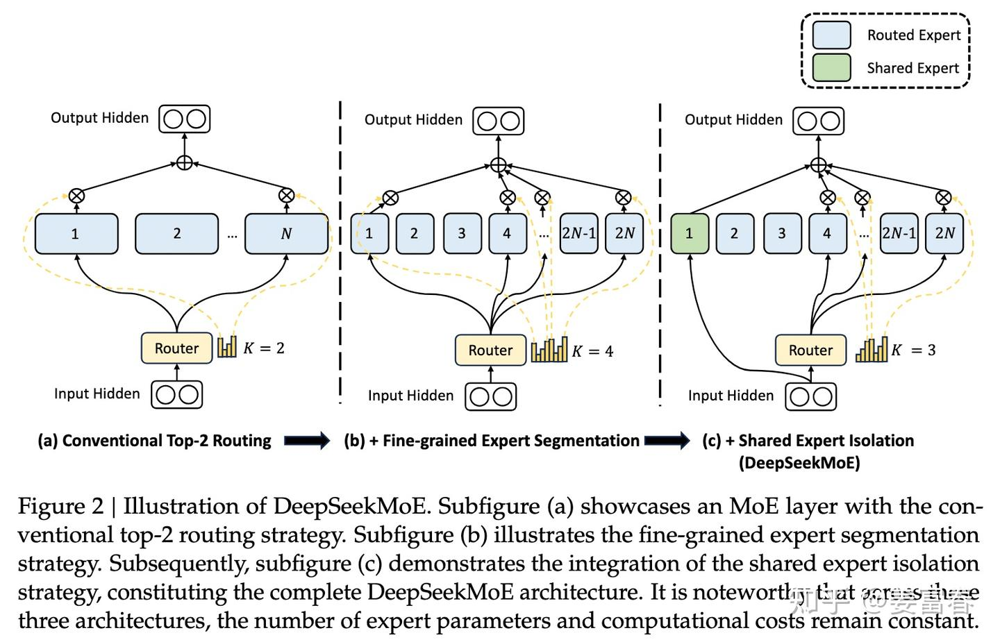

# 大模型发展史
> 翻译了各家大模型的技术文章  
> https://zhuanlan.zhihu.com/p/670574382?utm_psn=1884598268316586416  


## InstructGPT（2022.01.27）
> https://arxiv.org/abs/2203.02155  
> https://zhuanlan.zhihu.com/p/637419868 

InstructGPT的核心目的：**遵循人类的意图**，因为大语言模型无监督训练方法是 "从互联网上的大量语料库中学习根据上文来预测下一个词"，它做的是个生成任务。而不是 "根据人类的指令生成有帮助，无害的对应答案"。

### RLHF


1. **构建一个人类标注的指令遵循数据集，进行SFT**  
作者们聘请了 40 个人的团队来标数据，主要是针对用户提交给 OpenAI API 的问题 (Prompts) 标了一些期望的回复 (human-written answer)，并使用这个标注的数据微调 GPT-3，这一步是个有监督学习 (SFT)。但是值得注意的是，这个 SFT 的数据集是一种对话形式的数据集，带有 Prompt，这种数据集的采集成本很大，所以数据的量级不大。

2. **构建一个奖励模型数据集，训练一个RM**  
给定一个prompt，传给第一步训练的模型，生成多个结果，让人类进行排序。RM学习排序，这个模型的作用是预测人类更喜欢模型的哪个输出（学习人类偏好）。

3. **使用这个RM作为奖励函数，并使用PPO强化学习算法微调第1步训练的模型以最大化这个奖励**  
将第1步训练的 LLM 模型视为策略 (Policy)，第2步训练的 Reward 模型视为环境 (Environment)，采用 PPO 的 RL 方法训练 LLM 模型，得到最终的模型。

## ChatGPT（2022.11.30）
同InstructGPT，可能数据量更大

## LLama（2023.02）
> https://arxiv.org/pdf/2302.13971  

模型结构的改进：
### RMSNorm  

原Norm公式：  
$\bar{a}_{i}=\frac{a_{i}-\mu}{\sigma}g_{i}， \mu=\frac{1}{n} \sum_{i=1}^{n} a_{i}, \quad \sigma=\sqrt{\frac{1}{n} \sum_{i=1}^{n}\left(a_{i}-\mu\right)^{2}} .$  

RMSNorm公式（**优点**：省去了减均值的操作，减少计算量）：  
$\bar{a}_{i}=\frac{a_{i}}{\operatorname{RMS}(\mathbf{a})} g_{i}, \quad \text { where } \operatorname{RMS}(\mathbf{a})=\sqrt{\frac{1}{n} \sum_{i=1}^{n} a_~{i}^{2}}$

### SwiGLU激活函数  

SwiGLU是门控线性单元（GLU）的一种，GLU其实不算是一种激活函数，而是一种**神经网络层**。它是一个线性变换后面接门控机制的结构。其中门控机制是一个sigmoid函数用来控制信息能够通过多少。  

$\operatorname{GLU}(x, W, V, b, c)=\sigma(x W+b) \otimes(x V+c)$  
$\operatorname{SwiGLU}(x, W, V, b, c)=\operatorname{Swish}_{1}(x W+b) \otimes(x V+c)$  
$\operatorname{Swish}_{1}(x)=x \sigma(1 x)$  
$\operatorname{ReLU}(x, W, V, b, c)=\max(0, x W+b)\otimes(x V+c)$  

**优点**：ReLU的硬截断特性可能导致梯度消失，而SwiGLU的Swish门控平滑且保留负区间的部分信息，增强了梯度的稳定性；同时，门控机制通过参数化选择重要特征，提升了模型表达能力。SwiGLU相比于ReLU在Transformer架构下能降低约1-2%的困惑度，比ReLU更平滑

### RoPE(Rotary Position Embedding)旋转位置编码  
> https://zhuanlan.zhihu.com/p/647109286  （旋转位置编码公式的推导）

RoPE不同于绝对位置编码的相加运算，RoPE是将位置编码和query（或key）进行相乘得到的。

$Q_{i}=X_{i} W^{Q} R_{i}$   
$e_{i, j}=\frac{Q_{i} K_{j}^{T}}{\sqrt{H}}$(原Attention公式)  -> $e_{i, j}=\frac{Q_{i} R_{i-j} K_{j}^{T}}{\sqrt{H}}$(旋转位置编码公式)  

$R_{i-j} = R_i^{T}R_j$

其中左侧的大矩阵$R_m$就是位置m的位置编码，与右侧query向量相乘得到增加了位置信息的query。因此，这种编码不是作用在embedding的输入层，而是作用在与Attention的计算中。

**优点**：1. 有很好的外推性【可以通过旋转矩阵$R$来生成超过预期训练长度的位置编码，提高了模型的泛化能力和鲁棒性】 2. 解决了绝对位置编码（每个位置的位置编码向量都是不一样的）无法实现的：任何位置之间的相对距离在不同长度的句子中应该是一致的【有效地保持位置信息的相对关系】
> 什么是大模型的外推性？  
> 外推性是指大模型在**训练时和预测时的输入长度不一致**，导致模型的泛化能力下降的问题。例如，如果一个模型在训练时只使用了512个 token 的文本，那么在预测时如果输入超过512个 token，模型可能无法正确处理。这就限制了大模型在处理长文本或多轮对话等任务时的效果。

## GPT-4（2023.03.15）
OpenAI没有给出技术细节报告

## LLama2（2023.07.18）
> https://arxiv.org/pdf/2307.09288

### 模型结构的改进：
1. GQA（分组查询注意力）

标注的MHA见图中最左边的示例，每个query head都有对应的key head和value head；而GQA将query head分成了多个组，每个组共享一个key head和value head。

```python
import torch
import torch.nn as nn
import torch.nn.functional as F

# MHA
class MultiHeadAttention(nn.Module):
    def __init__(self, embed_dim, num_heads):
        super(MultiHeadAttention, self).__init__()

        self.num_heads = num_heads

        # 计算每个头的维度大小
        self.head_dim = embed_dim // num_heads

        # 定义Q K V的线性变换层
        self.q_linear = nn.Linear(embed_dim, embed_dim)
        self.k_linear = nn.Linear(embed_dim, embed_dim)
        self.v_linear = nn.Linear(embed_dim, embed_dim)

        # 最终输出变换
        self.output_linear = nn.Linear(embed_dim, embed_dim)  

    def forward(self, x, mask=None):
        # x.size: batch_size, seq_len, embed_dim
        batch_size, seq_len, embed_dim = x.size()

        # 线性变换得到q k v 然后将embed_dim维度分割成多个头
        # 形状变换: (batch_size, seq_len, embed_dim) -> (batch_size, seq_len, num_heads, head_dim)
        # 转置维度: (batch_size, num_heads, seq_len, head_dim)
        q = self.q_linear(x).view(batch_size, seq_len, self.num_heads, self.head_dim).transpose(1, 2)
        k = self.k_linear(x).view(batch_size, seq_len, self.num_heads, self.head_dim).transpose(1, 2)
        v = self.v_linear(x).view(batch_size, seq_len, self.num_heads, self.head_dim).transpose(1, 2)

        # 计算缩放点积注意力（Scaled Dot-Product Attention），每个头都有独立的注意力分数
        # 注意力分数: (batch_size, num_heads, seq_len, seq_len)
        multihead_attention_scores = torch.matmul(q, k.transpose(-2, -1)) / torch.sqrt(torch.tensor(self.head_dim))

        # 应用掩码（如果需要）
        if mask is not None:
            multihead_attention_scores = multihead_attention_scores.masked_fill(mask == 0, float('-inf'))
        
        # 计算注意力权重
        multihead_attention_weights = F.softmax(multihead_attention_scores, dim=-1)

        # 计算上下文向量
        # (batch_size, num_heads, seq_len, seq_len) x (batch_size, num_heads, seq_len, head_dim) = (batch_size, num_heads, seq_len, head_dim)
        context = torch.matmul(multihead_attention_weights, v)

        # 合并多个头
        # 转置维度: (batch_size, seq_len, num_heads, head_dim)
        context = context.transpose(1, 2).contiguous()
        # 重塑形状: (batch_size, seq_len, embed_dim)
        context = context.view(batch_size, seq_len, embed_dim)

        output = self.output_linear(context)
        return output

x = torch.randn(2, 4, 512)          # batch_size:2 seq_len:4 dim:512
mha = MultiHeadAttention(512, 8)    # 8个头
output = mha(x)

# GQA
class GroupedQueryAttention(nn.Module):
    def __init__(self, embed_dim, num_heads, num_groups):
        super(GroupedQueryAttention, self).__init__()
        self.num_heads = num_heads
        self.head_dim = embed_dim // num_heads
        self.num_groups = num_groups

        # 定义线性变换层
        self.q_linear = nn.Linear(embed_dim, embed_dim)
        self.k_linear = nn.Linear(embed_dim, self.head_dim * num_groups)
        self.v_linear = nn.Linear(embed_dim, self.head_dim * num_groups)
        self.output_linear = nn.Linear(embed_dim, embed_dim)

    def forward(self, x):
        batch_size, seq_len, embed_dim = x.size()

        q = self.q_linear(x).view(batch_size, seq_len, self.num_heads, self.head_dim)
        # k v 重塑形状，得到的是组数，而不是头数
        k = self.k_linear(x).view(batch_size, seq_len, self.num_groups, self.head_dim)
        v = self.v_linear(x).view(batch_size, seq_len, self.num_groups, self.head_dim)

        # 将K和V扩展到与查询头数匹配
        # (batch, seq_len, num_heads(copy了 self.num_heads // self.groups 份), head_dim)
        k = k.repeat_interleave(self.num_heads // self.num_groups, dim=2)  
        v = v.repeat_interleave(self.num_heads // self.num_groups, dim=2)

        # ==========================后面就和正常的MHA一样了===============================#
        # 调整维度顺序以便矩阵乘法
        # (batch, num_heads, seq_len, head_dim)
        q = q.transpose(1, 2)  
        k = k.transpose(1, 2)
        v = v.transpose(1, 2)

        # 计算注意力分数
        # (batch, num_heads, seq_len, seq_len)
        scores = torch.matmul(q, k.transpose(-2, -1)) / torch.sqrt(torch.tensor(self.head_dim))
        
        attn_weights = F.softmax(scores, dim=-1)

        # (batch_size, num_heads, seq_len, head_dim)
        context = torch.matmul(attn_weights, v) 

        # 合并多个头
        # 转置维度: (batch_size, seq_len, num_heads, head_dim)
        context = context.transpose(1, 2).contiguous()
        # 重塑形状: (batch_size, seq_len, embed_dim)
        context = context.view(batch_size, seq_len, embed_dim)
        
        output = self.output_linear(context)

        return output
```

GQA的优点：1. 模型性能和MHA几乎相同的同时，**节约 KV-Cache(推理阶段，保存前序token计算过的KV向量) 显存空间，减少了计算量，提升速度**。
MQA，G=1的GQA注意力机制：大幅降低计算量，但损失性能，即所有的Head共享同一个k。

## Qwen（2023.08.03）
> https://github.com/QwenLM  
> https://arxiv.org/pdf/2309.16609 (官方技术报告)

### 模型改变
1. Embedding和Output Projection不再共享  
原因：基于初步的实验结果，使用独立的权重矩阵（untied weights）可以**获得更好的性能**。这可能是因为输入嵌入和输出投影在功能上有不同的需求，使用独立的权重可以更好地满足各自的需求。代价是增大了模型的参数

2. RoPE  
矩阵使用的是高精度FP32，提升模型对序列中相对位置关系的理解，提升处理位置敏感任务的性能

3. 在大多数层中移除Bias，但在QKV上保留以提升模型的外推能力  
提升模型的稳定性、减少参数、降低过拟合风险；但在注意力层保持Bias可以增强模型的外推能力，更好地捕获数据特征，提升模型在处理未知数据的表现

4. 使用pre-norm（基本上就是一个共识）  
提升模型的稳定性，缓解梯度消失和梯度爆炸。加快模型的收敛速度

5. RMSNorm  
见LLama

6. SwiGLU  
见LLama，隐藏层大小从4x 变成 8/3x

### 上下文长度扩展
1. NTK 感知插值 & 动态NTK
> https://blog.csdn.net/v_JULY_v/article/details/135072211 （通俗易懂的外推讲解）

仅在推理阶段使用的免训练技术，以扩展模型的上下文长度。

2. LogN-Scaling  
LogN Scaling通过一个取决于上下文长度与训练长度之比的因子重新缩放注意力中Q和V的点积，确保注意力值的熵随着上下文长度的增长而保持稳定。
$\operatorname{Attention}(Q, K, V)=\operatorname{softmax}\left(\frac{\log _{m} n}{\sqrt{d}} Q K^{\top}\right) V$  
其中m是训练长度，n是预测长度。这种技术有助于维持模型在处理长序列时的注意力机制的有效性。

3. window attention  
a. 窗口注意力：将注意力限制在一个上下文窗口内，防止模型关注到太远的内容  
b. 分层注意力：低层注意力窗口更小，高层注意力窗口更大（研究团队观察到Qwen模型在处理长上下文时在不同层次上的建模能力存在差异，较低的层次相对于较高的层次更加敏感于上下文长度的扩展）

## Mixtral（2023.12.11）
> https://zhuanlan.zhihu.com/p/684922663  

### MoE的思想
MoE替换的是模型中的MLP层

$y=f(\boldsymbol{x}\left[\boldsymbol{W}_1^{(A)}\quad\boldsymbol{W}_2^{(A)}\quad\cdots\quad\boldsymbol{W}_n^{(A)}\right]) \begin{bmatrix} \boldsymbol{W}_1^{(B)} \\ \boldsymbol{W}_2^{(B)} \\ \vdots \\ \boldsymbol{W}_n^{(B)} \end{bmatrix}=\sum_{i=1}^n\underbrace{f(\boldsymbol{x}\boldsymbol{W}_i^{(A)})\boldsymbol{W}_i^{(B)}}_{\boldsymbol{v}_i}$

MoE提出的问题是：能否只挑k个向量的和来逼近n个向量的和呢？这样就可以将计算量降低到k/n。在实现过程中，表现为8个专家（7B），挑出2个适合当前token的，执行计算。

### Mixtral的实现
对于每个token，路由网络在每层选择两个专家来处理当前状态并合并它们的输出。



```python
class MoeLayer(nn.Module):
    def __init__(self, experts: List[nn.Module], gate: nn.Module, moe_args: MoeArgs):
        super().__init__()
        assert len(experts) > 0
        # 定义experts，就是一组(8个)Llama FFN，
        # Llama FFN就是两个Linear + Silu + Linear
        self.experts = nn.ModuleList(experts)
        # gate也是一个Linear，这个Linear weight的维度是[hidden_dim , num_experts]
        self.gate = gate  
        self.args = moe_args

    def forward(self, inputs: torch.Tensor):
        # 更改input shape [bst,seq_len,hidden-dim] -> [bst*seq_len,hidden-dim]
        inputs_squashed = inputs.view(-1, inputs.shape[-1])
        # Gate Linear 将输入线性映射到num_experts
        # 即[bst*seq_len,hidden-dim] -> [bst*seq_len,num_experts]
        gate_logits = self.gate(inputs_squashed)
        # topk排序
        # weights返回topk的值
        # selected_experts 返回topk的index
        # torch.topk 用于返回输入张量中每个元素沿指定维度的最大k个元素及其索引
        weights, selected_experts = torch.topk(
            gate_logits, self.args.num_experts_per_tok
        )
        # 对每个weight做softmax，归一化
        weights = nn.functional.softmax(
            weights,
            dim=1,
            dtype=torch.float,
        ).type_as(inputs)
        results = torch.zeros_like(inputs_squashed)
        for i, expert in enumerate(self.experts):
            # 根据selected_experts确定weight的行id和列id
            batch_idx, nth_expert = torch.where(selected_experts == i)
            # 通过上述id选择对应的加权数据 以及执行对应的expert，并将结果加权求和
            results[batch_idx] += weights[batch_idx, nth_expert, None] * expert(
                inputs_squashed[batch_idx]
            )
        return results.view_as(inputs)
```

### 负载均衡-辅助损失
引入负载均衡损失，目的是解决多专家token分布不均的问题。因为如果完全按门控权重选取topk专家，容易导致训练过程出现负载不均衡的问题。比如：大多数token被分配到少数几个专家。

我们可以用每个专家收到的token比例的平方和（方差）来描述负载均衡损失，公式如下，其中S是token数量，E是专家个数，$c_e$是第e个专家收到的token数量。

$l_{aux}=\frac{1}{E}\sum_{e=1}^E(\frac{c_e}{S})^2$

## Qwen1.5（2024.02.05）


## LLama3（2024.04.18）
> https://ai.meta.com/blog/meta-llama-3/  

没有特别多的技术改进

## GPT-4o（2024.05.14）

## Qwen2（2024.06.06）

## o1（2024.09.12）

## Qwen2.5（2024.09.19）

## 混元（2024.11）

## minimax（2025.01）

## deepseek-r1（2025.01.20）

### MLA
> https://zhuanlan.zhihu.com/p/16730036197    

MLA的核心是对注意力的KV进行低秩压缩，来减少显存KV Cache开销，从而提升推理性能。

> 什么是KV-Cache？计算前面token的 K V并不受后面token的影响，且推理过程中前面的token都是重复的，KV也是重复的，因此可以将前序的token存起来。

MLA 它对 Q 和 K 进行拆分，一部分维度做压缩，一部分维度做 ROPE 编码。



#### 流程：  
1. 先对 K，V 通过一个低秩矩阵 $W^{DKV}$ 进行联合压缩、压缩成向量 C，然后再用两个升维矩阵 $W^{UK}$ 和 $W^{UV}$ 进行升维。  **具体来说，对注意力机制中K V的线性变换进行维度缩小与放大**（类似于LORA）。此外，DeepSeek 还对 Q 进行了低秩压缩，对 Q 的压缩方式和 K、V 一致，依然是先降维再升维（不过维度减小得并不多）。对应图中公式（37）（38）

2. 位置编码增强：我们注意到在增加RoPE位置编码并没有在上述计算出的 $K^{C}_t$ 和 $q^{C}_t$ 的基础上乘以Rope的对角矩阵。而是如公式（39）和公式（43）所示，单独计算了两个带着位置编码的 $q^{R}_t$ 和 $k^{R}_t$ ，然后将$K^{C}_t$ 和 $k^{R}_t$拼接之后，再进行公式（46）的注意力计算。

    > 1. $q^{R}_t$ 和 $k^{R}_t$的维度都很小，是head_dim的一半  
    > 2. $k^{R}_t$ 是MQA的方式，所有head共享一个$W^{KR}$

#### 为什么要单独计算位置编码？【MLA压缩KV Cache的核心原理】  
因为RoPE与低秩KV不兼容，没法做矩阵吸收计算。  
a) 没有RoPE时  
$q_{t}^T\times k_{j}=(W^{UQ}c_t^Q)^T\times W^{UK}c_j^{KV}=(c_t^Q)^T\times(W^{UQ})^TW^{UK}\times c_j^{KV}$  

这样的好处是，我们只需要缓存$c_j^{KV}$，因为$(W^{UQ})^TW^{UK}$是固定的，而C的维度很小，因此极大减小缓存。

b) 有RoPE时  
$q_{t}^T\times k_{j}=(R_tW^{UQ}c_t^Q)^T\times R_jW^{UK}c_j^{KV}=(c_t^Q)^T\times(W^{UQ})^TR_t^{T}R_jW^{UK}\times c_j^{KV} = (c_t^Q)^T\times(W^{UQ})^TR_{t-j}W^{UK}\times c_j^{KV}$ 

中间这个分量 $(W^{UQ})^TR_{t-j}W^{UK}$ 是随这相对位置变化而变化的，并不是个固定的矩阵，因此并不能提前计算好。所以论文中说RoPE与低秩变换不兼容。

#### 为什么大幅节约了KV Cache
因为MLA，只缓存了$C^{KV}_t$和$k^{R}_t$，而不是缓存KV，$C^{KV}_t$通过低秩矩阵计算之后，维度小了很多（论文中是4 x $d_{head}$）



### MTP（Multi-Token Prediction）
核心思想：通过解码阶段的优化，将1-token的生成，转变成**multi-token的生成**，从而提升训练和推理的性能。具体来说，在训练阶段，一次生成多个后续token，可以一次学习多个位置的label，进而有效提升样本的利用效率，提升训练速度；在推理阶段通过一次生成多个token，实现成倍的推理加速来提升推理性能。



##### 推理
虽然DeepSeek做了MTP训练，但他的主要目的是加速模型收敛，因为Loss更多了。在推理时，依然是1-token的。

### MoE



#### 共享专家
将某些专家隔离出来，作为始终激活的共享专家，旨在捕获不同上下文中的共同知识。通过将共同知识压缩到这些共享专家中，可以减轻其他路由专家之间的冗余，这可以提高参数效率，确保每个路由专家专注于不同方面而保持专业化。

#### 细粒度专家
在保持参数数量不变的情况下，作者通过分割FFN中间隐藏维度来将专家分割成更细的粒度，生成更多的专家。  
expert就是FFN，FFN就是两个Linear + Silu + Linear  
通过分割FFN中间隐藏维度，参数没有增加，从FFN中输出的tensor维度也没有变化。

#### MoE门控计算从 Softmax->Sigmoid

$${ \mathbf { h } } _ { t } ^ { \prime } = { \mathbf { u } } _ { t } + \sum _ { i = 1 } ^ { N _ { s } } \mathrm { F F N } _ { i } ^ { ( s ) } \left( { \mathbf { u } } _ { t } \right) + \sum _ { i = 1 } ^ { N _ { r } } g _ { i , t } \mathrm { F F N } _ { i } ^ { ( r ) } \left( { \mathbf { u } } _ { t } \right) ,$$
$$
g _ { i , t } = \frac { g _ { i , t } ^ { \prime } } { \sum _ { j = 1 } ^ { N _ { r } } g _ { j , t } ^ { \prime } } ,$$
$$g _ { i , t } ^ { \prime } = \left\{ \begin{array} { l l } { s _ { i , t } , } & { s _ { i , t } \in \operatorname { T o p k } ( \{ s _ { j , t } | 1 \leqslant j \leqslant N _ { r } \} , K _ { r } ) , } \\ { 0 , } & { \text { otherwise } , } \end{array} \right.$$
$$
s _ { i , t } = \operatorname { S i g m o i d } \left( { \mathbf { u } } _ { t } ^ { T } { \mathbf { e } } _ { i } \right) ,$$

从实现门控的效果上看，Softmax和Sigmoid都能做实现筛选TopK的功能，也能做概率分布的归一化处理。

但V3版的MoE为什么要做从Softmax -> Sigmoid的升级？

要解释这个问题，我们看看V3版相对于V2版的专家设置发生了哪些变化。

V2版：路由专家数： 160， 激活专家数： 6个， 模型总参数67B，激活参数21B  
V3版：路由专家数： 256， 激活专家数： 8个， 模型总参数671B，激活参数37B  

这里我个人理解：V3相对于V2的路由专家数增加了近100个，我们考虑在计算一个较大维度的softmax操作，softmax要在内部对所有维度的值做归一化处理，维度越大，会趋向于计算出的每个维度的值会越小，因为所有维度加和要等于1，所以维度越大，每个维度值理论上分配的值就越小。这样在选取 K 个最大值时，会有数据区分度不高的问题，维度越大，问题越严重。而选择Sigmoid函数，它是对每个专家分别计算一个 (0, 1) 的打分，它并是不随专家维度变化而变化，理论上计算的打分值域更宽，区分度更高。所以V3版在配置更多路由专家的情况下，采用了值域更宽的Sigmoid的函数计算专家激活权重。

#### sequence粒度的负均衡损失
平衡单个sequence的token分配给每个专家

### R1的训练过程
见02-推理模型

## o3（2025.01.31）

## QwQ（2025.03.06）

# Qwen3（2025.04.29）
