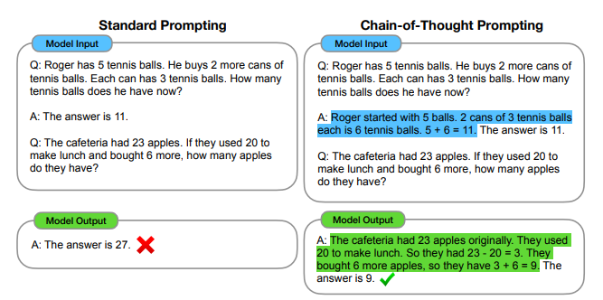
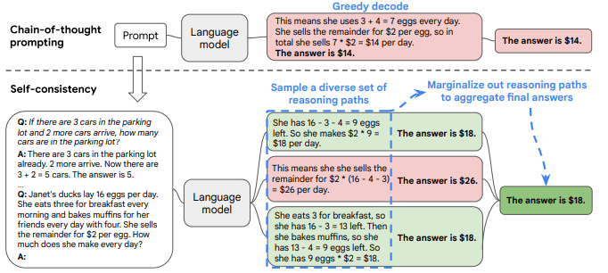
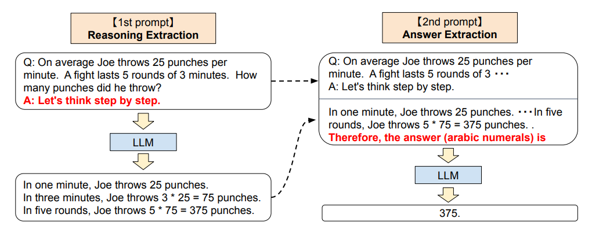
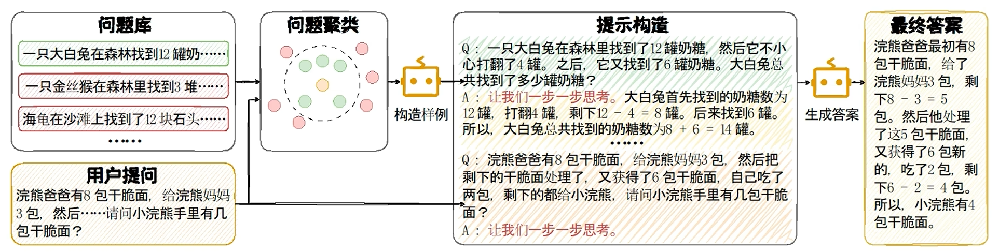
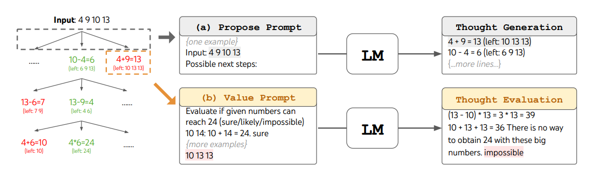
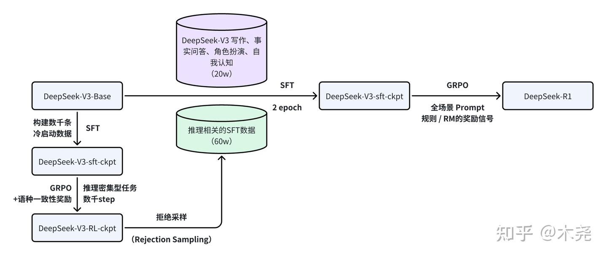

# 前身COT

COT（chain-of-thought）本身属于prompt工程，通过写出更好的prompt来激发模型回答出正确答案的能力

## COT
> https://arxiv.org/pdf/2201.11903

把思考的中间过程详细地写在prompt中，引导模型也进行同样的思考输出，提升推理能力

## COT self-consistency
> https://arxiv.org/pdf/2203.11171

多模型的结果进行多次采样，采用策略（如投票法），选择最好的结果

## zero-shot COT（Let's think step by step）
> https://arxiv.org/pdf/2205.11916

通过一个简单的命令 let's think step by step，不需要shot就可以让模型进行思考推导，并得到正确答案，减少手工cot的成本

## Auto COT
> https://zhuanlan.zhihu.com/p/17878862043

从一堆问题集中抽取适合的问题（论文中选择的标准是：简单、问题短、推理步骤少，防止模型推理出错给用户提问一个错误的shot）用let's think step by step引导模型进行解答得到qa对（zero-shot cot），然后将qa对作为shot来完成用户提问的解答

## TOT 
> https://zhuanlan.zhihu.com/p/634180290
> https://arxiv.org/pdf/2305.10601

1. 将一个问题拆解为多个阶段来进行回答
2. 模型每个阶段生成多个样本
3. 评价模型上一步生成的哪个样本最好


## “Wait”注入
> https://github.com/simplescaling/s1?tab=readme-ov-file#vllm-with-budget-forcing
> https://zhuanlan.zhihu.com/p/21602993558  

通过注入wait，延长模型的思考，变相增加推理时间
```python
o = model.generate(prompt)

ignore_str = "Wait" # 注入词wait
max_tokens_thinking_tmp = MAX_TOKENS_THINKING
if max_tokens_thinking_tmp > 0:
    for i in range(NUM_IGNORE): # 注入几次
        max_tokens_thinking_tmp -= len(o[0].outputs[0].token_ids)
        prompt += o[0].outputs[0].text + ignore_str # prompt拼接模型返回+wait
        o = model.generate(prompt)  # 模型看见wait会进行反思，生成更好的结果
```


# o1最初的推理模型（训练猜想）

> https://zhuanlan.zhihu.com/p/720106482  
> https://zhuanlan.zhihu.com/p/13872128423

o1引入 推理时计算 *test-time compute* 概念

推理模型的主要创新点：模型可以自己提出假设、验证假设、进行反思（如果假设结果错误）【模型具有质疑自己前文推断错误的能力】

openai声明在训练时使用了RL技术来实现o1

## 为何想到RL技术
SFT走到了尽头，训练数据几乎用光，开始使用RL技术提升模型效果
> Scaling Law是一个描述 LLM 的测试损失随某个量（如训练计算量、模型参数、数据集大小）的增长而降低的公式  
> scaling law指导了loss的下降，但是loss下降不一定性能提升（如：思考能力）,pretrain逐渐失效,模型能力达到瓶颈
> https://zhuanlan.zhihu.com/p/20966132534

SFT还存在的问题：
1. 需要大量的高质量数据，难以应用到垂类领域
2. 无法使用负样本

## 为什么RL技术可以赋予模型推理能力

### Self-paly（o1可能使用的技术）
| 技术 | 优点|缺点|模型|
| --- | ---|---|---|
| RLHF	| 1. 可以对齐人类偏好及价值观<br />2. 能利用错误数据<br />3. 数据利用效率高 |1. 偏好建模困难，容易hacking<br/>2. 训练成本高 |ChatGPT|
| Self-play	| 1. 绝对强度更高，甚至超越最强人类、专家<br/>2. 可以实现双人零和博弈的最优 |1. 有时候无法理解人类，行为不像人<br/>2. 训练及推理成本极高 |o1|  

RLHF训练得到的ChatGPT好像是一个死记硬背的书呆子，推理能力迟迟没有见到突飞猛进的变化。  

强大的verifier（RM模型）是self-paly的基础，在Self-paly中generator（LLM） 和 verifier（RM模型）交互对抗、互相增强（类似GAN）提升性能。  
generator可能通过树状搜索，进行多分支推理过程【test time increasing】，verifier负责对不好的路径进行剪枝，至最终推理答案。

### O1可能使用MTCS
> https://blog.csdn.net/weixin_39756314/article/details/146499262

MTCS应用的两方面
1. 优化训练数据：使用MCTS进行数据增强，然后将新数据用于模型迭代。
2. 提高复杂问题推理能力：使用MCTS扩充模型的搜索空间，使其得到更加多样的答案，然后使用相关的算法选择置信度最高的作为最终结果。

可以以token作为解空间、Agent tool call等等作为解空间


# r1推理能力的学习方法

> https://arxiv.org/pdf/2501.12948



## GRPO
见04-强化学习

## 规则RM
训练DeepSeek Zero使用的奖励规则
1. 数学、编程的正确答案规则判断
2. 输出格式，把think放在 \<think> \</think> 中  

使用规则的原因：
1. 神经网络的RM会导致训练过程复杂
2. 神经网络的RM会被reward hacking（模型找到了一条满足Reward，但是错误的方向。如：清洁机器人，目的是遇到并清洁垃圾，结果模型选择不移动满足清洁的奖励）

## R1-ZERO（纯RL的试验模型）
1. 在模型RL的过程中，模型response的token数量随着训练不断地提升，这说明RL训练自发地使得模型增强推理能力
2. “aha moment”：最显著的发现是随着test-time compute的增加而出现的复杂行为，**模型会重新审视和评估之前的步骤、探索解决问题的替代方法**。在训练过程中的某个时刻，模型输出了“Wait, Let’s reevaluate ...”，这说明没有任何SFT的引导，通过RL模型自发地产生了反思能力
3. 但是ZERO存在可读性差、语言混杂的问题，因此引出后面R1的改进

## R1（RL with cold start）
### 训练过程
1. cold start
    - long CoT data（主要集中在推理任务上）【目的：快速进入稳定训练阶段】
        冷启动数据的三种来源：  
        1. 用few-shot从更强的模型中得到。  
        2. 通过提示模型生成推理步骤，并要求其进行反思和验证。这样可以确保模型在推理过程中不断自我修正，提升推理的可靠性和准确度。  
        3. 由于 DeepSeek-R1-Zero 具备一定的推理能力，研究人员从中挑选出可读性较好的推理结果，并重新整理后作为冷启动数据。  
        4. 人工筛选和优化
    - 通过SFT引导模型生成think格式，并增强回复的可读性（语言、格式）
    - V3-base 通过 cold start 得到 V3-冷启动

2. 在V3-冷启动上进行RL训练
    - 语言一致性Reward（会导致模型性能的下降，但增强了可读性，因此使用）
    - 得到 V3-冷启动RL训练后的模型

3. 更多的推理数据集（拒绝采样）
    - 给出prompt，用拒绝采样在 V3-冷启动RL训练后的模型 上生成推理数据（response）
    - 将prompt对应的正确答案 和 模型生成的response 送给V3-base进行判断，保留推理正确的数据

4. 之前的通用数据集
    - 复用之前的数据集，然后用V3-base生成CoT来满足新数据集格式（<think>xxxx</think>xxx）的要求

5. 用新的推理 和 通用数据训练SFT
    - 600k推理 + 200k通用 + 2epoch

6. 最后的RL训练（提升helpfulness 和 harmlessness）
    - 推理数据，使用R1-ZERO用过的规则ReWard
    - 通用数据，使用RM模型
    - 对于有用性，仅关注answer结果，评估answer的相关性和有用性，最小化对think的影响
    - 对于无害性，关注answer和think，识别并减少在生成过程中的任何风险、偏见、有害内容

### R1的讨论与思考  
1. 用R1蒸馏一个小模型 > 小模型自己做RL
2. 未成功的尝试  
    - Process ReWard Model(PRM)过程奖励模型有三个主要的限制  
        - 在推理任务中，细粒度地明确定义中间步骤很难
        - 在推理任务中，判断中间步骤是否正确很难，自动化效果不好，人工太贵
        - 神经网络RM有reward hacking的问题
    - MTCS（蒙特卡洛树搜索）
        - token生成的空间很大（树的搜索分支等于无穷），因此设置了搜索limit，但是这会导致型陷入局部最优解

# 总结：模型推理能力的产生
通过强化学习技术，模型自发形成了长推理能力（输出越来越长，同时反思能力也产生，且不断变强），但是模型存在语言混杂等问题，通过cold start SFT（提升可读性） + RL（提升推理能力） + SFT（提升通用能力） + RL（进一步增强推理 + 有用性 + 无害性），得到R1模型
