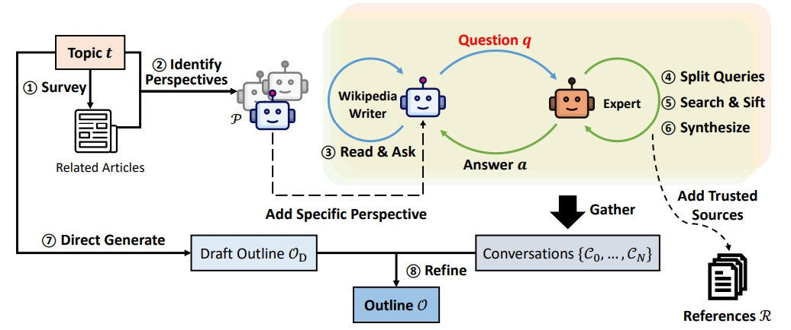
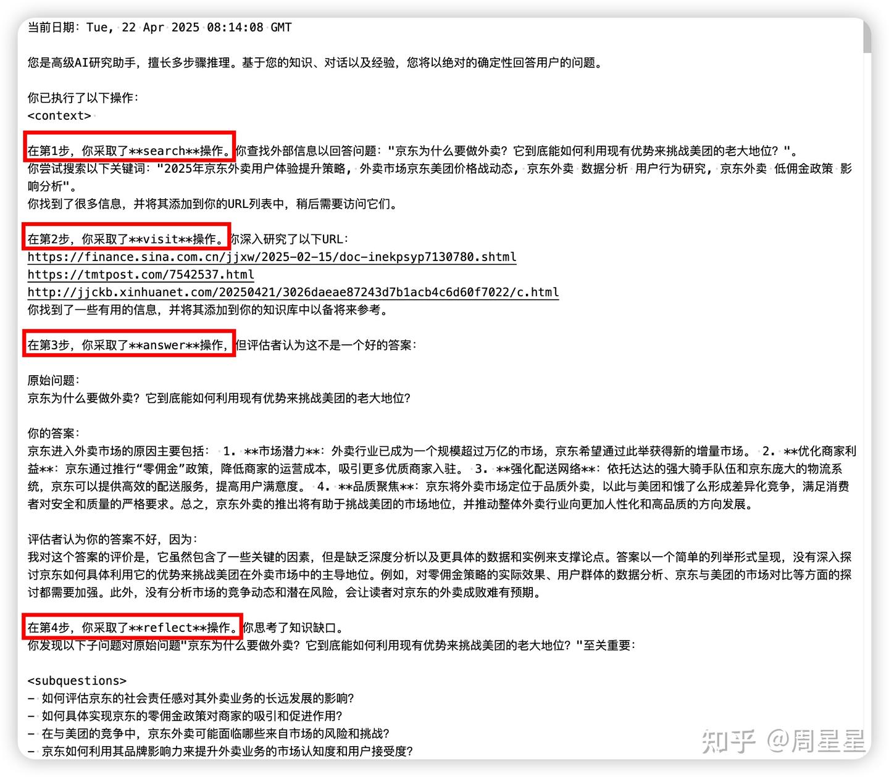
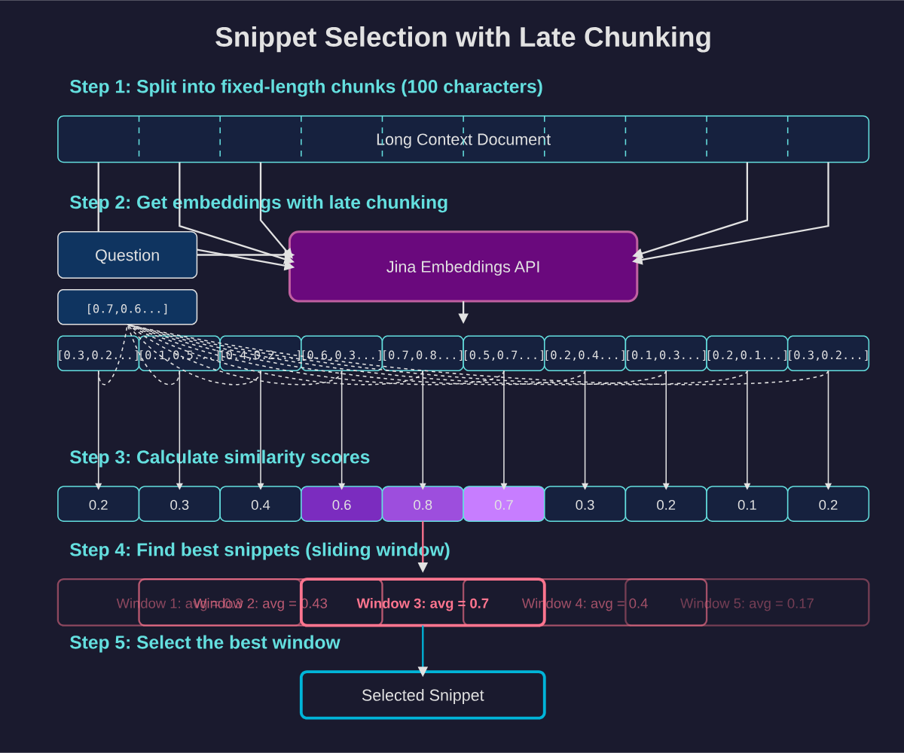
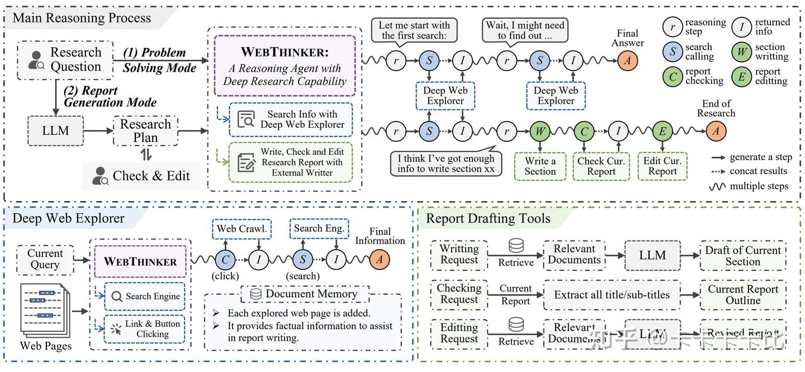
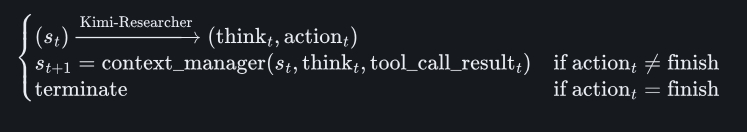

# workflow

## 前身
### STORM
**research工作流**
pre-writing stage（搜索query相关的信息生成大纲） + writing stage（xxx）

**pre-writing stage**
1. 发现当前query（即topic）的多个视角【提升研究、搜索的全面性】
2. 模拟不同视角的wiki作者向专家（掌握可信源）提出问题 + 回答的对话【收集问答形式的信息】
3. 用收集的信息 + 草稿大纲 生成 新大纲  

评价方法：利用 NER + embedding相似度评价模型生成的大纲 和 真实大纲的差异


**writing stage**
1. 每个章节单独生成正文
2. 利用**pre-writing stage**阶段收集的references，完成写作

**具体的流程**
1. topic -> related topic
2. related topic -> 相关wiki页面的目录
3. 相关wiki页面的目录 -> 多个视角（包括topic本身的基础视角）
4. 模拟生成wiki作者以某个视角和专家（可以搜索大量wiki页面）进行对话 -> （q1, a1, q2, a2, ..., qm, am） 【q由wiki作者生成】 
    a. query分解【由专家进行分解】  
    b. 专家利用URL进行可信源的判断，获取可信内容进行回答
    c. 可信源被添加到references（搜索到的网页正文）中，用于正文写作
4. 草稿大纲 + 对话 -> 优化大纲
5. 用embedding检索和各级title相关的文档（文档来自references）
6. 并行生成各章节的正文
7. 合并所有章节去除各章节中重复的部分

### co-storm的改进
引入了协作对话机制，并采用轮次管理策略，实现流畅的协作式 AI 学术研究。

多代理对话：Co-STORM 采用多个语言模型（LM）代理，每个代理都拥有与当前主题相关的独特专业知识。这些代理进行回合制对话，根据实时网络搜索和检索提问并提供答案。一个特殊的“主持人”代理确保对话探索新的方向并且不会变得重复。

动态思维导图：为了帮助用户跟踪不断发展的对话并组织已发现的信息，Co-STORM 维护一个分层思维导图，该导图会随着新信息的讨论而自动更新。这种结构既可以作为对话过程中的导航辅助，也可以作为生成全面最终报告的基础。

混合主动式交互：用户可以被动地观察对话，也可以通过插入问题或将讨论引导至特定感兴趣的领域来主动参与。当用户不干预时，系统会自动生成下一个对话回合，从而保持探索过程的势头。

## 研报写作的开源方案
> https://github.com/deansaco/r1-reasoning-rag

见 项目.md


# Agent
> https://zhuanlan.zhihu.com/p/1892489650469323191(超级好文)


## Search-O1（webthinker前身）
> https://arxiv.org/abs/2501.05366

### Search-o1 实现了**动态的、多步骤**的检索机制：

1. 模型在推理过程中可以识别自身知识的不足点
2. 当遇到知识不确定的情况时，模型会自动生成搜索查询，格式为 <|begin_search_query|>搜索词<|end_search_query|>
3. 系统检测到这一标记后，暂停模型推理，执行网络搜索
4. 搜索结果被包装在 <|begin_search_result|>检索到的内容<|end_search_result|> 标记中返回给模型
5. 模型继续推理，并可以根据需要多次重复这一过程。

### Reason-in-Documents
检索出来的内容可能很杂乱和很长，而现在的大模型处理长文本性能会下降，因此，把检索到的内容进行精炼，再放入到原有推理链中，从而缓解检索文档中存在冗余信息和LLM 处理长文档的局限性。


## Search-R1【与search-o1不同的是强化学习设计 和 没有Reason-in-Documents模块】
> https://arxiv.org/pdf/2503.09516
> https://zhuanlan.zhihu.com/p/30784344002

本文尝试将强化学习框架和检索增强场景想结合。**核心思想：将搜索引擎建模为强化学习环境的一部分，使LLM能通过试错自主学习，打破现有的 RAG 和工具使用方法在灵活性和可扩展性方面存在局限性【如现在的deep research项目】。**

搜索即环境交互：将搜索 API 调用转化为马尔可夫决策过程的状态转移  
结构化文本生成：通过特殊标记实现程序化控制  
轻量化奖励设计：仅用最终答案正确性作为奖励信号，避免复杂过程监督  

### 例子
```
<think>xxxx</think>
<search>xxx</search>【当检测到模型生成这个特殊token时进行检索，不会被学习】
<information>xxx</information>【检索到的信息，直接放入其中，没有总结】

...

<answer>xxxx</answer>
```

### 奖励模型
规则奖励，精准字符匹配（没有设计格式奖励，作者说模型对格式遵循地很好了）

### QA
Q1：**SEARCH-R1 如何解决多轮交互的问题？**
SEARCH-R1 的核心创新在于它允许 LLM 在**推理过程中自主决定**何时以及如何进行搜索。通过引入 <search> 和 </search> 等特殊 token，LLM 可以在生成文本的过程中，显式地发出搜索请求。系统会根据这些 token 提取查询语句，调用搜索引擎，并将检索结果以 <information> 和 </information> 的形式插入回 LLM 的上下文。

这样，LLM 就可以根据实时检索到的信息，动态调整其推理路径和搜索策略，实现真正意义上的多轮交互。

Q2：检索 Token 掩码（retrieved Token masking）的作用是什么？为什么它可以提高训练的稳定性？
在强化学习中，模型的目标是通过调整策略来最大化奖励。如果没有检索 token 掩码，模型可能会尝试直接修改检索到的文本，以获得更高的奖励。这会导致以下问题：

信息污染：模型可能会改变检索到的信息，使其与事实不符，从而损害模型的知识来源。
训练不稳定：模型可能会过度关注检索到的文本，而忽略了自身推理能力的提升。
检索 token 掩码通过阻止模型修改检索到的 token，强制模型专注于如何更好地利用这些信息。这可以避免信息污染，并促使模型学习更有效的推理和搜索策略，从而提高训练的稳定性。

Q3：为什么文章选择使用基于结果的奖励函数，而不是基于过程的奖励函数？
基于过程的奖励函数需要对模型的中间推理步骤进行评估，这通常需要人工标注或复杂的规则。这不仅增加了成本和复杂性，而且也容易引入人为偏见。

基于结果的奖励函数只关注最终答案的正确性，避免了对中间步骤的评估，更加简单和通用。文章的实验结果表明，即使只使用简单的基于结果的奖励函数，SEARCH-R1 也能有效地学习到复杂的推理和搜索策略。

Q4：为什么要用强化学习 + 搜索而不是监督学习 + 搜索？
技术细节：

多轮搜索的决策树复杂度呈指数增长（3 轮搜索可能有 $10^6$ 种路径），监督学习难以覆盖所有情况
强化学习的试错机制能自主发现最优搜索策略，如论文表 5 案例中模型自动进行验证性检索
就像教小孩骑自行车，监督学习相当于在训练轮上反复练习固定动作，而强化学习允许他自主探索平衡点，通过摔倒（负奖励）和前进（正奖励）来学习更灵活的操控。


## R1-searcher
> https://arxiv.org/pdf/2503.05592
两阶段基于阶段的强化学习方法。先确保模型掌握正确的检索行为规范，再专注于提升答案质量，实现了检索能力与信息整合能力的阶梯式提升。

```python
'''
You are a helpful assistant. Given a question, you should answer it by first thinking about the reasoning process in the mind and then providing the final answer. The output format of reasoning process and final answer are enclosed within <think> </think> and <answer> </answer> tags, respectively, i.e., "<think> reasoning process here </think><answer> final answer here </answer>". You should perform thinking with decomposing, reflecting, brainstorming, verifying, refining, and revising. Besides, you can perform searching for uncertain knowledge if necessary with the format of "<|begin_of_query|> search query (only keywords) here <|end_of_query|>".""" Then, the search system will provide you with the retrieval information with the format of "<|begin_of_documents|> ...search results... <|end_of_documents|>"
'''
```

### 第一阶段(检索学习训练)
设计格式奖励函数，引导模型生成特殊tokne，进行检索激励

### 第二阶段（集成检索结果训练）
设计答案奖励+格式奖励


## jina【search + visit + reflect + answer 四大工具】
> https://jina.ai/news/a-practical-guide-to-implementing-deepsearch-deepresearch/
> https://zhuanlan.zhihu.com/p/1898295379990132543

### search
当系统选择Search动作时，它不仅仅是用原始问题进行直接搜索，而是让大模型生成多个相关的search query（搜索查询），以获取全面的信息【没有返回全文。返回的是摘要】。**Jina不会在第一轮搜索后就停止search 这一步。而是根据初步搜索结果，对 search query 进行改写，以进一步细化搜索问题。**

### visit（阅读）
挑选合适的URL，并进行全文获取，用大模型提取与当前问题最相关的内容。

### reflect
Reflect阶段是实现"Deep"的关键环节。在这一阶段，系统会维护一个gaps问题列表，并不断识别出知识的缺口，从而生成子问题。  
**Reflect问题**：是对原始问题的深入分析与分解，目的是产生可以独立研究的子问题。每一个子问题都与原问题相关，且待解决后将成为进一步回答原始问题的上下文知识。  
**Search查询**：是为了解决当前子问题而查询搜索引擎使用的查询语句。Search查询本身不需要被解答，它的目的是获取有用的信息来帮助回答当前的问题。

### answer
文章生成之后，还会进行check，如果写得不好，会给予不好的原因并重新进行loop

### 知识管理（核心）

#### System memory

将模式的工具执行过程与执行结果，存储起来

#### memory
以上下文的形式保存起来，输入到prompt中。因为LLM 都有很大的上下文窗口，我们选择不使用向量数据库。

独立设置Memory进行知识存储，并利用R1输出Memory操作来进行工具调用过程中的知识更新  

JINA设置了Add Delete 但是没有Replace，因为他们发现模型过度依赖Replace

```python
# Status: IN_PROGRESS
# Memory: 
# <nuz-032>Potential warm May destinations: Malaga (Spain), Crete (Greece), Algarve (Portugal)</nuz-032>
# <xwj-969>URL to scrape for Crete hotel details: <https://www.tripadvisor.com/HotelsList-Crete-Beachfront-Cheap-Hotels-zfp13280541.html></xwj-969>
# <vsc-583>URL to scrape for flight details: <https://www.expedia.com/lp/flights/fra/her/frankfurt-to-heraklion></vsc-583>

'''R1生成的结果，对记忆进行更新'''
r1_output = {
	"memory_updates": [
	  {"operation": "add", "content": "Round-trip flight from Berlin to Tenerife in May 2025 ranges from €59.99 to €200 round-trip as per the Skyscanner and Iberia sources."},
	  {"operation": "delete", "id": "nuz-032"},
	  ...
	]
}

```


### 其他
#### DeepSearch vs DeepResearch
虽然很多人经常将 DeepSearch 和 DeepResearch 混为一谈，但在我们看来，它们解决的是完全不同的问题。DeepSearch 作为一个原子构建块，是 DeepResearch 所依赖的核心组件。另一方面，DeepResearch 专注于制作高质量、可读性强的长篇研究报告，这涉及一系列不同的要求：通过图表和表格来整合有效的可视化内容，用适当的章节标题来组织内容，确保子章节之间的逻辑流畅，在整个文档中保持术语一致性，消除章节之间的冗余，制作连接前后内容的流畅过渡。这些元素与核心搜索功能基本无关。  

#### prompt细节
使用XML效果好

#### 串行搜索
当search时，利用FIFO（先进先出）机制，新的query先搜索，然后将search res应用到后面的query中。我的理解是：生成了3个query，一个一个search，后面的query可以根据search res进行更改。

*但我们的研报写作方案是并行搜索*

#### 查询改写
query改写非常重要，一个好的query能找到好的素材，进而完成好的报告。【我在研报写作中也觉得query十分重要】

#### 查询去重
jina最初使用LLM进行去重，但是发现很难控制去重程度；最终他们使用了embedding。

#### 爬取网页内容
除了完整的网页内容外，我们还会聚合搜索引擎返回的其他信息（URL 摘要等等）作为代理后续推理的额外知识。  
因为很多工作都会通过URL 摘要进行初步判断该素材是否可用

embedding的使用：利用embedding检索出最相关的切分后的网页文本。  
知识连贯：我们不能接受像 [1-2, 6-7, 9, 14, 17, ...] 这样组合散落句子的片段。更有用的知识片段应该遵循像 [3-15, 17-24, ...] 这样的模式 —— 始终保持文本连续。




#### 评价
JINA使用的是多维度打分（few shot），但是我们实验下来这种方法很差，还是对比评价效果更好，V2 和 V1比，同时还可以加入真实研报作为标准。


## Webthinker


### Deep Web Explorer
模型可以自主决定搜索查询，并通过点击链接、按钮等交互元素在网页间导航，深入挖掘信息。  
持续探索直至收集到足够信息，返回精炼总结。

### Autonomous Think-Search-and-Draft
（1）模型可以实时写作、修改报告内容，而不是在所有搜索完成后一次性生成。(写草稿)  
（2）配备专门的工具集（写作、检查当前报告、编辑内容），确保报告的连贯性并能适应新发现。

### RL-based training strategies
通过迭代式的**在线直接偏好优化（DPO）**训练，提升LRM对研究工具（包括搜索、导航、报告撰写工具）的利用效率。  
构建偏好数据集，优先选择能得出正确答案/高质量报告且工具使用更高效的推理路径。

## kimi-researcher【Agent + RL】
> https://moonshotai.github.io/Kimi-Researcher/
> https://www.zhihu.com/question/1919712376204256921/answer/1920925901035644513

利用RL方法，训练了一个端到端的Agent模型，完成自主search和reasoning，而不再是现在研报写作的workflow模式。**端到端代理强化学习训练单一Agent模型来全面解决问题**：给定一个查询，agent会探索大量可能的策略，获得正确解决方案的奖励，并从完整的轨迹中进行学习。与 SFT 不同，它能够自然地处理长时间的、基于策略的推理，并适应不断变化的工具和环境；与workflow方法不同，所有技能（规划、感知和工具使用）都是一起学习的，无需手工制定规则或工作流模板。



### 三大工具
1. 一个实时的内部搜索工具

2. 一个web text-based browser工具

3. 代码编写工具

### 数据集
1. 数学和代码推理：Kimi-Researcher 学习使用工具集来解决此类问题，而不仅仅是单纯地运用思路链。

2. hard 搜索：Agent必须在上下文约束内迭代搜索、综合和推理才能得出有效答案的场景。通过Case案例，研究发现了这些硬搜索任务如何推动更深层次的规划和强大的工具增强推理策略的出现。

为了大规模构建这套多样化的问答集，我们开发了一套全自动流程，能够在极少的人工干预下生成并验证大量问答对，从而以前所未有的规模确保多样性和正确性。

### RL的奖励
1. 格式奖励：如果在推理的路径中包含无效工具调用或上下文/迭代超过最大限制，模型将受到惩罚。

2. 结果正确性奖励：对于没有格式错误的推理路径，奖励基于模型的答案与基本事实之间的比较。

3. 为了鼓励模型发现更短、更有效的探索路径，路径奖励 reward = r * t^(T-i)，其中 0 < t < 1，T是步骤的数量

### 上下文管理

长step的推理路径，可能涉及大量的观察上下文（来自于search），而缺乏内存管理的简单智能体很容易在 10 次迭代内就超出限制。为了解决这个问题，我们设计了一种上下文管理机制，允许模型保留重要信息并丢弃不必要的文档，从而将单次推出轨迹的迭代次数扩展到 50 次以上。

### 涌现的新能力

1. 当出现来自多个来源的相互矛盾的信息时，Kimi-Researcher 会通过迭代假设改进和自我修正来解决不一致问题。

2. Kimi-Researcher 表现出谨慎和严谨：即使对于看似简单的问题，它也会在回答之前刻意进行额外的搜索并交叉验证信息。

3. 模型在遇到一个极度专业的问题、现有信息无法解答时，它会“思考”并产生一个action——“给这篇论文的作者发邮件寻求解答”。


## OPENAI
> https://cdn.openai.com/deep-research-system-card.pdf

强化学习

两类训练目标：
1. ground truth  
规则判断

2. open-ended tasks  
大模型判断

三大核心能力训练
1. 训浏览、检索能力（searching, clicking, scrolling, interpreting files）

2. 训python使用能力

3. 训reasoning和总结能力

