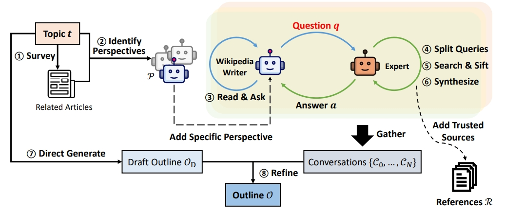

# deep search
- [X] storm paper
- [ ] jina
- [ ] openai
- [ ] grok
- [ ] Manus

## 前身
### STORM
**research工作流**
pre-writing stage（搜索query相关的信息生成大纲） + writing stage（xxx）

**pre-writing stage**
1. 发现当前query（即topic）的多个视角【提升研究、搜索的全面性】
2. 模拟不同视角的wiki作者向专家（掌握可信源）提出问题 + 回答的对话【收集问答形式的信息】
3. 用收集的信息 + 草稿大纲 生成 新大纲  

评价方法：利用 NER + embedding相似度评价模型生成的大纲 和 真实大纲的差异

**writing stage**
1. 每个章节单独生成正文
2. 利用**pre-writing stage**阶段收集的references，完成写作

**具体的流程**
1. topic -> related topic
2. related topic -> 相关wiki页面的目录
3. 相关wiki页面的目录 -> 多个视角（包括topic本身的基础视角）
4. 模拟生成wiki作者以某个视角和专家（可以搜索大量wiki页面）进行对话 -> （q1, a1, q2, a2, ..., qm, am） 【q由wiki作者生成】 
    a. query分解【由专家进行分解】  
    b. 专家利用URL进行可信源的判断，获取可信内容进行回答
    c. 可信源被添加到references（搜索到的网页正文）中，用于正文写作
4. 草稿大纲 + 对话 -> 优化大纲
5. 用embedding检索和各级title相关的文档（文档来自references）
6. 并行生成各章节的正文
7. 合并所有章节去除各章节中重复的部分

### co-storm的改进

## deep reseach方案
### jina
> https://jina.ai/news/a-practical-guide-to-implementing-deepsearch-deepresearch/

#### DeepSearch vs DeepResearch
虽然很多人经常将 DeepSearch 和 DeepResearch 混为一谈，但在我们看来，它们解决的是完全不同的问题。DeepSearch 作为一个原子构建块，是 DeepResearch 所依赖的核心组件。另一方面，DeepResearch 专注于制作高质量、可读性强的长篇研究报告，这涉及一系列不同的要求：通过图表和表格来整合有效的可视化内容，用适当的章节标题来组织内容，确保子章节之间的逻辑流畅，在整个文档中保持术语一致性，消除章节之间的冗余，制作连接前后内容的流畅过渡。这些元素与核心搜索功能基本无关。  

#### prompt细节
使用XML效果好

#### 串行搜索
当search时，利用FIFO（先进先出）机制，新的query先搜索，然后将search res应用到后面的query中。我的理解是：生成了3个query，一个一个search，后面的query可以根据search res进行更改。

#### 查询改写
query改写非常重要，一个好的query能找到好的素材，进而完成好的报告。【我在研报写作中也觉得query十分重要，目前是利用人工标准数据，指导模型生成好的、适配于搜索接口的query】

#### 查询去重
jina最初使用LLM进行去重，但是发现很难控制去重程度；最终他们使用了embedding。

#### 爬取网页内容
除了完整的网页内容外，我们还会聚合搜索引擎返回的其他信息（URL 摘要等等）作为代理后续推理的额外知识。  
因为很多工作都会通过URL 摘要进行初步判断该素材是否可用

embedding的使用：利用embedding检索出最相关的切分后的网页文本。  
知识连贯：我们不能接受像 [1-2, 6-7, 9, 14, 17, ...] 这样组合散落句子的片段。更有用的知识片段应该遵循像 [3-15, 17-24, ...] 这样的模式 —— 始终保持文本连续。

#### 知识管理
以上下文的形式保存起来，输入到prompt中。因为LLM 都有很大的上下文窗口，我们选择不使用向量数据库。

#### 评价
JINA使用的是多维度打分（few shot），但是我们实验下来这种方法很差，还是对比评价效果更好，V2 和 V1比，同时还可以加入真实研报作为标准。

### 我们所用的开源方案
> https://github.com/deansaco/r1-reasoning-rag

### Webthinker

### 

