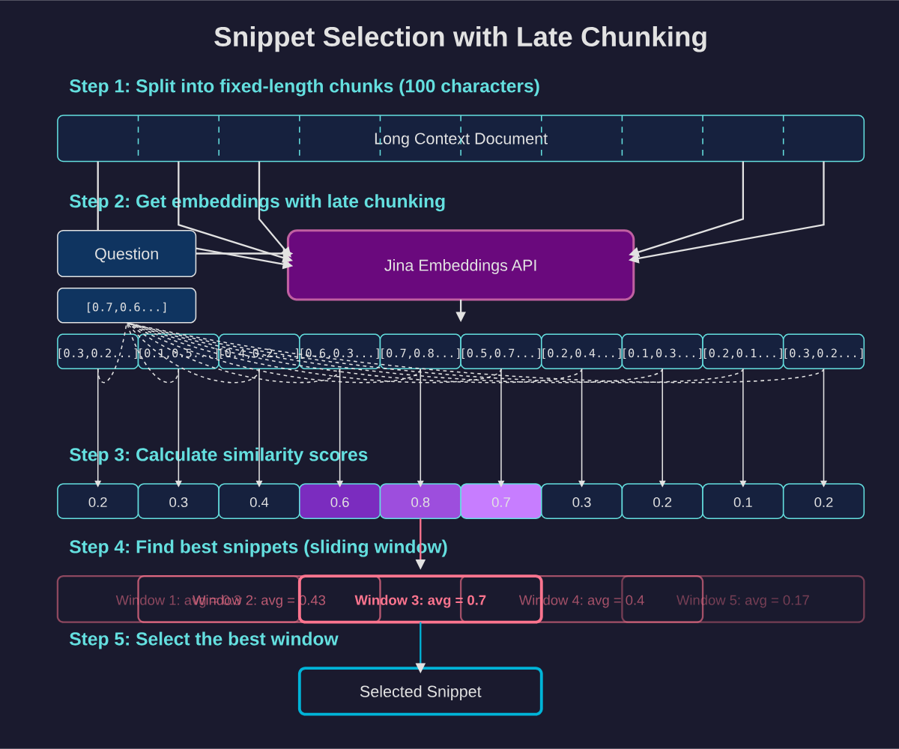

# deep search

## 前身
### STORM
**research工作流**
pre-writing stage（搜索query相关的信息生成大纲） + writing stage（xxx）

**pre-writing stage**
1. 发现当前query（即topic）的多个视角【提升研究、搜索的全面性】
2. 模拟不同视角的wiki作者向专家（掌握可信源）提出问题 + 回答的对话【收集问答形式的信息】
3. 用收集的信息 + 草稿大纲 生成 新大纲  

评价方法：利用 NER + embedding相似度评价模型生成的大纲 和 真实大纲的差异


**writing stage**
1. 每个章节单独生成正文
2. 利用**pre-writing stage**阶段收集的references，完成写作

**具体的流程**
1. topic -> related topic
2. related topic -> 相关wiki页面的目录
3. 相关wiki页面的目录 -> 多个视角（包括topic本身的基础视角）
4. 模拟生成wiki作者以某个视角和专家（可以搜索大量wiki页面）进行对话 -> （q1, a1, q2, a2, ..., qm, am） 【q由wiki作者生成】 
    a. query分解【由专家进行分解】  
    b. 专家利用URL进行可信源的判断，获取可信内容进行回答
    c. 可信源被添加到references（搜索到的网页正文）中，用于正文写作
4. 草稿大纲 + 对话 -> 优化大纲
5. 用embedding检索和各级title相关的文档（文档来自references）
6. 并行生成各章节的正文
7. 合并所有章节去除各章节中重复的部分

### co-storm的改进
引入了协作对话机制，并采用轮次管理策略，实现流畅的协作式 AI 学术研究。

多代理对话：Co-STORM 采用多个语言模型（LM）代理，每个代理都拥有与当前主题相关的独特专业知识。这些代理进行回合制对话，根据实时网络搜索和检索提问并提供答案。一个特殊的“主持人”代理确保对话探索新的方向并且不会变得重复。

动态思维导图：为了帮助用户跟踪不断发展的对话并组织已发现的信息，Co-STORM 维护一个分层思维导图，该导图会随着新信息的讨论而自动更新。这种结构既可以作为对话过程中的导航辅助，也可以作为生成全面最终报告的基础。

混合主动式交互：用户可以被动地观察对话，也可以通过插入问题或将讨论引导至特定感兴趣的领域来主动参与。当用户不干预时，系统会自动生成下一个对话回合，从而保持探索过程的势头。

## deep reseach方案
### jina
> https://jina.ai/news/a-practical-guide-to-implementing-deepsearch-deepresearch/

#### DeepSearch vs DeepResearch
虽然很多人经常将 DeepSearch 和 DeepResearch 混为一谈，但在我们看来，它们解决的是完全不同的问题。DeepSearch 作为一个原子构建块，是 DeepResearch 所依赖的核心组件。另一方面，DeepResearch 专注于制作高质量、可读性强的长篇研究报告，这涉及一系列不同的要求：通过图表和表格来整合有效的可视化内容，用适当的章节标题来组织内容，确保子章节之间的逻辑流畅，在整个文档中保持术语一致性，消除章节之间的冗余，制作连接前后内容的流畅过渡。这些元素与核心搜索功能基本无关。  

#### prompt细节
使用XML效果好

#### 串行搜索
当search时，利用FIFO（先进先出）机制，新的query先搜索，然后将search res应用到后面的query中。我的理解是：生成了3个query，一个一个search，后面的query可以根据search res进行更改。

*但我们的研报写作方案是并行搜索*

#### 查询改写
query改写非常重要，一个好的query能找到好的素材，进而完成好的报告。【我在研报写作中也觉得query十分重要，目前是利用人工标准数据，指导模型生成好的、适配于搜索接口的query】

#### 查询去重
jina最初使用LLM进行去重，但是发现很难控制去重程度；最终他们使用了embedding。

#### 爬取网页内容
除了完整的网页内容外，我们还会聚合搜索引擎返回的其他信息（URL 摘要等等）作为代理后续推理的额外知识。  
因为很多工作都会通过URL 摘要进行初步判断该素材是否可用

embedding的使用：利用embedding检索出最相关的切分后的网页文本。  
知识连贯：我们不能接受像 [1-2, 6-7, 9, 14, 17, ...] 这样组合散落句子的片段。更有用的知识片段应该遵循像 [3-15, 17-24, ...] 这样的模式 —— 始终保持文本连续。



#### 知识管理
以上下文的形式保存起来，输入到prompt中。因为LLM 都有很大的上下文窗口，我们选择不使用向量数据库。

独立设置Memory进行知识存储，并利用R1输出Memory操作来进行知识更新  

JINA设置了Add Delete 但是没有Replace，因为他们发现模型过度依赖Replace

```python
# Status: IN_PROGRESS
# Memory: 
# <nuz-032>Potential warm May destinations: Malaga (Spain), Crete (Greece), Algarve (Portugal)</nuz-032>
# <xwj-969>URL to scrape for Crete hotel details: <https://www.tripadvisor.com/HotelsList-Crete-Beachfront-Cheap-Hotels-zfp13280541.html></xwj-969>
# <vsc-583>URL to scrape for flight details: <https://www.expedia.com/lp/flights/fra/her/frankfurt-to-heraklion></vsc-583>

'''R1生成的结果，对记忆进行更新'''
r1_output = {
	"memory_updates": [
	  {"operation": "add", "content": "Round-trip flight from Berlin to Tenerife in May 2025 ranges from €59.99 to €200 round-trip as per the Skyscanner and Iberia sources."},
	  {"operation": "delete", "id": "nuz-032"},
	  ...
	]
}

```

#### 评价
JINA使用的是多维度打分（few shot），但是我们实验下来这种方法很差，还是对比评价效果更好，V2 和 V1比，同时还可以加入真实研报作为标准。

### 我们所用的开源方案
> https://github.com/deansaco/r1-reasoning-rag


### Webthinker

#### Deep Web Explorer

#### Autonomous Think-Search-and-Draft
（1）写草稿
（2）check 当前的文章
（3）编辑文章

#### RL-based training strategies
基于推理的准确率、工具的使用情况、最后的输出，使用DPO在线学习

### kimi-researcher
> https://moonshotai.github.io/Kimi-Researcher/
> https://www.zhihu.com/question/1919712376204256921/answer/1920925901035644513

利用RL方法，训练了一个端到端的Agent模型，完成自主search和reasoning，而不再是现在研报写作的workflow模式。**端到端代理强化学习训练单一Agent模型来全面解决问题**：给定一个查询，agent会探索大量可能的策略，获得正确解决方案的奖励，并从完整的轨迹中进行学习。与 SFT 不同，它能够自然地处理长时间的、基于策略的推理，并适应不断变化的工具和环境；与workflow方法不同，所有技能（规划、感知和工具使用）都是一起学习的，无需手工制定规则或工作流模板。


#### 三大工具
1. 一个实时的内部搜索工具

2. 一个web text-based browser工具

3. 代码编写工具

#### 数据集
1. 数学和代码推理：Kimi-Researcher 学习使用工具集来解决此类问题，而不仅仅是单纯地运用思路链。

2. hard 搜索：Agent必须在上下文约束内迭代搜索、综合和推理才能得出有效答案的场景。通过Case案例，研究发现了这些硬搜索任务如何推动更深层次的规划和强大的工具增强推理策略的出现。

为了大规模构建这套多样化的问答集，我们开发了一套全自动流程，能够在极少的人工干预下生成并验证大量问答对，从而以前所未有的规模确保多样性和正确性。

#### RL的奖励
1. 格式奖励：如果在推理的路径中包含无效工具调用或上下文/迭代超过最大限制，模型将受到惩罚。

2. 结果正确性奖励：对于没有格式错误的推理路径，奖励基于模型的答案与基本事实之间的比较。

3. 为了鼓励模型发现更短、更有效的探索路径，路径奖励 reward = r * t^(T-i)，其中 0 < t < 1，T是步骤的数量

#### 上下文管理

长step的推理路径，可能涉及大量的观察上下文（来自于search），而缺乏内存管理的简单智能体很容易在 10 次迭代内就超出限制。为了解决这个问题，我们设计了一种上下文管理机制，允许模型保留重要信息并丢弃不必要的文档，从而将单次推出轨迹的迭代次数扩展到 50 次以上。

#### 涌现的新能力

1. 当出现来自多个来源的相互矛盾的信息时，Kimi-Researcher 会通过迭代假设改进和自我修正来解决不一致问题。

2. Kimi-Researcher 表现出谨慎和严谨：即使对于看似简单的问题，它也会在回答之前刻意进行额外的搜索并交叉验证信息。

3. 模型在遇到一个极度专业的问题、现有信息无法解答时，它会“思考”并产生一个action——“给这篇论文的作者发邮件寻求解答”。
