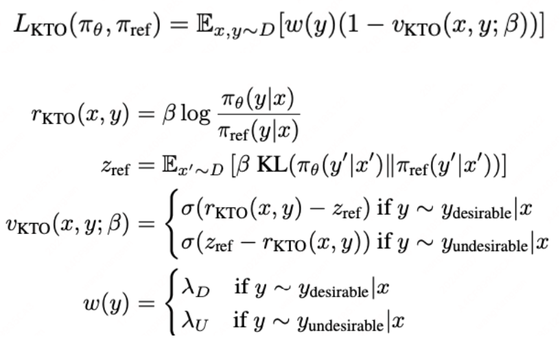
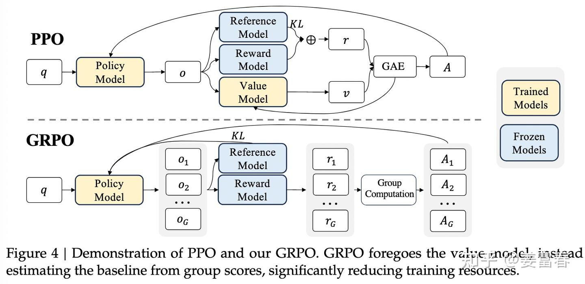
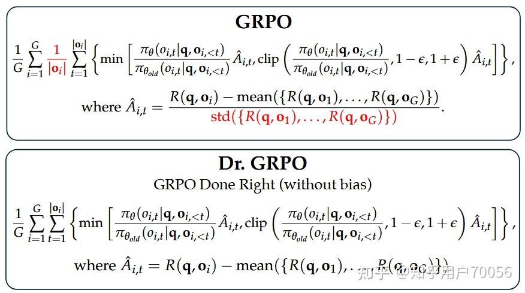

先明确一个概念——策略（policy），它就是RLHF中的“学生”，policy由两个模型组成，一个叫做演员模型（Actor）【演员就是我们想要训练出来的大模型。】，另一个叫做评论家模型（Critic）【评论家是强化学习的辅助模型】，一个负责决策，一个负责总结得失。Reward model则是RLHF中的“老师”，指导policy（“学生”）的更新。

强化学习的三个过程：采样 -> 反馈 -> 学习

# PP0
> https://zhuanlan.zhihu.com/p/645225982

```python
'''
ref_policy_model —— 基准模型（原模型，不更新参数）
policy_model —— Actor（输入一段上下文，它将输出下一个token的概率分布） + Critic（评论家是强化学习的辅助模型，输入一段上下文，它将输出下一个token的“收益”。）
reward_model —— reward模型（上帝，它说的都是对的，不更新参数）
'''

policy_model = load_model()
ref_policy_model = policy_model.copy() # 基准模型

for k in range(20000):
    # 采样m个prompt
    prompts = sample_prompt()
    ## response：m个字符串，每个字符串包含n个token
    ## old_log_probs：演员输出的 m x n 的张量，包含了response中每次生成token的概率的对数 
    ## old_values：评论家输出的 m x n 的张量，包含了response中每次生成token时评论家Critic预估的收益
    responses, old_log_probs, old_values = respond(policy_model, prompts)
    
    # 反馈（计算奖励）
    ## 奖励大模型【老师】（reward_model） 对 问答序列（data） 进行打分，指导模型的改进方向
    ## scores：奖励模型输出的 m x 1 的张量，仅在最后一个位置上生成整个prompt+response的奖励
    scores = reward_model(prompts, responses)
    ref_log_probs, _ = ref_policy_model.forward_pass(prompts, responses)
    ## ref_log_probs 被用来和old_log_probs，计算KL散度然后增加到reward中，防止模型更新偏离原始模型太多
    rewards = reward_func(scores, old_log_probs, ref_log_probs)
    
    # 学习（更新参数）
    ## advantages（优势） = return（实际收益）【从生成第j个token开始到生成第N个token为止，所能获得的所有奖励的总和。】 - old_values（预期收益）
    ## advantage_func：对rewards进行累加得到returns, returns减去old_values得到advantage
    returns, advantages = advantage_func(rewards, old_values)

    for epoch in range(epoch):
        log_probs, values = policy_model.forward_pass(prompts, responses)
        ## actor_loss用来训练Actor，在advantages为正的地方，让模型学习增大输出该token的概率
        def actor_loss_func(advantages, old_log_probs, log_probs):
            # 首先计算新旧策略的动作概率比，即重要性采样
            # 作用：
            # 当生成某个token的概率（old_log_probs）已经很大了的时候，即便这个动作的优势很大（advantages），也不要再使劲增大log_probs的概率了。或者更通俗地说，就是步子不要迈得太大。

            ratio = torch.exp(log_probs - old_log_probs)
            loss = - advantages * ratio
            ## 此处还有一个裁剪的计算，暂时没有写到代码中
            return loss

        actor_loss = actor_loss_func(advantages, old_log_probs, log_probs)
        ## critic_loss用来训练Critic，让它输出的预期收益(values)逼近实际收益(returns)
        critic_loss = critic_loss_func(returns, values)

        ## 合并loss
        loss = actor_loss + 0.1 * critic_loss
        ## 在实际过程中，actor和critic来自同一个LLM，评论家就是将演员模型的倒数第二层连接到一个新的全连接层上。除了这个全连接层之外，演员和评论家的参数都是共享的。因此更新policy_model即可
        train(loss, policy_model.parameters())
```

## 采样
模型接受prompt，生成response。

## 反馈
prompt + response送入奖励模型得到奖励分数。其中还会利用训练模型（Actor）和基准模型计算KL散度，防止模型更新太大。

过程奖励：KL散度就是过程奖励，在我们给予最终奖励之前，最好也对它的“标新立异”给予少量的惩罚

结果奖励：reward模型对整个response的打分就是结果奖励

下面就是代码中的reward_func()：  
$reward[i,j]= \begin{cases} ref\_log\_prob[i,j]-old\_log\_prob[i,j], & j<N \\ ref\_log\_prob[i,N]-old\_log\_prob[i,N]+score, & j=N & \end{cases}$

其中i是第i个prompt和response，j是序列中第j个token

## 学习
**强化优势动作**是PPO学习阶段的焦点。在深入探讨之前，我们首先要明确一个关键概念——优势。此处，我们将优势定义为“实际获得的收益超出预期的程度”。【优势 = 实际收益（return） - 预期收益（value）】

对于LLM而言，为第i个response生成第j个token的实际收益就是：从生成第j个token开始到生成第N个token为止，所能获得的所有奖励的总和。我们用return来表示实际收益。预期收益又该如何计算呢？记得我们在“采样”阶段提到过，policy包含演员模型和评论家模型，其中后者是用来预估收益的。其实，当时说的收益old_values就是现在我们想要计算的预期收益。评论家会为response中的每个token计算一个预期收益，第i个response的第j个token的预期收益记为values[i, j]

$\mathrm{return}[i,j]=\sum_{k=j}^N\mathrm{reward}[i,k]=\mathrm{reward}[i,j]+\ldots+\mathrm{reward}[i,N]$

**强化优势动作**表示：如果在上下文（context）中生成了某个token，并且这个动作的优势很高，那么我们应该增加生成该token的概率（预期你考80分。但你实际考了100分，说明你的学习方法是有效的，应该继续下去）。

### Loss

$a = return(实际收益，来自奖励模型) - old\_value(预期收益，来自评论家模型)$

Actor Loss: 见上述代码中的函数actor_loss_func

当优势大于0时，概率越大，loss越小；因此优化器会通过增大生成该token的概率（即强化优势动作）来减小loss  
当优势小于0时，概率越小，loss越小；因此优化器会通过减小生成该token的概率（即弱化劣势动作）来减小loss

Critic Loss:  
$\text { critic\_loss }= \frac{1}{2N} \sum_{j=1}^{N} (return[j] - value[j])^2 $ 

# DPO
DPO相比于PPO是通过引入人类偏好数据，将在线策略优化，修改为通过二元交叉熵直接拟合人类偏好数据的**离线策略**，不再属于强化学习范畴，**属于有监督学习**。

## 与PPO相比优缺点
优点：
1. 不需要奖励模型，只需reference模型
2. 稳定性高
3. Loss简单，训练难度低，Loss如下：
$\mathcal{L}_{\mathrm{DPO}}\left(\pi_{\theta} ; \pi_{\mathrm{ref}}\right)=-\mathbb{E}_{\left(x, y_{w}, y_{l}\right) \sim \mathcal{D}}\left[\log \sigma\left(\beta \log \frac{\pi_{\theta}\left(y_{w} \mid x\right)}{\pi_{\mathrm{ref}}\left(y_{w} \mid x\right)}-\beta \log \frac{\pi_{\theta}\left(y_{l} \mid x\right)}{\pi_{\mathrm{ref}}\left(y_{l} \mid x\right)}\right)\right]$

缺点：
1. 容易过拟合：DPO由于缺少reward model的泛化，因此容易直接拟合人类偏好数据，造成过拟合。
2. 需求更大标注数据量：相比PPO等，DPO的效果表现更依赖标注数据量。
3. 多任务适配较难：由于DPO仅依赖数据，所以如果需要进行多任务的对比，则需要从头标注涉及到多个维度的数据，但是在线策略的方法可以通过单个维度的数据，训练不同的多个reward model，引入多维度的奖励。

## 流程
1. 对每个prompt，采样两个结果并进行人工标记偏好顺序，构建离线偏好数据集
2. 通过最小化Loss，优化LM

# KTO
> https://zhuanlan.zhihu.com/p/1907949654739513685  

**DPO的缺点：** 考虑到dpo的loss是优化margin，也就是chosen-rejected的差。可能会存在两边同时上升/下降，但margin仍然增加的情况。那么考虑固定一边，就可以优化另一部分的效果。比如rejected为0，那么优化margin就变成了优化chosen，固定chosen同理。



此时从reward优化方式变成了类似sft的优化方式（不再需要偏好数据），因为接近SFT方式，所以可以在base模型上直接KTO训练，但相比SFT来说，KTO需要有ref_model。  

在代码中设置kto_tag，若为true，则chosen数据保持不变，rejected_logits设置为0，反过来则一样。从而使得独立处理两种数据均有SFT效果，可以对正负样本不均衡的数据进行训练。

# GRPO
> https://zhuanlan.zhihu.com/p/24816372882

GRPO原理比较简单，相对于PPO同时在线四个模型，GRPO做了简化，裁剪掉了Critic Model。GRPO中计算Advantage的过程，是一种基于组内相对优势的计算方式。具体来说，对于每个问题，通过Reference Model采样一组结果，再通过Reward Model计算一组结果的打分 。GRPO计算每个采样 的Advantage就是对一组Reward Score做规范化处理（对每个采样的奖励 减去一组值的均值，再比上一组值的方差），如下公式：  

$A_i=\frac{r_i-\mean(\{r_1,r_2,\cdots,r_G\})}{\mathrm{std}(\{r_1,r_2,\cdots,r_G\})}$




## 优点：  
1. 解决了计算优势值时需要同时依赖奖励模型（reward model）和价值模型（value model）的问题，成功移除了value model（价值模型），显著降低了推理时的内存占用和时间开销。  
2. advantage是response级别的，而不是token级别的。在代码实现过程中会copy。这样做适合于文本序列，不必追求对每个token的奖励。  
3. 内卷式对比生成优势，只关注排名差异，这更符合奖励模型的相对判断能力。

# DAPO
> https://zhuanlan.zhihu.com/p/31157035727
> https://www.alphaxiv.org/zh/overview/2503.14476

## GRPO的问题：
1. 熵坍缩【某些低概率token的出现次数很小，模型无法学习多样性能力】是其中一个最显著的障碍。在标准的强化学习训练中，随着模型收敛到高概率标记，策略会迅速变得确定性，**从而严重限制了对替代推理路径的探索**。这种过早的收敛阻碍了发现对于复杂数学推理至关重要的多样化解决方案策略。  
2. 梯度饥饿发生在批次样本提供不足学习信号时。在数学推理任务中，提示通常会产生完全正确或完全不正确的响应。**在GRPO的组相对优势计算下，这种统一的结果导致梯度为零**，有效浪费了计算资源并减慢了收敛速度。  
3. 长度偏差和奖励噪声进一步使训练复杂化。传统的损失计算不区分响应长度，对所有响应一视同仁，可能低估了有价值的长推理链。此外，截断的响应常常受到严厉惩罚，这可能会**惩罚有效但冗长的推理过程**，从而在奖励信号中引入噪声。

## DAPO的改进
1. 动态采样：消除零梯度样本，过滤掉组内样本奖励一样的样本。  
2. token-level损失：GRPO是基于样本维度进行计算的，但是这样会导致超长样本学得不好。 而DAPO的做法会给长回答一个相对更大的loss。  

    $L_{long}=\frac{\sum_{i=1}^{N_1}loss_{i,1}}{2N_1}$  
    $L_{short}=\frac{\sum_{i=1}^{N_2}loss_{i,1}}{2N_2}$

    $L_{GRPO} = 1 / 2 * (L_{long} + L_{short})$  
    $L_{DAPO} = 1 / (N_1 + N_2) * (L_{long} + L_{short})$  

3. 超长sequence奖励：在之前超长的部分会直接截断，并给一个很大的惩罚。DAPO会给一个软惩罚，根据超出的长度进行一个奖励的缩小

4. clip-higher：对clip的两个边界分别设置不同的 $\epsilon$ 来控制，其中上边界改变为一个较大的值来鼓励探索，新策略token的允许概率会更大。  
    $1 - e < \frac{p新策略}{p旧策略} < 1 + e $

5. 去掉KL，没有必要和ref model一样。

# DrGRPO

1. 在计算reward的时候去掉了回答长度的平均。**目的：和DAPO中token-level loss的想法很像，几乎一致**

2. 在计算advantage的时候去掉了标准差。**目的：对于太简单或者太难的问题，标准差会很低，导致在策略更新的时候被赋予更大的权重，从而产生优化偏差。**




# BRPO

