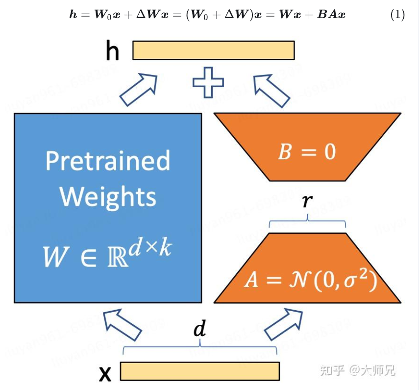

# 训练（微调）大模型

## 拒绝采样

## LORA
LoRA的本质就是用更少的训练参数【低秩，通过一个较低维度的表示来近似表示一个高维矩阵】来近似LLM全参数微调所得的增量参数，从而达到使用更少显存占用的高效微调。

LoRA的做法是在LLM的某些矩阵（ $\boldsymbol{W} \in \mathbb{R}^{d \times k}$ ）旁插入一个和它并行的新的权值矩阵（$\Delta \boldsymbol{W} \in \mathbb{R}^{d \times k}$），但是因为模型的低秩性的存在，我们可以将 $\Delta \boldsymbol{W}$拆分成降维矩阵（$\boldsymbol{A} \in \mathbb{R}^{r \times k}$） 和升维矩阵（$\boldsymbol{B} \in \mathbb{R}^{d \times r}$），其中r很小，从而实现了以极小的参数数量训练LLM。

# 推理大模型

## 参数

### TOP-P
在每一步，只从累积概率超过某个阈值 p 的最小单词集合中进行随机采样，而不考虑其他低概率的单词。这种方法也被称为核采样（nucleus sampling），因为它只关注概率分布的核心部分，而忽略了尾部部分。
例如，如果 p=0.9，那么我们只从累积概率达到 0.9 的最小单词集合中选择一个单词，而不考虑其他累积概率小于 0.9 的单词。这样可以避免采样到一些不合适或不相关的单词，同时也可以保留一些有趣或有创意的单词。

### TOP-K
选择概率排名前K个的token

### 温度
语言模型首先根据之前的上下文计算词汇表中每个词的非归一化对数概率。
然后将这些对数概率除以 Temperature 值：log_prob_scaled = log_prob / temperature
经过 Temperature 缩放后，应用 softmax 函数将这些缩放后的对数概率转换为总和为 1 的概率分布。
所以，Temperature < 1，这会使得对数概率更极端（即更高的对数概率更高、更低的对数概率更低）；Temperature > 1，它则会起到相反的作用，使得对数概率变得不那么极端，趋向于 0。

如果Temperature = 0，模型每次输出的内容都会是一样的。
