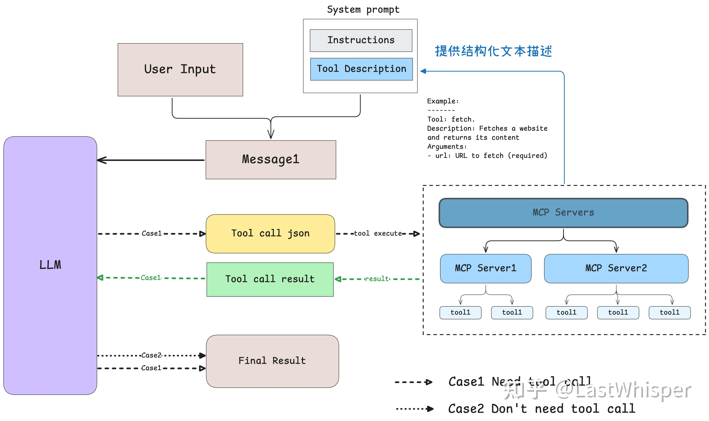

# 传统Agent
## ReACT
和deepseek一样，让模型输出思考之后再行动，不过当时还没有推理模型。

prompt
thought（ReACT）
action

# MCP
Model Context Protocol，模型上下文协议



如下代码，模型是通过 prompt engineering，即提供所有工具的结构化描述和 few-shot 的 example 来确定该使用哪些工具。

```python
system_message = (
         "You are a helpful assistant with access to these tools:\n\n"
         f"{tools_description}\n"
         "Choose the appropriate tool based on the user's question. "
         "If no tool is needed, reply directly.\n\n"
         "IMPORTANT: When you need to use a tool, you must ONLY respond with "
         "the exact JSON object format below, nothing else:\n"
         "{\n"
         '    "tool": "tool-name",\n'
         '    "arguments": {\n'
         '        "argument-name": "value"\n'
         "    }\n"
         "}\n\n"
         "After receiving a tool's response:\n"
         "1. Transform the raw data into a natural, conversational response\n"
         "2. Keep responses concise but informative\n"
         "3. Focus on the most relevant information\n"
         "4. Use appropriate context from the user's question\n"
         "5. Avoid simply repeating the raw data\n\n"
         "Please use only the tools that are explicitly defined above."
     )
```


# Agent智能体
> https://zhuanlan.zhihu.com/p/1892489650469323191

25.7 目前的智能体方案，以强化学习、工具构建、memory管理、训练数据合成、评价系统等维度进行设计与分析

## 训练方法与数据集
RL 数据简单

非RL 类似webthinker 通过最终结果判断，取最佳和最差做微调训练

## 工具集合
search
write
check【对写完的文章进行检查】
read
deep think
attack【对目前的结论进行攻击，引导模型差缺补漏】

## memory管理
long long COT  
knowledge  

## 评价
ground truth【标准答案】 + open【开放评价】

