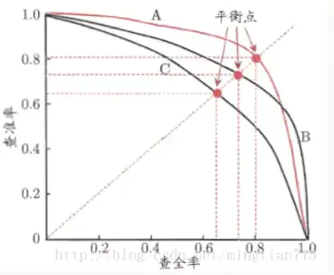
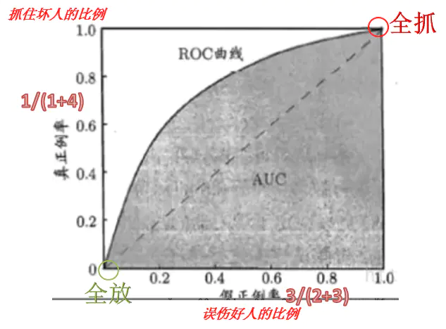
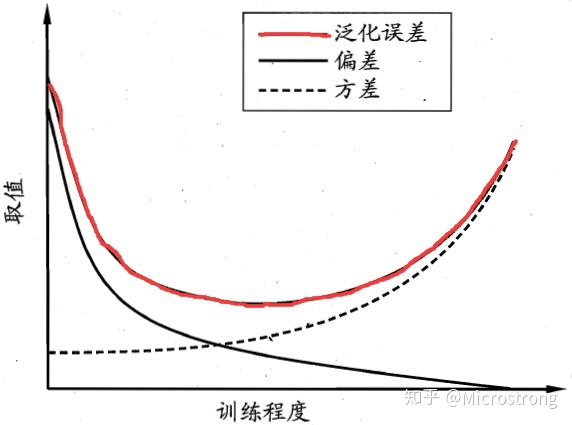

[TOC]

# 模型能力评估指标

## K折验证

将数据集切分为K分，做K次训练，每次训练留出不同的一份做验证集。将K次训练得到的结果平均化即为最终的结果。

这种方法可以充分考虑数据，将valid数据集也加入到模型中进行训练。同时，因为是多个模型的平均结果，也是一种ensemble的方法，可以降低模型过拟合造成的影响。

## ACC

$$
Accuracy = 预测正确样本数 / 样本总数
$$

## Precision、Recall、F1值

|           | 预测1                     | 预测0                     |
| --------- | ------------------------- | ------------------------- |
| **真实1** | True Positive(TP 真正例)  | False Negative(FN 假负例) |
| **真实0** | False Positive(FP 假正例) | True Negative(TN 真负例)  |

$$
\begin{aligned}
Precision &= \frac{TP}{TP+FP}，预测为正的样本中真实为正的比例 \\
Recall &= \frac{TP}{TP+FN}，真实为正的样本中预测为正的比例 \\
F_\beta &= \frac{(1+\beta^2)\times P \times R}{\beta^2 \times P+R}，\beta > 1时Recall更重要，反之Precision更重要
\end{aligned}
$$

## P-R

对于一个二分类任务，我们根据所有样本的预测正例的概率从高到低进行排序，按照这个顺序逐个将样本预测为正例。这样，每次预测正例数目加一，每次都可以计算出TP、TN、FP、TN四个值，以Precision为纵轴、Recall为横轴就是P-R曲线。

Precision = Recall的点，被称作平衡点，用于比较那个模型绘制的曲线更好。

## ROC、AUC

若以$TPR=\frac{TP}{TP+FN}$为纵轴【真实为1的样本中预测为1的占比，**真正例率**】，$FPR=\frac{FP}{FP+TN}$为横轴【真实为0的样本中预测为1的占比，**假正例率**】则是ROC曲线。【随着预测为1的样本在不断增大，TPR和FPR就会渐渐从0变为1】

------

AUC 是 ROC曲线与坐标轴之间的面积，下面我们解释AUC的意义：

首先，我们观察一下ROC图中的对角线：**它表示的意义是任何一个样本，分类器预测为1的概率都是相等的**（模型没有分类能力，就是在瞎猜）

而我们希望分类器达到的效果是：对于真实类别为1的样本，分类器预测为1的概率【TPR】要大于真实类别为0而分类器却预测类别为1的概率【FPR】，因此大部分的ROC曲线都如下图所示。

现在有一个特别好的模型将所有的正样本排序在所有的负样本前面，此时ROC曲线，先从(0,0)走到(0,1)，再从(0,1)走到(1,1)，那么AUC的值就是1，可以直观理解为：**给定一个正样本和一个负样本，在100%的情况下，模型对正样本的打分高于对负样本的打分**。

## 偏差与方差

给定一堆来自同一分布的训练集，他们的样本数量是一样的。假设训练集有5份，我们使用这5份训练集$D_i$训练5个模型。

对于一个测试集中的样本，5个模型预测的结果算均值得到$\bar f(x)$。

方差定义：不同训练集训练的模型预测结果$-\bar f(x)$ 的平方均值。**方差反映了不同数据对训练结果的干扰情况**
$$
var(x) = \frac{\sum_{i=1}^{5}(f(x;D_i) - \bar f(x))^2}{5}
$$
偏差定义：$\bar f(x)$与真实结果之间的差异，**偏差反映了学习算法的期望预测与真实结果的偏离程度**
$$
bias(x) = \bar f(x) - y
$$
泛化误差 = 偏差$^2$ + 方差 + 误差（公式推导过程省略） 

给定一个任务，为了取得最好的泛化性能，我们需要一个拟合能力强【偏差】且数据扰动影响较小【方差】的模型。

欠拟合阶段：模型拟合能力差，偏差大；模型训练不充分，训练数据不同而导致的差异没有被模型捕捉，方差小

过拟合阶段：模型拟合能力强，偏差小；但模型过分训练，捕捉到了不同训练数据其各自的局部规律，导致每个模型的预测结果差距大，方差大

例如样本真实值为4.4：模型前期预测结果为[3.1, 3.2, 3.3, 3.4, 3.5]  -> 中期为 [4, 4.2, 4.4, 4.6, 4.7] -> 后期为[2, 3, 4.4, 5.6, 7]
