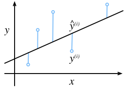
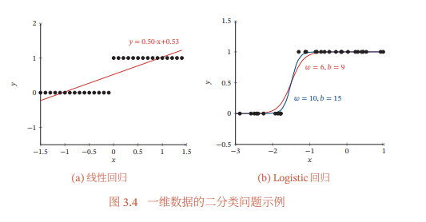

[TOC]

# 线性回归

给定输入$x$、输出$y$，找到$y$和$x$之间的线性关系。例如下面的一些样本，找到面积和房龄 与 房价的关系：

| 面积$x1$ | 房龄$x2$ | 房价$y$ |
| -------- | -------- | ------- |
| 100      | 1        | 100     |
| 50       | 2        | 53      |

为了求解样本输入和输出之间的线性关系，我们可以建立一个模型(线性方程)：$y = \theta_1x1 + \theta_2x2 + b$，然后求解出$x1,x2,b$的值，使得模型预测结果(prediction)和真实值(label)之间的误差$\epsilon$尽可能小。

对于数据集中的每个样本$i$，预测值$\hat y^{(i)}$和真实值$y^{(i)}$之间总会存在着一个误差，换句话说就是不存在一条完美拟合所有样本的直线（模型参数）。

$$
\begin{aligned}
y^{(i)} &= \hat y^{(i)} + \epsilon^{(i)} \\
&= \theta_1x1^{(i)} + \theta_2x2^{(i)} + b + \epsilon^{(i)} \\ 
&= \theta^\top X^{(i)} + b + \epsilon^{(i)} \\
我们将右式进行合并&，即将\theta和X进行矩阵增广\\
&= (\theta;b)^\top (X^{(i)};1) + \epsilon^{(i)}
\end{aligned}
$$

误差可以被视为一种噪声（比如：人在数百元大钞时，正常应该有几个张百元RNB就得到多少钱，但是人总会有**数多数少**的情况，那么这个**数多数少**就是噪声，所有的数据集中都会存在着一些噪声）。我们可以对误差（噪声）的分布假设为**均值为0，方差为$\sigma^2$的正态分布**，于是得到下式：
$$
\begin{aligned}
P(\epsilon^{(i)}) &= \frac{1}{\sqrt{2 \pi \sigma^2}} \exp(-\frac{(\epsilon^{(i)})^2}{2 \sigma^2}) \\
&= \frac{1}{\sqrt{2 \pi \sigma^2}} \exp(-\frac{(y^{(i)} - \theta^\top X^{(i)} - b)^2}{2 \sigma^2}) \\
P((\theta;b)^\top (X^{(i)};1) + \epsilon^{(i)}|X^{(i)};(\theta;b)) &= \frac{1}{\sqrt{2 \pi \sigma^2}} \exp(-\frac{(y^{(i)} - \theta^\top X^{(i)} - b)^2}{2 \sigma^2}) \\
P(y^{(i)}|X^{(i)};(\theta;b)) &= \frac{1}{\sqrt{2 \pi \sigma^2}} \exp(-\frac{(y^{(i)} - \theta^\top X^{(i)} - b)^2}{2 \sigma^2}) \\
likelihood((\theta;b)|X^{(i)};y^{(i)}) = P(y^{(i)}|X^{(i)};(\theta;b)) &= \frac{1}{\sqrt{2 \pi \sigma^2}} \exp(-\frac{(y^{(i)} - \theta^\top X^{(i)} - b)^2}{2 \sigma^2}) \\
对于一个数据集，&似然函数为所有样本的联合概率密度 \\
likelihood((\theta;b)) &= \prod_{i=1}^{n} P(y^{(i)}|X^{(i)};(\theta;b)) \\
-\log likelihood((\theta;b)) &= \sum_{i=1}^n \frac{1}{2} \log(2 \pi \sigma^2) + \frac{1}{2 \sigma^2} \left(y^{(i)} - \theta^\top X^{(i)} - b\right)^2
\end{aligned}
$$

于是最小化$\sum_{i=1}^N (y^{(i)} - \theta^\top X^{(i)} - b)$，就相当于最大化似然函数，即最小化均方损失就是以极大似然估计的方式寻找最优模型参数。

# 逻辑回归(对数几率回归)

线性回归不合适处理分类任务，比如二分类的输入可以是多种多样的，但是输出只有{0,1}。如下图所示，如果让线性模型硬去学习则很难找到很好拟合样本的模型参数。所以我们可以额外使用一个函数将线性模型的输出实数$z$转换为0-1值，这样就可以用来表示概率了。

这个额外使用的函数就是对数几率函数(logistic function)：
$$
y = \frac{1}{1+ e^{-x}}
$$
那么，我们就得到了对数几率回归的模型：
$$
y = \frac{1}{1+e^{-(w^\top x + b)}}
$$
