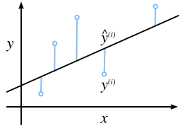
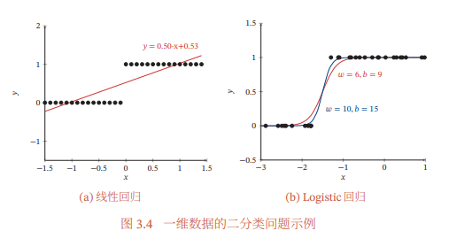

[TOC]

# 线性回归

给定输入$x$、输出$y$，找到$y$和$x$之间的线性关系。例如给定下面的两个样本，找到面积、房龄和房价的关系：

| 面积$x1$ | 房龄$x2$ | 房价$y$ |
| -------- | -------- | ------- |
| 100      | 1        | 100     |
| 50       | 2        | 53      |

为了求解样本输入和输出之间的线性关系，我们可以建立一个模型(线性方程)：$y = \theta_1x1 + \theta_2x2 + b$，然后求解出$\theta1,\theta2,b$的值，使得模型预测结果(prediction)和真实值(label)之间的误差$\epsilon$尽可能小。

$$
\begin{aligned}
y^{(i)} &= \hat y^{(i)} + \epsilon^{(i)} \\
&= \theta_1x1^{(i)} + \theta_2x2^{(i)} + b + \epsilon^{(i)} \\ 
&= \theta^\top X^{(i)} + b + \epsilon^{(i)} \\
我们将右式进行合并&，即将\theta和X进行矩阵增广\\
&= (\theta;b)^\top (X^{(i)};1) + \epsilon^{(i)}
\end{aligned}
$$

我们通常使用均方损失来作为线性回归模型的性能度量，接下来我们解释为什么使用均方损失。

误差$\epsilon$可以被视为一种噪声（比如：人在数百元大钞时，正常应该有几个张百元RNB就得到多少钱，但是人总会有**数多数少**的情况，那么这个**数多数少**就是噪声，所有的数据集中都会存在着一些噪声）。我们先验地认为误差（噪声）的分布为**均值为0，方差为$\sigma^2$的标准正态分布**，于是得到下式：
$$
\begin{aligned}
P(\epsilon^{(i)}) &= \frac{1}{\sqrt{2 \pi \sigma^2}} \exp(-\frac{(\epsilon^{(i)})^2}{2 \sigma^2}) \\
&= \frac{1}{\sqrt{2 \pi \sigma^2}} \exp(-\frac{(y^{(i)} - \theta^\top X^{(i)} - b)^2}{2 \sigma^2}) \\
P((\theta;b)^\top (X^{(i)};1)【常数】 + \epsilon^{(i)}|X^{(i)};(\theta;b)) &= \frac{1}{\sqrt{2 \pi \sigma^2}} \exp(-\frac{(y^{(i)} - \theta^\top X^{(i)} - b)^2}{2 \sigma^2}) \\
P(y^{(i)}|X^{(i)};(\theta;b)) &= \frac{1}{\sqrt{2 \pi \sigma^2}} \exp(-\frac{(y^{(i)} - \theta^\top X^{(i)} - b)^2}{2 \sigma^2}) \\
likelihood((\theta;b)|X^{(i)};y^{(i)}) = P(y^{(i)}|X^{(i)};(\theta;b)) &= \frac{1}{\sqrt{2 \pi \sigma^2}} \exp(-\frac{(y^{(i)} - \theta^\top X^{(i)} - b)^2}{2 \sigma^2}) \\
对于一个数据集，&似然函数为所有样本的联合概率密度 \\
likelihood((\theta;b)) &= \prod_{i=1}^{n} P(y^{(i)}|X^{(i)};(\theta;b)) \\
-\log likelihood((\theta;b)) &= \sum_{i=1}^n \frac{1}{2} \log(2 \pi \sigma^2) + \frac{1}{2 \sigma^2} \left(y^{(i)} - \theta^\top X^{(i)} - b\right)^2
\end{aligned}
$$

于是最小化$\sum_{i=1}^N (y^{(i)} - \theta^\top X^{(i)} - b)$，就相当于最大化似然函数，即最小化均方损失就是以极大似然估计的方式寻找最优模型参数。

# 逻辑回归(对数几率回归)

线性回归不合适处理分类任务，比如二分类的输入可以是多种多样的，但是输出只有{0,1}。如下图（左）所示，如果让线性模型硬去学习则很难找到很好拟合样本的模型参数。所以我们可以额外使用一个函数将线性模型的输出实数$z$转换为0-1之间的概率，这样的一条非线性函数就可以更好地拟合样本了，见下图（右）。

这个额外使用的函数就是对数几率函数(logistic function)，也就是Sigmoid函数：
$$
y = \frac{1}{1+ e^{-x}}
$$
那么，我们就得到了对数几率回归的模型：
$$
y = \frac{1}{1+e^{-(w^\top x + b)}} \\
\ln \frac{y}{1-y} = w^\top x + b
$$
现在，假设模型的输出值$y$为预测正例的概率，则$1-y$就是预测负例的概率，两者的比例$\frac{y}{1-y}$就是“几率”，这反映了输入$x$作为正例的可能性。$\ln \frac{y}{1-y} $就是对数几率，逻辑回归其实就是用线性回归模型的预测结果来逼近真实标记的对数几率。

给定样本$x^{(i)}$，模型将其预测为正负类的概率表示如下：【逻辑回归假设样本非正则负，服从伯努利分布】
$$
\begin{aligned}
预测为正类的概率&，P(正类 | x^{(i)}) = Sigmoid(x^{(i)}) \\
预测为负类的概率&，P(负类 | x^{(i)}) = 1-Sigmoid(x^{(i)}) \\
将正类设为1，负类设为0&，模型预测结果\hat y^{(i)}\in \{0, 1\} \\
合并得到预测为正负类的概率&，P(\hat y^{(i)}|x^{(i)}) = Sigmoid(x^{(i)})^{\hat y^{(i)}} \times (1-Sigmoid(x^{(i)}))^{1-\hat y^{(i)}}
\end{aligned}
$$
于是，逻辑回归模型的似然函数为：
$$
\begin{aligned}
likelihood((w;b)) &= \prod_{i=1}^{n} P(y^{(i)}|x^{(i)};(w;b))，y^{(i)}是样本的真实类别，要么是1要么是0 \\
\log likelihood((w;b)) &= \sum_{i=1}^{n} \left(y^{(i)}\log Sigmoid(x^{(i)}) + (1-y^{(i)})\log \left(1-Sigmoid(x^{(i)})\right)\right)
\end{aligned}
$$
这个似然函数就是二分类交叉熵（Binary Cross Entropy），于是逻辑回归的损失函数就是交叉熵损失函数。

# Softmax多分类回归

**如何设计多分类标签：**给一张图片分类为{猫，狗，猪}，此时真实值{猫，狗，猪}如何用计算机来表示？如果仿照线性回归任务将{猫，狗，猪}设置为{1，2，3}是不合理的。因为这蕴含着一层含义：1和3之间的差距比2和3之间的差距大，然而分类任务的类别之间是没有关系的、是**正交**的。所以使用正交的one-hot表示{[1,0,0], [0,1,0],  [0,0,1]}更加合理，同时one-hot表示也正好**表达了类别概率的信息**，如：[1,0,0]表示猫的概率为1，狗和猪的概率为0。

**使用什么模型：**我们依然可以利用**线性模型**输出这C个分类上每个分类的一个实数值。设C=3，此时有一个样本的输出为[-5, 0, 2]，我们可以使用$argmax$函数来决定该样本属于那个类别。

**将模型预测结果转为概率的必要性：**不过$argmax$函数无法进行损失计算，那使用MSE计算损失可以吗？假设一个样本的真实标签为[1,0,0]，模型预测的结果为[2,0,-8]，此时已经分类得不错了，**但是MSE的loss依然会用很大的惩罚将[2,0,-8]拉到[1,0,0]，这显然是不正确的**。而如果将模型预测的实数归一到0-1之间的概率，就能很好地解决这个的问题。同时，多分类回归也是逻辑回归（二分类回归）的一种推广，这个任务本身也是希望模型可以得到类别的预测概率的。

**如何将预测结果转为概率：**Softmax函数为我们提供了一个很好的计算多个类别概率的方法。

优点：1. 将实数值转为概率，并通过指数函数放大实数值之间的差异 2. 多个类别的预测概率加和为一
$$
\text{类别j的预测概率： } \mathrm{softmax}(o_j) = \frac{\exp(o_j)}{\sum_{k=1}^{C} \exp(o_k)} \\
\text{例如： } \mathrm{softmax}([-5,0,2]_{j=1}) = \frac{\exp(-5)}{\exp(-5) + \exp(0) + \exp(2)}
$$
**使用那个损失函数：**现在，我们得到预测输出概率$(\hat{y_{a}}, \hat{y_{b}}, \hat{y_{c}})$，其真实标签(1,0,0)。对于MSE损失，导数计算如下：
$$
\begin{aligned}
\hat y_{a} &= \frac{e^{z_{a}=w_ax+b}}{\sum_{k}e^{z_k}} \text{   ,   } L_{mse} = (\hat{y_a}-1)^{2} +  \hat{y_b}^{2} + \hat{y_c}^{2} \\
\frac{\partial L_{mse}}{\partial z_{a}} &= \frac{\partial L_{mse}}{\partial \hat{y_a}} \times \frac{\partial \hat{y_a}}{\partial z_a} + \frac{\partial L_{mse}}{\partial \hat{y_b}} \times \frac{\partial \hat{y_b}}{\partial z_a} + \frac{\partial L_{mse}}{\partial \hat{y_c}} \times \frac{\partial \hat{y_c}}{\partial z_a} \\
&= [(\hat{y_a}-1) \times \hat{y_a}(1-\hat{y_a}) - \hat{y_a}\hat{y_b}^2 - \hat{y_a}\hat{y_c}^2] \times 2
\end{aligned}
$$
假设此时标签$y_a$为1，若模型预测出的$\hat{y_{a}}$值很小趋近于0，说明错得离谱，此时应该以更大的梯度进行参数更新。但是MSE推到出的梯度却很小，显然不合理。而交叉熵的梯度计算更合理，当$\hat{y_{a}}$的值更小时，梯度更大。交叉熵导数计算如下：
$$
\begin{aligned}
L_{ce} &= -y_a \times \log \hat y_a \\
L_{ce} &= -1 \times \log \hat y_a \\
\frac{\partial L_{ce}}{\partial z_{a}} &= \frac{\partial L_{ce}}{\partial \hat{y_a}} \times \frac{\partial \hat{y_a}}{\partial z_a} \\
&= - \frac{1}{\hat y_a} \times \hat{y_a}(1-\hat{y_a}) \\
&= \hat{y_a}-1
\end{aligned}
$$
**从极大似然函数的角度解释交叉熵损失函数：**
$$
\begin{aligned}
P(y^{(i)}|x^{(i)};(w;b)) &= \prod_{k=1}^{C} Softmax(x_{k}^{(i)})^{y_{k}^{(i)}}，y^{(i)}是one-hot向量，y_k^{(i)}\in \{0,1\}表示k类别的概率 \\
likelihood((w;b)) &= \prod_{i=1}^{n} P(y^{(i)}|x^{(i)};(w;b)) \\
\log likelihood((w;b)) &= \sum_{i=1}^{n} \sum_{k=1}^{C} {y_{k}^{(i)}}\log Softmax(x_{k}^{(i)}) 
\end{aligned}
$$
于是，最大化似然函数就是最小化交叉熵损失
