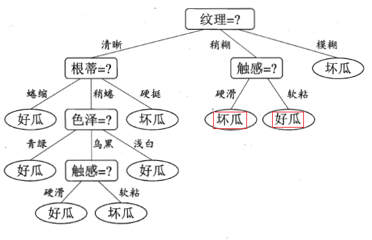

[TOC]

# 决策树

每个节点（叶子节点除外）都是一个决策，从根节点开始将样本不断地进行判断，直至叶子节点（分类结果）。

## 决策树与熵

现在给定4个小球，小球有大小和重量两个**属性**，预测小球的颜色：

| ID   | 大小 | 长度 | 类别 |
| ---- | ---- | ---- | ---- |
| 1    | 大   | 重   | 红色 |
| 2    | 大   | 轻   | 红色 |
| 3    | 小   | 轻   | 白色 |
| 4    | 小   | 重   | 白色 |

决策树学习的关键在于如何选择最优的划分属性。现在，我们要从{大小，重量}中选择一个最好的属性做根节点来进行样本划分，那么如何选择呢？我们使用熵来进行判断

在决策树算法中，给定样本集合D和其第k类（k=1,2,...,n）样本的占比，集合D的**信息熵**定义为：
$$
\begin{aligned}
Ent(D) &= -\sum_{k=1}^n p_k\log p_k \\
\end{aligned}
$$
让我们举例说明这个信息熵，现在有样本集合D1={ID1【红色】，ID3【白色】}和D2={ID1【红色】，ID2【红色】}，它们的信息熵分别是：
$$
\begin{aligned}
Ent(D1) &= -(\frac{1}{2}\log\frac{1}{2}+\frac{1}{2}\log\frac{1}{2}) = \log2\\
Ent(D2) &= -(\log1 + 0\log0) = 0
\end{aligned}
$$
D2的样本都是红色、D1的样本有红有白，D2的信息熵比D1的信息熵低，D2的“纯度”比D1的“纯度”更高！

------

直观上，我们就希望通过决策树的划分，**使决策树的分支节点所包含的样本尽可能属于同一类别【使样本纯度升高】**。给定样本集合D={1，2，3，4}，通过**大小**的属性划分得到纯度更高、熵更低的{1，2}和{3，4}；而通过**重量**的属性划分得到纯度更低、熵更高的{1，3}和{2，4}。

## 用熵选择最优属性

因为“纯度”越高，熵越低，所以我们可以使用**信息增量**（越往下划分，熵会越来越低，增量指的是当前熵-划分之后的熵）来挑选最优属性。假设离散属性a有V个可能的取值$\left\{a^1, a^2, ..., a^V\right\}$，若使用a来对样本集D进行划分，则会产生V个分支结点，其中第v个分支结点包含了D中所有在属性a上取值为$a^v$的样本，记为$D^v$。**信息增量**的定义如下：
$$
Gain(D,a) = Ent(D) - \sum_{v=1}^{V}\frac{|D^v|}{|D|}Ent(D^v)
$$
信息增量越大，则意味着使用属性a进行划分所获得的“纯度提升”越大，于是我们选择$a^*=argmaxGain(D,a)$

这样，不断迭代就可以找到一颗决策树了。

## 不同的熵指标，不同的决策树算法

- ID3 信息增益的缺点是偏向于选择特征更多的属性【如上图：根蒂的特征有3个，触感的特征有2个，算法选择了根蒂】。举例说明：如果小球的ID也是一种属性，那么选择ID作为划分属性得到的**信息增量**会是最大的。

- C4.5 信息增益率：
  $$
  \begin{aligned}
  Gain\_ratio(D,a) &= \frac{Gain(D,a)}{IV(a)} \\
  IV(a) &= -\sum_{v=1}^{V}\frac{|D^v|}{|D|}\log \frac{|D^v|}{|D|}
  \end{aligned}
  $$

- CART 基尼指数：
  $$
  \begin{aligned}
  Gini(D) &= 1 - \sum_{k=1}^{n}p_k^2，Gini(D)越小，说明数据集D的纯度越高 \\
  Gini\_index(D,a) &= \sum_{v=1}^{V}\frac{|D^v|}{|D|}Gini(D^v)
  \end{aligned}
  $$

# 剪枝

剪枝是决策树算法解决过拟合的主要手段，分为预剪枝【边建树边剪枝】和后剪枝【先建树后剪枝】两种策略

## 预剪枝

我们根据验证集进行预剪枝决策：决策的标准就是**看划分前后的泛化性能是否有提升**

我们依然使用小球这个例子，添加两个验证集样本和一个训练集样本

| ID      | 大小 | 长度 | 类别 |
| ------- | ---- | ---- | ---- |
| 训练集1 | 大   | 重   | 红色 |
| 训练集2 | 大   | 轻   | 红色 |
| 训练集3 | 小   | 轻   | 白色 |
| 训练集4 | 小   | 重   | 白色 |
| 训练集5 | 小   | 重   | 白色 |
| 验证集1 | 大   | 重   | 红色 |
| 验证集2 | 小   | 重   | 红色 |

在使用根节点**大小这个属性**进行划分之前，我们先假设不进行划分，那么该结点会被标记为叶子结点，其类别为训练集中类别最多的那个类别【白色】，那么划分前的验证集精度为0%【因为验证集都是红色，所以都划分错了】

而用**大小这个属性**划分之后，大的样本有{1，2}最多的是红色类别；小的样本有{3，4，5}最多的是白色类别。验证集1会被划分到大样本的类别中、验证集2会被划分到小样本的类别中，得到划分后的验证集精度50%【验证集1类别划分正确、验证集2类别划分错误】

50% > 0%所以划分！不必剪枝

## 后剪枝

和预剪枝的决策策略一样，就是先生成决策树，然后自底向上进行剪枝判断
