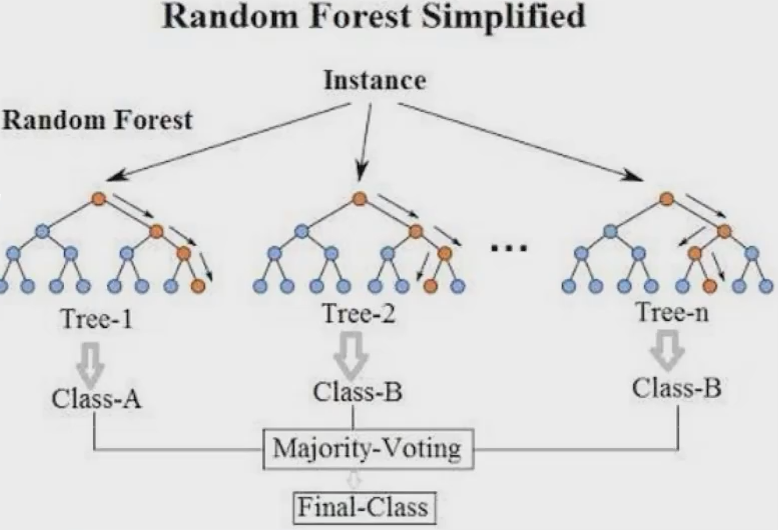

[TOC]

# 集成学习

## Bagging

bagging就是并行训练多个模型，然后将他们的集成结果作为最终模型的输出，它最典型的代表就是随机森林。

- 随机属性：随机森林使用决策树作为基学习器，为了让不同的决策树之间具有差异性，随机森林引入了随机属性选择。【传统的决策树从全部属性中选择最优属性，而随机森林从随机采样的k个属性中选择最优属性】
- 数据随机：每次从全部训练集中选择一部分作为每个基学习器（决策树）的训练数据

## Boosting（提升）

Boosting是一族可将弱学习器提升为强学习器的算法。这族算法的工作机制类似：先从初始化训练集中训练出一个基学习器，再根据基学习器的表现对训练样本分布进行调整，使得先前基学习器做错的训练样本在后续收到更多关注，然后训练下一个更好的基学习器。重复T次，将这T个基学习器进行加权结合。

模型代表：

- Adaboost：设我们要训练M个学习器。首先，我们要初始化每个样本的学习权重相同。然后，在第一个学习器学习结束之后，将预测错误的样本的学习权重调大，训练第二个学习器，至所有的学习器学习完毕。最终，将M个学习器的预测结果加权求和做最终的模型预测结果。
- GBDT【梯度提升决策树】：GBDT是一系列决策树的加法组合，后一棵树拟合之前预测结果与目标的**“残差”**。

## Stacking

Stacking先从初始训练集训练出**初级学习器**，然后“生成”一个次级数据集用于训练**次级学习器**。在这个次级数据集中，初级学习器的输出被当做样例输入特征，而初始训练集样本的标签仍被当做次级训练集样本的标签。

在训练阶段，次级训练集是利用初级学习器生成的，若直接使用初级学习器的训练集来生成次级训练集，则过拟合风险太大。因此，一般使用K折交叉验证法，留出的一部分样本，通过初级学习器进行预测，将预测结果作为次级训练集的样本送入次级学习器。【将K折交叉验证每次留出的样本拼接起来就是一个完整的训练集了】

## 集成学习优点

1. 单学习器泛化性能往往不佳，集成学习可以减小这一风险
2. 当模型陷入局部最优解时，集成学习可以降低陷入局部解的风险
