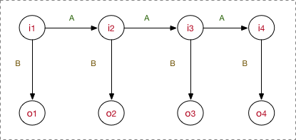
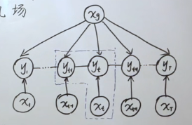

[TOC]

# 概率图模型

在监督学习下，模型可以分为判别式模型与生成式模型

## 判别式模型

模型根据样本的输入feature和目标label，直接去学习一个复杂的映射，直接建模$P(Y|X)$【例如：LR会直接输出分类的概率】

## 生成式模型

这类模型会先将所有的数据分布情况摸透，然后确定一个分布$P(X,Y)$来作为所有样本的分布。给了一个新样本X后，通过条件概率计算出Y：$P(Y|X)=\frac{P(X,Y)}{P(X)}$

生成式模型在训练的过程中，只是对$P(X,Y)$建模，我们需要确定得到这个联合概率分布的所有参数。


## 隐马尔可夫模型（生成式模型）



首先，明确HMM的5要素：

1. 隐藏状态$i$，我们的隐藏状态节点不能随意取，只能从限定的**隐藏状态集**$\left\{s_1,...,s_N \right\}$中取值，共N个
2. 观测状态$o$，我们的观测状态节点不能随意取，只能从限定的**观测状态集**$\left\{g_1,...,g_M \right\}$中取值，共M个
3. 矩阵A，状态转移矩阵$A=[a_{ij}]_{N \times N}$，矩阵中每个元素都是一个概率$P(s_j|s_i)$，表示若当前隐藏状态为$s_i$下一隐藏状态为$s_j$的概率
4. 矩阵B，观测概率矩阵$B=[b_{ij}]_{N\times M}$，矩阵中每个元素都是一个概率$P(g_j|s_i)$，表示若当前隐藏状态为$s_i$推导出观测状态$g_j$的概率
5. 初始状态概率，模型在初始时刻下各状态出现的概率，通常记为$\pi = \left(\pi_1, \pi_2,...,\pi_N\right)$，其中$\pi$表示模型的初始状态$i_1$为$s_i$的概率

HMM是一个有向无环图，HMM做了一个观测独立假设：**认为$o_i$之间是没有关系的，仅由它对应的隐藏状态推出；当前隐藏状态仅由上一时刻的隐藏状态推出。**
$$
P(o_t) = P(o_t|i_t) \\
P(i_t) = P(i_t|i_{t-1})
$$

------

我们现在要求出模型参数$\lambda = (\pi, A, B)$

### 三个问题

1. 给定模型$\lambda$及观测序列$O={o_1, o_2, ..., o_T}$计算其出现的概率$P(O|\lambda)$

   对于固定的隐藏状态序列$I =i_1,i_2,...,i_T$，得到观测序列$O$的概率为：$P(O|I,\lambda)=B[i_1][o_1]B[i_2][o_2]...B[i_T][o_T]$

   联合概率$P(O,I|\lambda) = P(I|\lambda)P(O|I,\lambda) = \pi_{i_1}B[i_1][o_1]A[i_1][i_2]B[i_2][o_2]...A[i_{T-1}][i_T]B[i_T][o_T]$

   观测序列概率$P(O|\lambda) = \sum_I P(O,I|\lambda)$

   上述方法过于暴力，我们使用前向算法进行优化~

   

2. 给定观测序列$O$，求解参数$(\pi, A, B)$使得$P(O|\lambda)$最大

   如果还有隐藏状态序列$I$，则可以用统计的方法得到$\pi, A, B$，但现在没有。我们需要使用Baum-Welch算法~

   

3. 已知模型$\lambda$及观测序列$O$求隐藏状态序列$I$，使得$P(I|O,\lambda)$最大

   **维特比算法：**[视频](https://www.bilibili.com/video/BV1oZ4y1v79c?p=10&vd_source=0cb506ddc76d40ec3b32014ba5fe9ccb)

   - 对于t时刻，隐藏状态为i，要找到所有可能路径的最大值：$\delta_t(i) = maxP(i_t=i,i_1,i_2,...i_{t-1},o_t,o_{t-1},...,o_1|\lambda),i=1,2,...,N$
   - 递推公式：$\delta_{t+1}(i) = maxP(i_{t+1}=i,i_1,i_2,..,i_t,o_{t+1},o_t,...,o_1|\lambda)=\underset{1 \le j \le N} {\operatorname{max}} (\delta_t(j)A[j][i])B[i][o_{t+1}]$
   - 概率最大路径中$t-1$时刻的状态：$\Psi_t(i) = \underset{1 \le j \le N} {\operatorname{argmax}}(\delta_{t-1}(j)A[j][i])$

   在实际的任务中，隐状态可以是文字$i$，观测状态是语音$o$。模型训练完成后，我们可以根据语音推测文字。


## Conditional Random Field（判别式模型）



CRF与HMM的区别：无向图（打破观测独立假设）+ 判别式模型

1. 首先，CRF属于马尔科夫随机场，它假设随机场中任意一个结点的赋值，仅仅和它的邻结点有关
2. 其次，CRF是马尔科夫随机场的特例，它假设模型只有输入变量$X$和输出变量$Y$，其中$Y$构成马尔科夫随机场
3. 最后，NER主要使用线性链条件随机场：
   - 相邻的每两个节点组成一个最大团
   - 任意时刻的$Y_t$都与所有时刻的$X$相关

【注：马尔科夫性：在随机过程中，某个事件发生只取决于它的上一个事件，是“无记忆”过程】

------

**CRF最重要的工作就是提取特征，构建特征函数**

用一个$F$函数做特征函数，$F$函数可以进一步被拆分为最大团的转移特征函数$t$和当前时刻的状态特征函数$s$
$$
\begin{aligned}
P(Y|X)&=\frac{1}{Z}\exp\left(\sum_{t=1}^{T}F(y_{t-1}, y_t, X)\right) 最大团只有两个结点\\
&=\frac{1}{Z}\exp\left(\sum_j\sum_{t=1}^{T}\lambda_jt_j(y_{t-1}, y_t, X) + \sum_k\sum_{t=1}^{T}\mu_ks_k(y_t,X)\right)
\end{aligned}
$$
### CRF的训练

CRF的转移特征函数会被随机初始化【可以人为设定一些绝对规则】，在训练时被不断地优化；而状态转移特征函数就是LSTM，LSTM输入句子，输出每个token的词性向量（该词性向量在code实现里并不是概率）。

```python
# 初始状态能量
score = self.start_transitions[tags[0]]

# 第一个token其对应label的概率能量（emissions来自于LSTM）
score += emissions[0, torch.arange(batch_size), tags[0]]
for i in range(1, seq_length):
    # 从上一个时刻转移到当前时刻状态的能量       
    score += self.transitions[tags[i - 1], tags[i]]
    # shape: (batch_size,)
    # 加上状态特征函数的能量
    score += emissions[i, torch.arange(batch_size), tags[i]]

# LOSS：希望对应label的score大，其他label的score小 
```

【注：CRF是对LSTM的输出进行了修正，避免了不符合序列排序的实体片段生成】

### CRF的预测

维特比算法