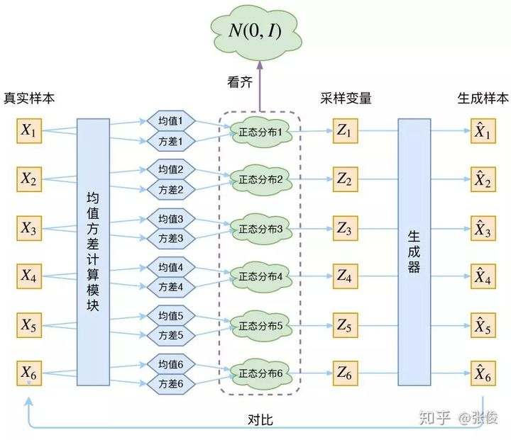

[TOC]

# 深度学习分类

1. 有监督学习
2. 无监督学习
   - 自监督学习：
     1. 生成式学习：自编码器（Auto-Encoder），主要用于数据的降维或者特征的抽取，训练方法是重建输入
     1. 对比式学习：对比学习，训练方法是区分正负样本
3. 半监督学习：有一些数据有标记，给没有标记的数据指明了方向

# 自监督学习（通过自定义的有监督学习方式，挖掘数据信息）

为下游的有监督任务学习提供良好的representation，即通过自监督学习学习到泛化性能很强的representation【如：BERT】

## 自编码器

结构：1. encoder：它可以把原先的图像压缩成更低维度的向量【得到一个低维的高度抽象的向量，起到**压缩数据、获取主要信息**的效果】。 2. decoder：它可以把压缩后的向量还原成图像，通常它们使用的都是神经网络。

**多个自编码器模型：**

1. de-nosing auto-encoder【典型的例子是BERT】

2. feature disentangle

   encoder学习（压缩）得到的特征会包含很多的信息，比如对一段声音进行压缩就会包含语音内容和发言者音色、音调等信息。那有没有一种方法可以将这些信息区分开呢？比如，下图将content和speaker的信息区分开。

   如果可以成功地将声音信号encode出来的向量中**内容和音色区分开**，那么给两段声音（A说你好，B说再见），就可以做到变声的效果（A说再见，B说你好）。

   

3. variational auto encoder（生成模型）

   现在，我们让AE去训练还原月球照片，接下来我们在code空间中，取全月和半月照片编码的中间点，我们期望模型可以生成一个3/4月的照片，但是AE是做不到的【左图】。为了解决这个问题，我们引入了噪声，使得图片的编码区域得到扩大，从而掩盖掉失真的空白编码点【中图】。不过这还不够充分，我们进一步将噪声拉大，拉成无限长，让他的编码覆盖整个code空间，并保证在原编码附近的概率最大，越远离原编码概率越小，这就是VAE【右图】。

   

   ------

   **VAE的工作流程：**【从左图到右图，encoder将输入从一个确定的空间点编码成一个空间上的分布（概率分布）】我们将encoder编码的code看作是隐变量z【z服从着某个未知的概率分布】，那么encoder的工作就是建模q(z|x)【得到一个概率分布】，decoder的工作就是建模P(x|z)【从z的概率分布中的采样一个z'，还原回输入x】。

   **我们先进行一个假设**：前面提到过，希望x经过encoder的编码，可以得到一个覆盖整个code空间的分布，所以我们先验地认为q(z|x)服从标准正态分布。

   因此，我们利用encoder来拟合q(z|x)，得到均值$\mu$和方差$\delta$
   
   然后，如果只有这些的话，是显然不行的。因为神经网络在拟合的过程中，会倾向于让方差$\delta$输出为0，就相当于取消了噪声，取消了随机性，就不再是正态分布了。那么又返回了AE那种code是一个确定的点的状态了。所以，VAE要在loss中加入$KL(q(z|x)||p(z))$来防止随机性被网络拟合掉。
   
   现在，VAE就是用encoder将x建模为某个分布z，再从z中采样一个出来，送入decoder进行x的还原。
   
   
   
   ------
   
   从数学角度入手：我们求解的目标是最大化$P(x) = \int_zp(x,z)dz = \int_zp(z)p(x|z)dz$【极大似然$P(x)$】，不过这个式子无法求解，这导致$p(z|x) = \frac{P(z)p(x|z)}{p(x)}$也是无法求解的，所以我们需要另寻他法，利用神经网络来拟合$p(z|x)$。
   
   再回到我们希望的求解目标上，现在：
   $$
   \begin{aligned}
   \log P(x) &= \int_zq(z|x)\log p(x)dz  \space\space\space (q(z|x) 是 encoder 的输出，就是上面说的拟合p(z|x))\\
   &= \int_zq(z|x) \log(\frac{p(z,x)}{p(z|x)})dz \\
   &= \int_zq(z|x) \log(\frac{p(z,x)}{q(z|x)}\times\frac{q(z|x)}{p(z|x)})dz \\
   &= \int_zq(z|x) \log(\frac{p(z,x)}{q(z|x)})dz+\int_zq(z|x)\log(\frac{q(z|x)}{p(z|x)})dz \\
   &= \int_zq(z|x) \log(\frac{p(x|z)p(z)}{q(z|x)})dz + KL(q(z|x)||p(z|x)) \\
   &\ge \int_zq(z|x) \log(\frac{p(x|z)p(z)}{q(z|x)})dz【下界】\\
   &= \int_zq(z|x) \log(\frac{p(z)}{q(z|x)})dz + \int_zq(z|x) \log p(x|z)dz\\
   &= -KL(q(z|x)||p(z)) + \int_zq(z|x) \log p(x|z)dz \\
   &= E_{q(z|x)}[\log p(x|z)] - KL(q(z|x)||p(z)) \\
   &= 重构loss + KL\space loss
   \end{aligned}
   $$
   
   ------
   
   因为采样是不可以求导的，所以我们要使用重采样技巧：
   
   下图是VAE结构图，我们的做法是让encoder生成两个code，一个是$\mu$，另一个是$\sigma$[它给高斯噪声e分配权重，代表了一个采样的过程]（从$N(\mu,\sigma^2)$中采样一个$Z$等于从$N(0,1)$中采样一个$\epsilon$，让$Z=\mu+\sigma \times \epsilon$）。右下角的loss是为了防止encoder编码出来的随机变量权重$\sigma$为0，导致模型没有给code加入噪声。【即KL loss】
   
   
   

## 对比学习

### 对比学习的LOSS

1. NCE：给定一个输入$x$，它的正例从$P_d(y|x)$中采样得到，它的负例从$P_n(y|x)$中采样得到。设正例采样个数：负例采样个数为1:k。记正例D=1，采样来自$P_d(y|x)$；负例D=0，采样来自$P_n(y|x)$。         
   $$
   \begin{aligned}
   在所有的样本中采样负例的概率，P(D=0|x) &= \frac{k}{k+1}P_n(y|x) \\
   在所有的样本中采样正例的概率，P(D=1|x) &= \frac{1}{k+1}P_d(y|x) \\
   于是，P(y|x) = P(D=0|x)+P(D=1|x)& \\
   给定x和y，负例的概率，P(D=0|x,y) = \frac{P(D=0,y|x)}{P(y|x)} &= \frac{P(D=0|x)}{P(y|x)} = \frac{kP_n(y|x)}{P_d(y|x) + kP_n(y|x)} \\
   给定x和y，正例的概率，P(D=1|x,y) = \frac{P(D=1,y|x)}{P(y|x)} &= \frac{P(D=1|x)}{P(y|x)} = \frac{P_d(y|x)}{P_d(y|x) + kP_n(y|x)} \\
   现在我们用神经网络\theta去拟合正例的分布，P(D=1|x,y,\theta) &= \frac{P_\theta(y|x)}{P_\theta(y|x) + kP_n(y|x)} \\
   这也就是NCE要做的事情，P(D=0|x,y,\theta) &= \frac{kP_n(y|x)}{P_\theta(y|x) + kP_n(y|x)}
   \end{aligned}
   $$
   **解决问题：给定一个输出$y$，判断它是输入$x$的正例还是负例（二分类）**  
   $$
   \begin{aligned}
   \log P(D|y,x,\theta) &= \sum_yP(y|x)\log P(D|y,x,\theta) \\
   &= \sum_y\frac{1}{k+1}[P_d(y|x) + kP_n(y|x)] \log P(D|y,x,\theta) \\
   &= \frac{1}{k+1}[\sum_yP_d(y|x)\log P(D|y,x,\theta) + k\sum_yP_n(y|x) \log P(D|y,x,\theta)] \\
   &= \frac{1}{k+1}[\sum_yP_d(y|x)\log P(D=1|y,x,\theta) + k\sum_yP_n(y|x) \log P(D=0|y,x,\theta)] \\
   &= \frac{1}{k+1}[\sum_yP_d(y|x)\log \frac{P_\theta(y|x)}{P_\theta(y|x) + kP_n(y|x)} + k\sum_yP_n(y|x) \log \frac{kP_n(y|x)}{P_\theta(y|x) + kP_n(y|x)}] \\
   一般正样本就是1个&，负样本采样k个，再将常数项的k+1约掉，就可以得到下式\\
   &= \log \frac{P_\theta(y|x)}{P_\theta(y|x)+kP_n(y|x)} + k\log \frac{kP_n(y|x)}{P_\theta(y|x)+kP_n(y|x)}
   \end{aligned}
   $$
   于是，我们希望可以最大化**似然函数**，即loss就是最大化上面的函数。
   
   
   
2. InfoNCE

​		
