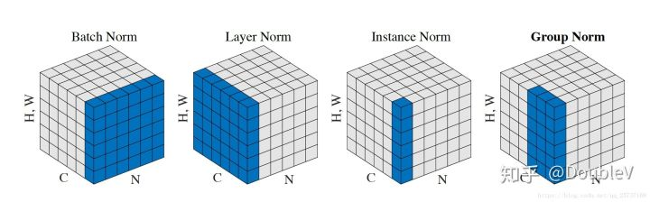

[TOC]

# Normalization

独立同分布的数据可以简化常规机器学习模型的训练、提升机器学习模型的预测能力。

## 深度学习中的内部协变量转换(ICS)

internal covariate shift：机器学习中 covariate shift 指训练集的样本数据分布变化时，在测试集的表现就会变差（例如：在新闻领域训练机器翻译模型，在生物领域上测试机器翻译模型）。深度神经网络模型**层堆叠**的结构，就可以看作每层的训练label不变，但是输入在改变（输入数据分布在变化），internal单词的含义就是层间。

ICS会导致：每层的输入数据不再是**独立同分布的**

1. 高层参数需要不断适应新的输入数据分布，这使得模型学习变慢

2. 异常值的出现会导致梯度消失，使学习过早停止（例如：sigmoid函数在输入过大或过小时，梯度接近于0，并且因为输入没有做标准化调整，很容易产生过大或过小的异常值）

3. 每层的更新都会影响到其他层，因此每层的更新策略需要尽可能的谨慎

所以，我们需要找到一个使各层输出标准化的操作：在x输入给高层网络前，先做平移和伸缩变换，将x的分布变成在固定区间范围的标准分布。
$$
h = f(g \frac{x-\mu}{\sigma} + b)
$$

1. 先通过$\mu$和$\sigma$，得到数据符合均值为$0$，方差为$1$的标准分布
2. 再通过$g$和$b$，得到数据符合均值为$b$，方差为$g^2$的标准分布

第二次变换的原因在于：

1. 保证模型的表达能力不因标准化而下降，即防止标准化操作让该层学习到的知识（数据分布）消失

## batch normalization

存在的问题：

1. 对batch敏感，需要batch之间，以及和整体数据是**近似同分布的**。分布差距较小的batch可以看作是为规范化操作和在模型训练加入噪声，可以提高模型的鲁棒性。但如果每个batch的分布差距很大，则会增加模型训练的难度，因此**batch size不宜过小**。

2. **不适合RNN网络，因为RNN网络在时间步上会参数复用，也就意味着normalization的参数也会被复用，一个特征在不同的时间步上复用同一个放缩参数，显然是不合理的**
3. 推断的时候，**每个batch不再计算自己的均值和方差**，而是使用训练过程中每个batch均值和方差的无偏估计。

优点：

1. 减轻ICS，缓解梯度消失，使深层网络更稳定

## layer normalization

优点：

1. LN针对单个样本，不依赖于其他数据，因此可以避免BN对batch敏感的问题
2. 不需要像BN一样存储训练过程中的均值和方差，节约了存储空间

问：为什么NLP使用LN？

答：BN是对每个特征在batch_size上进行缩放，那么应用到NLP上就是对batch内每个位置上的单词进行缩放，这是违背直觉的，自然效果也不好。

## instance normalization

Instance normalization是对单个图片的单个通道进行normalization，适用于图片风格迁移任务，将从一张图片的所有像素点上学习到的风格信息（mean和variance统计量）作用于另一张图片的所有像素点。

## group normalization

为了解决batch normalization在batch size过小时没什么作用提出的，将图片的多个通道分组，每组的图片进行normalization

为什么有效：

1. 这个方法可以认为是对多个卷积核进行分组，本身卷积核之间就不是完全独立的，某些抽取相似信息的核可以放到一个组里

## normalization为什么有效

1. 经过规范化再输入激活函数，得到的值大部分会落入非线性函数的线性区，导数远离导数饱和区，避免了梯度消失，这样来加速训练收敛过程
2. 权重伸缩不变性：权重变大变小$W'=\lambda W$都不会影响反向梯度的计算值，因此对反向传播没有影响，避免了权重过大或过小而导致的梯度消失或爆炸问题，从而加速训练。正常是不会对$x$计算导数的，这里$x$是指下一层的输入，它包含着下一层的$W$参数。

$$
\frac{\partial Norm(W'x)}{\partial x} = \frac{\partial Norm(Wx)}{\partial x} \\
$$

3. 数据伸缩不变性：当输入数据$x$进行伸缩$x'=\lambda x$时，得到的规范化后的值保持不变。所以当第0层输入发生伸缩时，高层的输入永远保持标准分布，这使得高层训练更简单。

$$
Norm(Wx') = Norm(Wx) \\
\frac{\partial Norm(Wx')}{\partial W} = \frac{\partial Norm(Wx)}{\partial W} \\
对于某一层神经元，x_{l+1} = W_lx_l = x_0 \prod_{k=0}^{l} W_k
$$
