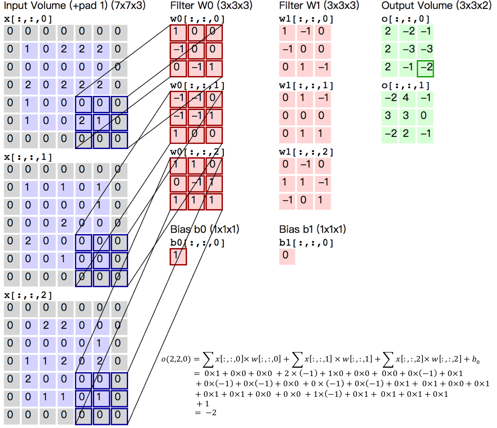

[TOC]

# convolutional neural network

## 1. 什么是卷积神经网络

**卷积层**：输入张量[H, W, C_i]，设置卷积核大小[h, w, C_i, C_o]，得到输出[H', W', C_o]

H'和W‘的值依据填充(padding)、步长(step)、张量大小(H, W)、卷积核大小(h, w)

某输出通道上的值 都是 该输出通道设置的每个卷积核参数与输入张量计算结果的累加

下例：输入[5, 5, 3] 设置卷积核[3, 3, 3, 2] 得到输出[3, 3, 2] 填充1 步长2

输出张量中第一个通道的数据[3, 3, 1]，是该通道设置的卷积核[3,3,3,1]与输入张量计算结果的累加。

1. 平移不变性：因为卷积核是共享的，当不同位置的feature map上面的值是一样时，卷积核卷出来的结果也是一样的，这个就是平移不变性（同一个物体在图片的不同位置得到同一个抽象特征）。
2. 局部性：卷积核是一个局部窗口，只会对局部信息进行抽取。

**池化层**：

作用：1. 进行特征选择，降低特征数量，从而减少参数数量  2. 扩大感受野，抽取全局信息

输出通道数=输入通道数，每个通道上自己做自己的池化，输出feature map长宽会变小（和卷积一样也有填充、步长的设置）

## 2. resnet

resnet要解决网络“退化”的问题，“退化”指的是：给网络叠加更多的层后，性能却下降了。为什么会有这样的现象呢？

训练集上的性能下降，首先可以排除过拟合、其次batch normalization的引入也解决了梯度消失和爆炸。即使在极端的情况下，顶层网络学习成了恒等变换，那性能也是不增长，不至于下降啊！**原因是网络优化难度大，越深的模型越难以优化（学习能力下降了）。**

解决方法：让模型不去拟合H(x)【假设H(x)为网络的期望参数】，而是去拟合H(x)-x【期望参数-上一层的输出】，因为让模型去学习0更容易。假设残差为0，那么堆叠层仅仅做了恒等变换；而实际上残差不会为0，这使得堆叠层在输入特征的基础上学习到了新的特征。

下面，我们从数学的角度来解释残差链接：
$$
\begin{aligned}
x_{l+1} &= x_l + F(x_l, W_l) \\
x_L &= x_l + \sum_{i=l}^{L-1}F(x_i,w_i) \\
\frac{\part loss}{\part x_l} &= \frac{\part loss}{\part x_L} * \frac{\part x_L}{\part x_l} \\
&= \frac{\part loss}{\part x_L} *(1+\frac{\part}{\part x_l}\sum_{i=l}^{L-1}F(x_i,w_i))
\end{aligned}
$$
可以看到残差链接缓解了梯度消失

此外，残差链接还可以被认为是浅层网络的ensemble
