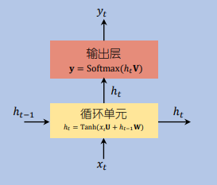
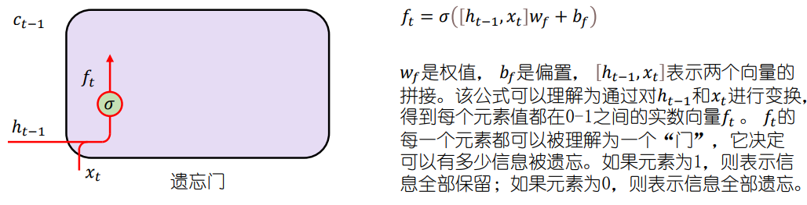
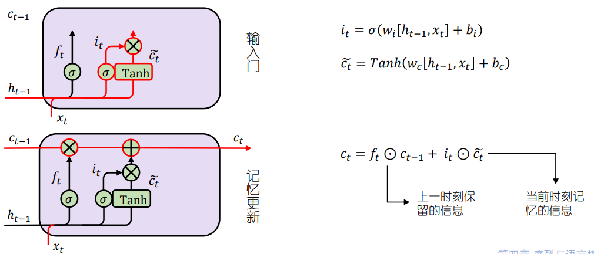
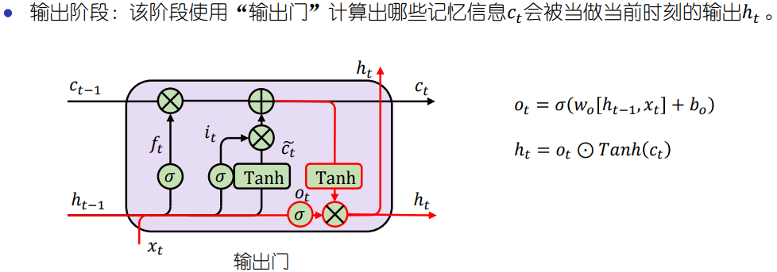
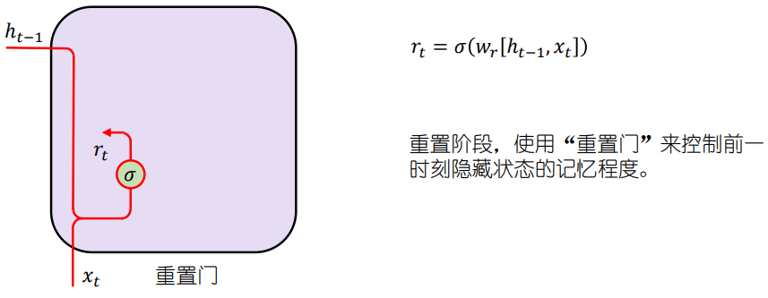
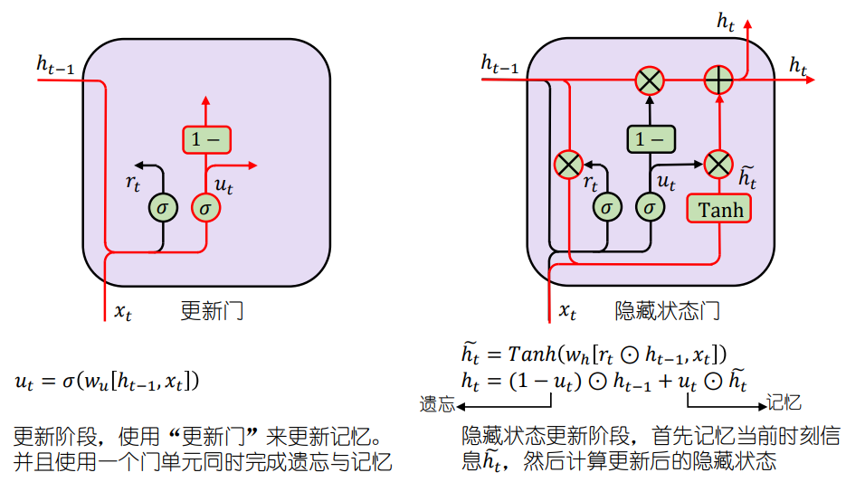

[TOC]

# Recurrent Neural Network

## 1. 什么是循环神经网络

​		前馈神经网络可以看作为一个复杂的函数，每次输入都是独立的，即网络的输出只于当前的输入有关；而循环神经网络则是一类具有短期记忆的模型。在循环神经网络中，神经元不但可以接受其他神经元的信息，也可以接受自身的信息。

> 为了处理时序数据（如：语音、语言）并利用其历史信息，我们需要让网络具有短期记忆能力，而前馈网络是一种静态网络，不具备这种记忆能力。

​		循环神经网络使用了==隐状态$h$==来存储并更新记忆，如下面的公式，输入序列$x_{1:T}=(x_1, x_2, ..., x_T)$ ，$t$时刻的隐状态$h_t$ 由当前时刻的输入$x_t$ 和前一时刻的隐状态$h_{t-1}$ 计算而来。

$$
h_t = f(h_{t-1}, x_t)
$$

## 2. 简单循环神经网络

> RNN在时间维度上共享参数，不但让模型有了处理任意长度样本的能力，还可以减少参数量。更重要的是这反映了RNN在每个step中都在做相同的事情（而不是让不同step的节点做不同的事情），这样单一节点的RNN能共享，或者说拥有了从不同序列长度和不同位置学习到的信息。

## 3. LSTM

LSTM中引入了“门”的概念，通过门单元来动态地选择遗忘和记忆多少之前的信息。分3个阶段：遗忘阶段、记忆更新阶段（输入+记忆更新）、输出阶段

## 4. GRU

GRU对LSTM做了简化，分为三个阶段：重置、更新、隐藏

