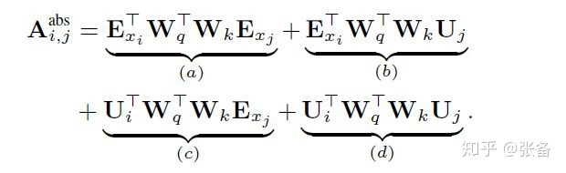
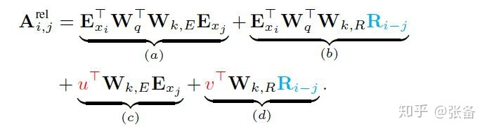

[TOC]

# Transformer

## QA

### 1. Transformer点积放缩的原因？

**比较大的输入会使得softmax的梯度变得很小甚至梯度消失为0，造成参数更新困难**。假设向量 q 和 k 的各个分量是互相独立的随机变量$N(0,1)$，那么点积qk会是$N(0,d_k)$【因为矩阵计算，qk向量各个元素相乘后的$N(0,1)$会因相加而得到$N(0,d_k)$】。将方差控制为1，可以有效地控制了前面提到的梯度消失问题。

   问：Q和K为什么均值为0，方差为1？

   答：在得到词向量embedding后，也会对其进行scaled，使QK均值为0，方差为1

   问：QK不除以根号dk，而是套一个LN，可以吗？

   答：可以，但是会增加计算量

### 2. 为什么使用Layernorm？

normalization（归一化）使得**梯度计算稳定**，降低了模型拟合的难度。nlp中batch维度的样本信息关联度不大，而且句子长度不一，做BN会损失不同样本间的差异性。同时，NLP任务中，句子之间不同token存在着一定的关系，使用LN保留了同一样本内部特征的关系，更有利于Transformer模型（注意力机制）捕捉token之间的全局信息。

### 3. 为何使用多头注意力机制？

1. 允许模型在不同的表示子空间里学习，捕捉到更加丰富的特征信息。例如在处理nlp问题时，有的头可以捕捉句法信息，有的头可以捕捉词法信息。【类比于CNN的多个卷积核】

2. 从ensemble的角度来理解。

3. 本人还有一个拙见就是从auto-encoder的角度来理解，auto-encoder会对输入的文本（语音、图片）进行维度压缩，获得高层次的特征。比如语音中，这份特征就包含了文字内容+音色两种信息，多头可以看成是将不同特征拆分出来的过程，每个头用自己的信息做注意力判断，最后再集合起来。

### 4. 为什么在进行多头注意力的时候需要对每个head进行降维？

我们先分析一下多头注意力机制和单头注意力机制的时间复杂度：

$n \times d$的矩阵Q 和 $d \times n$的矩阵K，相乘的时间复杂度是$O(n^2d)$

分成m个多头后，矩阵Q的形状变成$n \times \frac{d}{m}$，矩阵K的形状变成$\frac{d}{m} \times n$，相乘的时间复杂度依然是$O(n^2d)$

那么，为什么要采用64的维度而不继续采用隐藏层通用的768维度呢？

首先存在**计算量极大**的问题（如果采用768做每个头的维度，那么上面的时间复杂度就不会相等了），并且高维空间下的学习难度也会相应提升，这就难免会出现论文中实验参数量大但效果不佳的情况，于是将原有的高维空间转化为多个低维空间并再最后进行拼接，**形成同样维度的输出，并借此丰富语义信息，降低了计算量**，而且取得了更好的效果，十分巧妙。

### 5. Transformer为什么Q和K使用不同的权重矩阵生成，为何不能使用同一个值进行自身的点乘？

Q/K/V 使用不同的参数可以保证在不同空间进行投影，**增强了表达能力**。如果使用了相同的权重矩阵，那么**自身点乘得到的是对称矩阵**（如果Q==K，attention score是对称的），这样的矩阵会导致对V进行提纯的时候，效果不会好。
这个对称矩阵可以理解为：给了一句话*”我是一个男孩“*，其中 我对男孩的关注度 和 男孩对我的关注度 是一样的，这样就会造成**泛化能力有限**的现象。

### 6. Transformer在哪里做了权重共享，为什么可以做权重共享？

Transformer在两个地方进行了权重共享：

1. Encoder和Decoder间的Embedding层权重共享：共享同一张词表做权重共享，bpe的subword可能会共享语义
2. Decoder中Embedding层和全连接(FC)层权重共享：Embedding层和FC层权重共享，**Embedding层中和输入FC层的向量 x 最接近的那一行对应的词，会获得更大的预测概率**。还可以减少参数量，加快收敛。

### 7. 不考虑多头的原因，self-attention中词向量不乘QKV参数矩阵，会有什么问题？

Self-Attention的核心是**用文本中的其它词来增强目标词的语义表示**，从而更好的利用上下文的信息。在self-attention机制中，句子的每个词都会和句子中的每个词做点积去计算相似度，也包括这个词本身。如果不乘QKV参数矩阵，那这个词对应的q,k,v就是完全一样的。**在相同量级的情况下，$q_i$与$k_i$点积的值会是最大的（可以从“两数和相同的情况下，两数相等对应的积最大”类比过来）。**那在softmax后的加权平均中，该词本身所占的比重将会是最大的，使得其他词的比重很少，无法有效利用上下文信息来增强当前词的语义表示。而乘以QKV参数矩阵，会使得每个词的q,k,v都不一样，能很大程度上减轻上述的影响。

### 8. 为什么Transformer计算attention选择点乘而不是加法？两者计算复杂度和效果有什么区别？

加法计算attention的方法，如下：
$$
\begin{aligned}
e_{ij} &= MLP(qi, kj) \\
\alpha_{ij} &= \frac{\exp(e_{ij})}{\sum_{k=1}^{T}\exp(e_{ik})} 
\end{aligned}
$$
论文中的说法是乘法计算效率更快，一个矩阵乘法就搞定了。

两者计算复杂度相同都是$n^2$。

两者的效果和$d_k$相关，如果不除以$d_k$，在大$d_k$的情况下，加法的效果好。因为$d_k$越大点积的值也越大，softmax越容易陷入梯度饱和区，造成梯度弥散。

### 9. 为何在获取输入词向量之后需要对矩阵乘以embedding size的开方？意义是什么？

因为Transformer的词嵌入矩阵的初始化方式是 $W∼N(0, 1/d_{model})$，乘以embedding size的开方就是将参数分布调整到$N(0, 1)$，以加速收敛【Normalization那套说法】。
为什么不直接使用$N(0, 1)$做初始化呢？
因为，Transformer的输入词嵌入矩阵和输出的FC层共享参数，而FC是一个线性层用类xavier初始化方法更好。


### 10. dropout都在哪里？

1. 词嵌入和位置编码求和后

2. 残差连接处：每一个子层输出后，并且做LN之前

3. 注意力操作：attention计算完attention score后

4. 前馈神经网络的ReLU后


## RPR

相对位置会在Transformer的线性变换中渐渐消失，显式地建模一个相对位置编码可以加强位置信息。

$$
\begin{aligned}
e_{ij} &= \frac{x_iW^Q(x_jW^K + \alpha_{ij}^K)^T}{\sqrt{d_z}} \\
z_i &= \sum_{j=1}^Ne_{ij}(x_jW^V + \alpha_{ij}^V)
\end{aligned}
$$

```python
relative_keys_embedding = nn.Embedding(max_relative_position * 2 + 1, 64)
def generate_relative_positions_matrix(length, max_relative_position):
    with torch.no_grad():
        range_mat = torch,arange(length).extend(length, length)
        dist_mat = range_mat - range_mat.t()
        # 截断
        dist_mat = torch.clamp(dist_mat, -max_relative_position, max_relative_position)
        # 负值转为正值
        dist_mat = dist_mat + max_relative_position
    return dist_mat

# 在代码中加入rpr
attn_weights = torch.bmm(q, k.transpose(1, 2))
# 根据当前句子的长度，生成rpr矩阵
relative_positions_matrix = generate_relative_positions_matrix(src_len, max_relative_position)
# 得到rpr向量
relations_keys = relative_keys_embedding(relative_positions_matrix)
# 将相对位置编码加入attention中
relations_keys_logits = torch.bmm(q, relations_keys)
attn_weights += relations_keys_logits
```


# 变种

## Transformer-XL

1. segment-level recurrence

   Transformer-XL将段与段之间的信息联系起来了，在对当前segment进行处理的时候，缓存并利用上一个segment中所有layer的隐向量序列。

2. 相对位置编码

   绝对位置编码不可用，因为在Trm-XL中，每个segment都会被添加相同的绝对位置编码，导致多个segments之间无法区分位置关系。XL的做法是在算attention score的时候，只考虑query向量与key向量的相对位置关系，并且将这种相对位置关系，加入到每一层Trm的attention计算中。

   绝对位置编码：$(E_{xi}+U_i)W_q^TW_k(E_{xj}+U_j)$
   
   
   
   上述是绝对位置编码和相对位置编码的对比：
   
   XL首先将$U_j$替换为$R_{i-j}$；其次，因为$U_iW_q$是固定的，XL将它换成可学习的两个参数$u^T$和$v^T$，分别服务于内容信息和位置信息；最后，将$W_k$矩阵细分为两组矩阵$W_{k,E}$和$W_{k,R}$，也是服务于内容和位置信息。