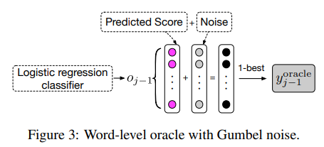

[TOC]

# Transformer

## QA

1. ##### Transformer点积放缩的原因

   **比较大的输入会使得softmax的梯度变得很小甚至梯度消失为0，造成参数更新困难**。**假设**向量 q 和 k 的各个分量是互相独立的随机变量，均值是0，方差是1，那么点积qk 的均值是0，方差是$d_k$。将方差控制为1，也就有效地控制了前面提到的梯度消失的问题。

   Q和K为什么均值为0方差为1：在得到词向量embedding后，也会对其进行scaled，使QK均值为0方差为1

   QK不除以根号dk，而是套一个LN，可以吗？可以，但是会增加计算量

2. ##### 为什么使用Layernorm？

   normalization（归一化）使得**梯度计算稳定**，降低了模型拟合的难度。nlp中batch维度的样本信息关联度不大，而且句子长度不一，做BN会损失不同样本间的差异性。NLP任务中，句子之间不同token存在着一定的关系，使用LN保留了同一样本内部特征的关系，因此更有利于Transformer模型（注意力机制）捕捉token之间的全局信息。

3. ##### 为何使用多头注意力机制

   允许模型在不同的表示子空间里学习，捕捉到更加丰富的特征信息。例如在处理nlp问题时，有的头可以捕捉句法信息，有的头可以捕捉词法信息。
   
   也可以从ensemble的角度来理解。
   
   本人还有一个拙见就是从auto-encoder的角度来理解，auto-encoder会对输入的文本（语音、图片）进行维度压缩，获得高层次，高信息量的特征【比如语音中，这份特征就包含了文字内容+音色两种信息，多头可以看成是将不同特征拆分出来的过程，每个头用自己的信息做注意力判断，最后再集合起来】
   
4. ##### 为什么在进行多头注意力的时候需要对每个head进行降维？
   
     我们先分析一下多头注意力机制和单头注意力机制的时间复杂度：

   $n \times d$的矩阵Q 和 $d \times n$的矩阵K，相乘的时间复杂度是$O(n^2d)$
   
   分成m个多头后，矩阵Q的形状变成$n \times \frac{d}{m}$，矩阵K的形状变成$\frac{d}{m} \times n$，相乘的时间复杂度依然是$O(n^2d)$
   
   那么，为什么要采用64的维度而不继续采用隐藏层通用的768维度呢？
   
   首先存在**计算量极大**的问题（如果采用768做每个头的维度，那么上面的时间复杂度就不会相等了），并且高维空间下的学习难度也会相应提升，这就难免会出现论文中实验参数量大但效果不佳的情况，于是将原有的高维空间转化为多个低维空间并再最后进行拼接，**形成同样维度的输出，借此丰富特性信息，降低了计算量**，而且取得了更好的效果，十分巧妙。
   
6. ##### Transformer为什么Q和K使用不同的权重矩阵生成，为何不能使用同一个值进行自身的点乘？

     Q/K/V 使用不同的参数可以保证在不同空间进行投影，**增强了表达能力，提高了泛化能力**。如果使用了相同的权重矩阵，那么**自身点乘得到的是对称矩阵**（如果Q==K，attention score是对称的），泛化能力有限，这样的矩阵导致对V进行提纯的时候，效果也不会好。

     这份对称矩阵可以理解为：给了一句话：*我是一个男孩*，我对男孩的关注度和男孩对我的关注度是一样的，这样就会造成**泛化能力有限**的现象。

6. ##### Transformer在哪里做了权重共享，为什么可以做权重共享？

     Transformer在两个地方进行了权重共享：
     
     （1）Encoder和Decoder间的Embedding层权重共享；(共享同一张词表做权重共享，bpe的subword可能会共享语义)
     
     （2）Decoder中Embedding层和全连接(FC)层权重共享。（Embedding层和FC层权重共享，**Embedding层中和输入FC层的向量 x 最接近的那一行对应的词，会获得更大的预测概率**。减少参数量，加快收敛）
     
7. ##### 不考虑多头的原因，self-attention中词向量不乘QKV参数矩阵，会有什么问题？

     Self-Attention的核心是**用文本中的其它词来增强目标词的语义表示**，从而更好的利用上下文的信息。self-attention中，句子中的每个词都会和句子中的每个词做点积去计算相似度，也包括这个词本身。如果不乘QKV参数矩阵，那这个词对应的q,k,v就是完全一样的。**在相同量级的情况下，qi与ki点积的值会是最大的（可以从“两数和相同的情况下，两数相等对应的积最大”类比过来）。**那在softmax后的加权平均中，该词本身所占的比重将会是最大的，使得其他词的比重很少，无法有效利用上下文信息来增强当前词的语义表示。而乘以QKV参数矩阵，会使得每个词的q,k,v都不一样，能很大程度上减轻上述的影响。当然，QKV参数矩阵也使得多头，类似于CNN中的多核，去捕捉更丰富的特征/信息成为可能。
     
8. ##### 为什么Transformer计算attention选择点乘而不是加法？两者计算复杂度和效果有什么区别？

     加法计算attention的方法，如下：
     $$
     \begin{aligned}
     e_{ij} &= MLP(qi, kj) \\
     \alpha_{ij} &= \frac{\exp(e_{ij})}{\sum_{k=1}^{T}\exp(e_{ik})} 
     \end{aligned}
     $$
     论文中的说法是乘法计算效率更快。
     
     两者计算复杂度相同都是$l^2$。
     
     两者的效果和$d_k$相关，如果不除以$d_k$，在大$d_k$的情况下，加法的效果越好。因为$d_k$越大点积的值也越大，softmax越容易陷入梯度饱和区，造成梯度弥散。
     
9. ##### 为何在获取输入词向量之后需要对矩阵乘以embedding size的开方？意义是什么？

     因为Transformer的词嵌入矩阵的初始化方式是 $W∼N(0, 1/d_{model})$，乘以embedding size的开方就是将参数分布调整到$N(0, 1)$，以加速收敛【Normalization那套说法】。
     
     为什么不直接适用$N(0, 1)$做初始化方法呢？
     
     因为，Transformer的输入词嵌入矩阵和输出的FC层共享参数，而FC是一个线性层用类xavier初始化方法更好。

## exposure bias

decoder预测单词，在**训练和预测**的时候，是从不同的分布中推断出来的，这种不一致就是exposure bias

Teacher-force技术在训练时受到了ground-truth的约束所以收敛得更快，但是也扼杀了翻译多样性。同时，还会产生 overcorrect（矫枉过正）的现象，如：

> 1. 待生成句的Reference为: "We should comply with the rule."
> 2. 模型在解码阶段中途预测出来："We should abide"
> 3. 然而Teacher-forcing技术把第三个ground-truth "comply" 作为第四步的输入。那么模型根据以往学习的pattern，有可能在第四步预测到的是 "comply with"
> 4. 模型最终的生成变成了 "We should abide with"
> 5. 事实上，"abide with" 用法是不正确的，但是由于ground-truth "comply" 的干扰，模型处于矫枉过正的状态，生成了不通顺的语句。

解决方法：

1. Scheduled Sampling：在训练的时候，每个token以p概率使用 teacher-forcing，1-p概率选择使用Autoregressive。
2. 前期p大，加速收敛；后期p小，让模型在自回归训练中尽可能修复自身产生的错误。

因为这样的方式破坏了Transformer的并行性，所以论文设计了two-pass的解码方案：

据此，论文中设计了一个 two-pass 的解码方案：

1. 在每个training-steps，第一趟先利用teacher-forcing技术，计算出当前句子中每个解码位置所有单词的分数（logits）
2. 根据一定的概率 ![[公式]](https://www.zhihu.com/equation?tex=p) ，选择第二趟解码时，是否用第一趟生成的单词作为decode输入，还是沿用ground-truth作为输入（只有第二趟解码会进行back-propogation）
3. 如果选择第一趟生成的结果，那么每个位置根据预测单词的分数（logits），可以有以下操作：

- 利用 argmax 选择每个位置中分数最大的单词，作为输入。
- 利用分数进行加权平均得到一个embedding向量，作为输入。
- 取topk结果，利用分数进行加权平均得到一个embedding向量，作为输入。
- 根据分数进行多项式采样，作为输入。

**为什么大规模语料训练通用模型的情况下，Exposure-Bias 的影响并不明显（指标优化同步），而在某些特定domain语料finetune的时候凸现出来了呢？**

Domain专业领域的翻译语料中，和通用语料的相比，**通用语料的翻译比较简单，而Domain翻译语料中存在着大量的意译、总结性翻译等问题。** 变数更多，对于机器翻译来说难度更大。正是因为难度的增大，在学霸的关怀下，表面来看还是蒸蒸日上，繁荣发展。但是在脱离学霸后，由于难度增大，Exposure-Bias的问题一下就凸现出来了。

ACL19 best paper 冯洋老师的工作：

Oracle word selection

Oracle sentence selection

选择BLEU最大的译文，作为ground-truth
