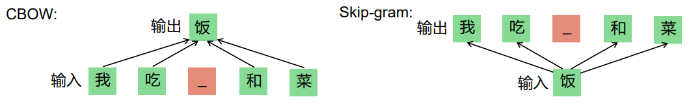
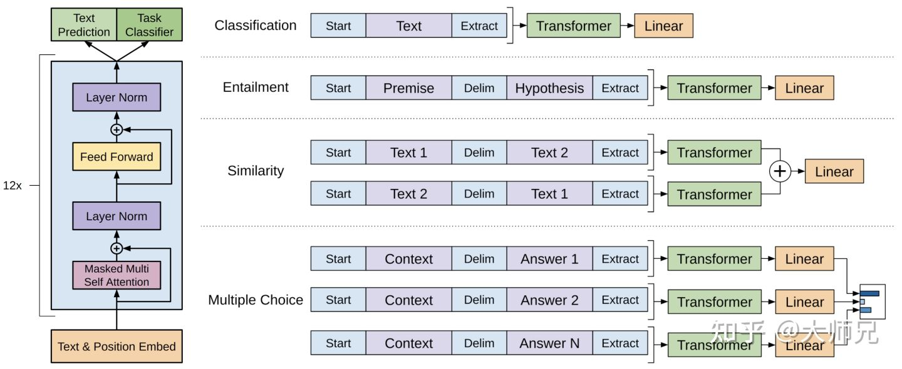
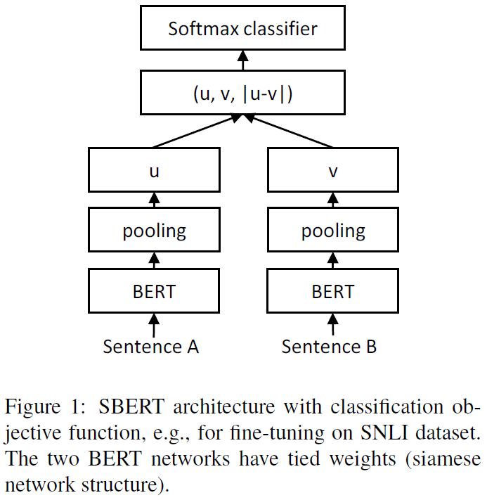
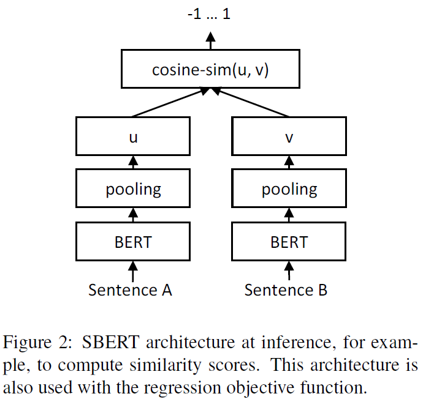
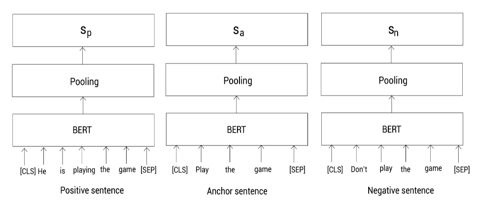

[TOC]

# BERT

## 词向量的发展历史

### word2vec

利用自监督训练的语言模型任务来学习到好的词向量表示

1. skip-gram
2. CBOW



### Glove

Glove建模语义的基本思想是共现概率矩阵

### ELMo

用LSTM模型进行语言模型的训练

之前的Word Embedding本质上是静态的方法，所谓静态指的是训练好之后每个单词的表示就固定了，对于多义词在不同的语境下是需要不同的表示的。

在下游任务中，将LSTM所有层的表示+原始词向量 进行加权作为最终token的表示


### GPT

GPT1：decoder，根据上文来预测当前的词 + 有监督finetune

下游任务具体做法：

1. 分类任务：送入transformer得到特征向量
2. 自然语言推理：将前提和假设拼接，通过分隔符隔开，送入transformer
3. 语义相似度：A句拼B句、B句拼A句，做正反两次拼接，然后送入transformer，将两个向量再拼接
4. 问答和常识推理：将每个回答都和内容进行拼接，送入transformer，选置信度最大的



GPT2：作者认为任何的有监督任务都是语言模型的一个子集，当模型容量非常大且数据量丰富时，仅靠LM就可以完成其他有监督任务的学习

GPT3：TODO


## BERT

GPT是单向的，BERT设计了双向。两个预训练任务MLM和NSP

MLM：15%的MASK进行预测，其中80%用MASK换，10%随机token，10%不变

NSP：预测是否连续，但是它太简单了，它的负样例来自于不同的document，相当于topic分类+segment连贯性预测的任务。改进的任务是SOP（sentence order prediction），在相同的document中选segment来做预测


# Sentence Bert

在语义相似度计算的任务上，Bert需要送入AB句，假设有1000个句子，两两计算相似度，则需要计算1000*999/2次。

Sentence-Bert采用孪生网络，将不同的句子输入到两个bert中（共享参数），得到句子的表征向量，用于语义相似度计算和无监督聚类。

## loss设计

1. 语义相似度分类任务

   
   
2. 余弦相似度损失(MAE)

   

3. 三重态相似度损失（对比学习）

   有3个句子，一个锚点，一个正样本，一个负样本

   ``` shell
   Anchor：play the game
   positive： he is playing the game
   negative：don't play the game
   ```
   
   

$$
max(||s_a - s_p|| - ||s_a-s_n||+ϵ,0)
$$

