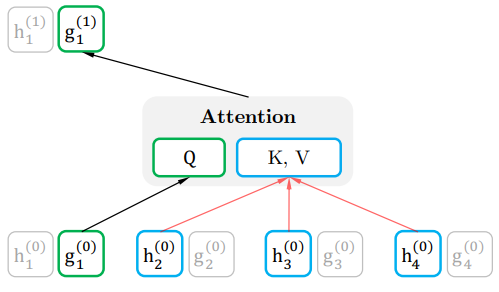
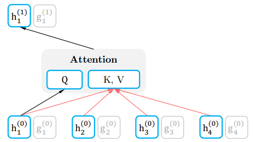
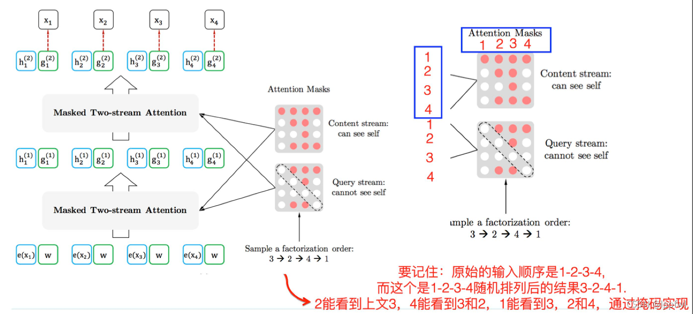

[TOC]

# XLNet

xlnet作为bert的升级版，对以下三个方面进行了优化

1. 采用AR模型代替了AE模型，并给AR引入了上下文信息，还解决了MASK带来的和finetune下游任务不一致的问题和预测一个被MASK掉的单词，无法利用其他被MASK掉的单词信息。

   eg:

   输入句子[ 我， 爱， 中， 国 ] 假设[ 爱，中 ]被mask掉了。则在预测爱的时候，只能利用我、国这两个字，

   P ( 爱 ∣ 我， 国 ) ， 而不能利用[ 中 ]即P ( 爱 ∣ 我， 中， 国 ) ，因为中被mask掉了

1. 双流注意力机制
2. 引入transformer-xl

## 排列语言模型

为了引入上下文信息，xlnet将句子token顺序进行重排序【利用排列组合来做】，比如将上文中的部分单词和下文中的部分单词进行对换，来实现预测当前词时，引入了上下文信息【利用attention mask来实现这一点】

## 双流自注意力机制

现在有排序 [1, 2, 3, 4] 和 [1, 2, 4, 3]，第一个排序预测位置3，得到公式P(3|1, 2)；第二个排序预测位置4，得到公式P(4|1, 2)。这会造成第一个排序预测位置3的单词和第二个排序预测4的单词是一样的，尽管它们所在的位置不同。

所以XLNet在预测单词的时候，把位置信息编码进去了，它希望：

- 预测当前单词的时候，只能使用当前单词的位置信息，不能使用当前单词的内容信息

  

- 预测其他单词的时候，可以使用当前单词的内容信息【标准的Transformer注意力机制】

  

## 总流程图

self-attention的计算过程中两个流的网络权重是共享的，最后在finetune阶段，去掉查询流即可。

## 集成Transformer-XL

片段循环机制 + 相对位置编码

## 预训练任务

去掉了NSP

# Roberta

# ALbert

