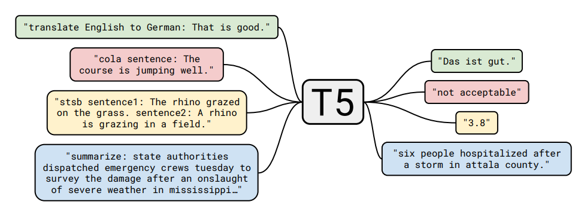

[TOC]

# XLNet（NIPS 2019）

xlnet作为bert的升级版，对以下三个方面进行了优化

1. 采用AR模型代替了AE模型，并给AR引入了上下文信息，还解决了MASK带来的和finetune下游任务不一致的问题和预测一个被MASK掉的单词，无法利用其他被MASK掉的单词信息。

   例如：给BERT输入句子[ 我， 爱， 中， 国 ]。假设[ 爱，中 ]被mask掉了，则在预测爱的时候，只能利用我、国这两个字，

   P ( 爱 ∣ 我， 国 ) ， 而不能利用[ 中 ]即P ( 爱 ∣ 我， 中， 国 ) ，因为[ 中 ]被mask掉了。如果[ 爱，中 ]之间有相关性则模型就会少学习很多知识

1. 双流注意力机制
2. 引入transformer-xl

## 排列语言模型

为了引入**上下文信息**，xlnet将句子token顺序进行重排序，将上文中的部分单词和下文中的部分单词进行对换，来实现预测当前词时，引入了上下文信息【实际上是利用attention mask来实现这一点，不再是future mask遮掩上三角矩阵】

因为排列方式有很多【排列组合$A_n^n$】，所以每个输入采样一个排列

## 双流自注意力机制

现在有排序 [1, 2, 3, 4] 和 [1, 2, 4, 3]，第一个排序预测位置3，得到公式P(3|1, 2)；第二个排序预测位置4，得到公式P(4|1, 2)。这会造成第一个排序预测位置3的单词和第二个排序预测4的单词是一样的，尽管它们所在的位置不同。

所以XLNet在预测单词的时候，要把该单词的位置信息编码也进去【P(3|1,2,p3) 和 P(4|1,2,p4)】，但是Transformer中加位置编码信息和内容编码信息加起来了，所以XLNet设计了双流自注意力机制来把位置信息拆分出来。

具体的结构设计：

- 预测当前单词的时候，只能使用当前单词的位置信息，不能使用当前单词的内容信息【另一个思路是像BERT使用了MASK，所以不需要考虑这个拆分内容信息的trick，因为MASK本身毫无意义，self-attn包含了MASK也没有影响；而因为XLNet没有MASK token，为了去掉当前单词的信息，需要将Query的内容信息drop掉，只保留位置信息】

  

- 预测其他单词的时候，可以使用除它外的单词的内容信息【标准的Transformer注意力机制】

  

## 总流程图

self-attention的计算过程中两个流的网络权重是共享的，在训练阶段使用**query流**的输出进行训练；而在finetune阶段，去掉查询流，使用**内容流**进行训练，就是传统的Transformer了。

## 集成Transformer-XL

片段循环机制 + 相对位置编码 + 

relative segment encoding：计算$segment_i$和$segment_j$之间的 attention weight 时，再加上一个 $a_{ij}$ 分量
$$
\alpha_{ij} = (q_i + b)^Ts_{ij}\\
当i和j是同一段，s_{ij} = s_+ \\
当i和j是非同段，s_{ij} = s_-
$$
好处是学习一个segment段间的信息 和 可以扩展到多segment，而不是bert的只有两个segment

## 预训练任务

去掉了NSP

# Roberta（2019）

## 去掉NSP：通过实验证明了NSP效果一般

- SEGMENT-PAIR + NSP：输入包含两部分，每个部分是来自同一文档或者不同文档的 segment （segment 是连续的多个句子），这两个segment 的token总数少于 512 。预训练包含 MLM 任务和 NSP 任务，这是原始 BERT 的做法。

- SENTENCE-PAIR + NSP：输入也是包含两部分，每个部分是来自同一个文档或者不同文档的单个句子，这两个句子的token 总数少于 512 。由于这些输入明显少于512 个tokens，因此增加batch size的大小，以使 tokens 总数保持与SEGMENT-PAIR + NSP 相似。预训练包含 MLM 任务和 NSP 任务。

- FULL-SENTENCES：输入只有一部分（而不是两部分），来自同一个文档或者不同文档的连续多个句子，token 总数不超过 512 。输入可能跨越文档边界，如果跨文档，则在上一个文档末尾添加文档边界token 。预训练不包含 NSP 任务。

- DOC-SENTENCES：输入的构造类似于FULL-SENTENCES，只是不需要跨越文档边界，其输入来自同一个文档的连续句子，token 总数不超过 512 。在文档末尾附近采样的输入可以短于 512个tokens， 因此在这些情况下动态增加batch size大小以达到与 FULL-SENTENCES 相同的tokens总数。预训练不包含 NSP 任务。

后面都采用FULL-SENTENCES的策略，因为便于保持每个batch内token总数维护在一个水平

## 动态MASKING

# ALbert（ICLR 2020）

压缩模型容量 + SOP代替NSP

## 减小参数量

1. 词嵌入分解，词嵌入的E和隐藏层的H往往是相等的，但是从建模的角度来说，**词嵌入的目标是学习上下文无关的表示，而隐藏层嵌入的目标是学习上下文相关的表示**。BERT 的表征能力很大一部分来自于使用上下文为学习过程提供上下文相关的表征信号。因此，将 WordPiece 词嵌入大小 E 从隐藏层大小 H 分离出来，可以更高效地利用总体的模型参数，其中 H 要远远大于 E。究者不再将 one-hot 向量直接映射到大小为 H 的隐藏空间，而是先将它们映射到一个低维词嵌入空间 E，然后再映射到隐藏空间。通过这种分解，可以**将词嵌入参数从 O(V × H) 降低到 O(V × E + E × H)**，这在 H 远远大于 E 的时候，参数量减少得非常明显。

2. 跨层参数共享

   共享所有encoder的参数，实验证明这种方法，每层的输入和输出之间的距离更稳定，没有很大的波动，这说明共享参数使得训练更稳定了。

## SOP

sentence order prediction 在实验中证明更有难度，对下游任务效果更好，去掉了主题分类的影响

## Masked-ngram-LM

1-gram 6/11、2-gram 3/11、3-gram 2/11

# BART（ACL 2020）【encoder-decoder】

吸收了BERT双向上下文的特点 + GPT自回归的特点；BART = Bert(encoder) + GPT(decoder)

BART是一个encoder-decoder的结构，其encoder端的输入是加了噪音的序列，decoder端的输入是right-shifted的序列，decoder端的目标是原序列。模型设计的目的很明确，就是在利用encoder端的双向建模能力的同时，保留自回归的特性，以适用于生成任务。

## 训练目标LOSS

还原加噪文本的交叉熵

## 5种加噪方式

1. token masking：和BERT一样的MASK替换
2. token deletion：删除token
3. text infilling：随机将一段连续的token（span）【从泊松分布中采样span长度】替换为**一个MASK**，span的长度如果是0，就是单纯插入一个[MASK]
4. sentence permutation：根据句号将文档分为多个句子，然后将这些句子随机排列
5. document rotation：从document中随机选择一个token，然后使得该token作为document的开头。这个任务是让模型有识别文档开头的能力

在BART中，加噪方式产生的文本长度变化是可以接受的，而BERT如果产生变长的噪声文本则是不好处理该文本的。

## finetune

文本分类：相同的文本送入encoder和decoder，取decoder最后一个token做预测

token分类：相同的文本送入encoder和decoder，取decoder每一个token做自己的预测

文本生成：天然的seq2seq，encoder输入 decoder输出

机器翻译：因为MT需要两种语言，所以将BART encoder的embedding初始化成一个新的encoder【embedding层初始化为一个encoder！！！】（**这里的一个思想是，新encoder将一个外语翻译成一个英文表示时，这个表示可能会是质量不佳的，正好有去噪声能力的BART可以帮助把这个有噪的英文表示生成到一个好的英文**）

finetune分两步

第一步：只更新初始化的encoder，BART positional embedding，BART encoder的第一层的self-attention的输入映射矩阵

第二步：更新全部参数，但只训练很少的轮数

# MASS（ICML 2019）

Masked Seq2Seq Pretraining（Autoencoder的味道，重构被MASK的源文）

动机：NLG上BERT不行，用encoder-decoder做

结构：MASS对句子随机屏蔽一个长度为k的连续片段【序列长度的50%，和BERT一样80 10 10的策略】，然后通过encoder-attn-decoder模型预测生成该片段。

优点：

1. 解码器端其它词都被屏蔽掉，**以鼓励解码器从编码器端提取信息来帮助连续片段的预测**，这样能促进编码器-注意力-解码器结构的联合训练
2. 为了给解码器提供更有用的信息，**编码器被强制去抽取未被屏蔽掉词的语义**，以提升编码器理解文本的能力
3. 让解码器预测连续的序列片段，以提升解码器的语言建模能力

## finetune

MASS只需要无监督的单语数据（比如WMT News Crawl Data、Wikipedia Data等）进行预训练。MASS支持跨语言的序列到序列生成（比如机器翻译），也支持单语言的序列到序列生成（比如文本摘要生成、对话生成）。当预训练MASS支持跨语言任务时（比如英语-法语机器翻译），**我们在一个模型里同时进行英语到英语以及法语到法语的预训练**，需要单独给每个语言加上相应的语言嵌入向量，用来区分不同的语言。

# T5（JMLR 2021）

Transfer Text-to-Text Transformer的简写【**将所有的NLP都转变为Text-to-Text的任务**】

比如上述黄色第三个文本语义相似度任务，T5也可以直接输出文本，而不是以 0.2 为间隔，从 1 到 5 分之间分成 21 个值的分类任务。（和GPT2&3的意思是一样的）

## 模型结构

作者对比了encoder-decoder【MASS BART】、decoder【GPT】、prefix LM【UniLM】，最后选择了encoder-decoder结构

## 预训练

1. 对比训练方法：GPT的语言模型训练方式、BERT的autoencoder训练方式、Deshuffling（文本顺序还原），最后选择了Bert-style
2. 对比MASK策略：将每个token换成[MASK]、将一个span（多个token）换成一个[MASK]、DROP方法丢弃字符，最后选择了Span法
3. 对文本的百分之多少进行破坏：10%、15%、25%、50%，最后选择了15%
4. 对多长的span进行MASK，对比了：2、3、5、10，最后选择了3

# UNILM（NIPS 2019）

直接复用BERT的AE结构做seq2seq，NLU直接用BERT做，NLG将S1 [SEP] S2当作encoder-decoder

## 模型结构

通过模型结构图，可以看出来主要是对attention的mask矩阵进行不同操作

## 预训练目标

- 单向LM

  作者使用了 left2right 和 right2left 两种LM训练方法，每个token在被预测时，只能看到它以及上或下文的token。

- 双向LM

  常规的BERT

- Seq2Seq LM

  A句做双向LM，B句做单向LM

# ELECTRA（generator-discriminator）

# ERINE清华（Knowledge-graph）

# ERINE百度

# XLM（NIPS 2019）【多语言】

XLM是跨语言预训练模型，它是一个可以编码任意语种句子的Transformer模型，针对多语言预训练提出了3个优化任务。

## 全语种混合BPE

首先是构建一个全语言的大词表。为了防止，小语种数据过少，进行加温度的多项式分布采样。$q_i$为这个i语种的句子被选择的概率；$p_i$为这个i语种语料占全部语料的比例。
$$
q_i = \frac{p_i^\alpha}{\sum_{j=1}^Np_j^\alpha}\space with\space p_i=\frac{n_i}{\sum_{k=1}^Nn_k}
$$

## 预训练任务

1. CLM 因果语言模型，GPT式的语言模型任务，在单语上做的
2. MLM 和BERT一样
3. TLM **利用双语平行句子**，借助对应译文，预测每个语言自身源文中被MASK的词

4. XLM丢去了NSP，将segment embedding换成了language embedding。

## finetune

无监督机器翻译：用预训练好的参数初始化encoder和decoder，作者对比了CLM和MLM训练的encoder和decoder，最后发现MLM预训练初始化的encoder和decoder效果最好

有监督机器翻译：和无监督机器翻译一样，用MLM初始化encoder和decoder

**encoder-decoder是两个模型，不是一个模型**

