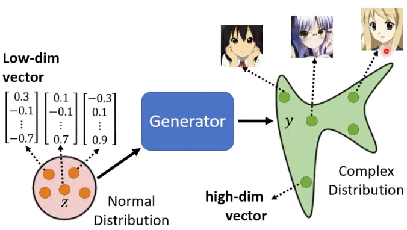
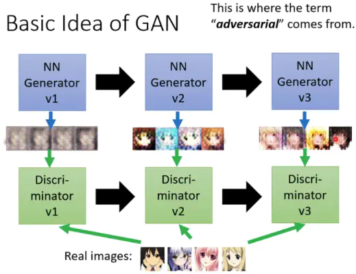

[TOC]

# 生成对抗网络

## generator

什么样的任务需要生成器呢？

具有“创造力”的任务，比如画一个女生，这会有很多种正确的输出【或者，一个对话系统会有多种合理的回答】。此时，generator需要输出的是一个distribution。

## generative adversarial network

给定几个正态分布的随机向量，generator会生成不一样的图片。但尽管生成的图片不一样，但它们都是女生的图片，也就是说我们期望generator输出的distribution要和某个特定分布尽可能相似。**如何做到这一点呢，就需要discriminator了**
 

### discriminator

discriminator可以认为是generator的对手，它专门用来和generator进行对抗，让generator不断进化。

1. Generator-v1的参数是随机初始化的，所以生成的图片（fake-imagev1）都比较差，此时我们用real image + fake image- v1训练了一个Discriminator-v1
2. 有了Discriminator-v1，我们来训练一个Generator-v2，使得其生成的图片可以骗过Discriminator-v1。然后，我们再用real image + fake image-v2训练了一个Discriminator-v2
3. ...

### 算法步骤

1. 初始化 Generator 和 Discriminator
2. Fix Generator，Update Discriminator（做二分类的任务）
3. Fix Discriminator， Update Generator（通过Discriminator的分类结果，训练Generator，让生成的图片尽可能分类为real image）

### 目标函数

- Generator

  找到使Generator生成的fake data的概率分布 和 real data的概率分布【我们通过采样部分数据来模拟概率分布】距离最小的Generator

$$
G^* = \underset{G} {\operatorname{argmin}} Div(P_{G}, P_{real})
$$

- Discriminator

  鉴别器的目标函数就是尽可能分辨出fake data 和 real data，其中$E_{y∼p_{data}}[\log D(y)]$表示当$y$从$P_{data}$中采样，通过鉴别器后的输出D(y)要尽可能大；同理，$E_{y∼P_G}[\log (1-D(y))]$表示当$y$从$P_G$中采样，通过鉴别器后的输出D(y)要尽可能小【让逻辑回归的数值，分类正例趋近于1，分类负例趋近于0】

$$
\begin{aligned}
D^* &= \underset{D} {\operatorname{argmax}} V(D, G) \\
V(D, G) &= E_{y∼p_{data}}[\log D(y)] + E_{y∼P_G}[\log (1-D(y))]
\end{aligned}
$$

$\underset{D}{\operatorname{max}} V(D,G)$和$Div(P_G, P_{data})$是相关的，直观上的理解就是$Div(P_G, P_{data})$越小，两者越相似，鉴别器越不好鉴别，$\underset{D}{\operatorname{max}} V(D,G)$也越小。

